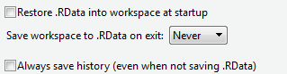
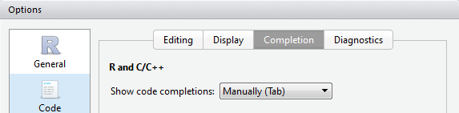

# Beginner skills {#intro}


```{r setup echo=FALSE, message=FALSE, include=FALSE}
suppressPackageStartupMessages(library(tibble))
suppressPackageStartupMessages(library(magrittr))
#htmltools::tagList(rmarkdown::html_dependency_font_awesome())

library(knitr)

current_output <- opts_knit$get("rmarkdown.pandoc.to")

knit_theme$set("earendel")
opts_chunk$set(background="grey94", 
               fig.showtext = TRUE,
               dev = ifelse(current_output == "latex", "pdf", "svg"))
```


## Installing R and Rstudio {#installingr}


We assume you have installed R and Rstudio. We occasionally give some tips on how to use Rstudio effectively, but since Rstudio is likely to change more quickly than R - we instead suggest you keep an eye on their documentation (link).

We assume that you have installed both R, and Rstudio. Please visit both websites ([here](http://cran.r-project.org) for R, [here for Rstudio](www.rstudio.org)) to download the latest version for your platform. Note that Rstudio simply runs R for us (and provides many, many other features) - you still need to install R itself.

**Rstudio settings**

We strongly recommend you change the following default settings in Rstudio. The default behaviour is to save all your objects to an 'RData' file when you exit, and loads the same objects when you open RStudio. This is very dangerous behaviour, and you **must** turn it off. For now, make sure you go to <kbd>Tools > Global Options...</kbd> and on the <kbd>General</kbd> tab, make sure the settings are like the figure below.

```{r echo=FALSE, out.width='40%'}

```

Another feature you may want to turn off is the automatic code completion, which is now a standard feature in RStudio. This is a matter of taste, but we find it handier to use code completion only when requested. If you change the settings as shown in the screenshot below, you can engage code completion by typing part of a function and then pressing `Tab`.

```{r echo=FALSE, out.width='40%'}

```

```{block2, type="rmdreading"}
This text is not a complete or even comprehensive guide to Rstudio - we focus on R. If you want to know more about all the options in the menu's, keyboard shortcuts, and various add-ons and features, [please visit this link](https://support.rstudio.com/hc/en-us/sections/200107586-Using-the-RStudio-IDE) to get started.
```


### Example data used throughout this book {#exampledata}

All example datasets used throughout this book are provided in the R package `lgrdata`. Install it like any other package (see \@ref(packages) for more information):

```{r eval=FALSE}
install.packages("lgrdata")
```

At the start of each script where you use an example dataset, load the package:

```{r}
library(lgrdata)
```

Then, you can make available any dataset from the package with :

```{r}
data(allometry)
```

Each dataset has help page, inspect it (`?allometry`) to learn a bit about the dataset, the meaning and units of the variables, and sometimes a simple example plot with the data.

```{block2 type="rmdtry"}
To look at all datasets included in the `lgrdata` package, it is most convenient to use Rstudio's package explorer, under the `Packages` tab in the bottom-right hand menu. Just find the package and click on it.
```


## Basic operations {#basicops}

In Rstudio, the R console is shown in one of the windows. The other windows include the 'Environment' window (with tabs 'Environment', 'History', etc.), a 'File management' window (where you can browse files, view plots, install packages, etc.), and a source window. 

The source window (containing a script where you can write and save code) may not show up on your first use of Rstudio, press <kbd>Ctrl-Shift-N</kbd> to open a new script. We return to scripts in Section \@ref(scripts).

In the console, you can type R code and get immediate results, for example:

```{r }
# I want to add two numbers:
1 + 1
```

Here, we typed `1 + 1`, hit <kbd>Enter</kbd>, and R produced `2`. The `[1]` means that the result only has one element (the number '2').

In this book, the R output is shown after `##`. Every example can be run by you, simply copy the section (use the text selection tool in Adobe reader), and paste it into the console (with <kbd>Ctrl + Enter</kbd> on a Windows machine, or <kbd>Cmd + Enter</kbd> on a Mac).

We can do all sorts of basic calculator operations. Consider the following examples:

```{r tidy=FALSE}
# Arithmetic
12 * (10 + 1)

# Scientific notation
3.5E03 + 4E-01

# pi is a built-in constant
sin(pi/2)

# Absolute value
abs(-10)

# Yes, you can divide by zero
1001/0

# Square root
sqrt(225)

# Exponents
15^2

# Round down to nearest integer (and ceiling() for up or round() for closest)
floor(3.1415)
```

Try typing `?Math` for description of more mathematical functions.

Also note the use of `#` for comments: anything after this symbol on the same line is *not* read by R. 


```{block2 type="rmdtry"}
When typing code directly into the console (other than a script, which is what you usually will do when developing more serious code), consider these tips:

- Press **UP** on your keyboard to repeat the previous command (and keep pressing UP to find all previous commands).
- Press **TAB** to auto-complete the name of a function (even those from loaded packages); very handy if you don't remember the name of the function, or you can't be bothered typing it in.
- Press **CTRL-L** (CMD-L on Mac) to 'clear' the console. This does not remove the history or any objects, just starts a fresh screen.
- Press **ESC** to cancel an operation (if R is taking long, and you don't want to wait).

```


## Working with vectors {#vectorintro}

A very useful type of object is the `vector`, which is basically a string of numbers or bits of text (but not a combination of both). The power of R is that most functions can use a vector directly as input, which greatly simplifies coding in many applications.

Let's construct an example vector with 7 numbers:

```{r }
nums1 <- c(1,4,2,8,11,100,8)
```

We can now do basic arithmetic with this *numeric vector*  :

```{r }
# Get the sum of a vector:
sum(nums1)

# Get mean, standard deviation, number of observations (length):
mean(nums1)
sd(nums1)
length(nums1)

# Some functions result in a new vector, for example:
rev(nums1)  # reverse elements
cumsum(nums1)  # cumulative sum
```

There are many more functions you can use directly on vectors. See the table below for a few useful ones.

```{r echo=FALSE, results='asis'}
tab <- tribble(~Function,   ~`What it does`,           ~Example,
                  "`length`",     "Length of the vector", "`length(nums1)`",
                  "`rev`",       "Reverses the elements of a vector", "`rev(nums1)`",
                  "`sort`",      "Sorts the elements of a vector", "`sort(nums1, decreasing = TRUE)`",
                  "`order`",     "The order of elements in a vector", "`order(nums1)`",
                  "`head`",      "The first few elements of a vector", "`head(nums1, 5)`",
                  "`max`",       "The maximum value", "`max(nums1)`",
                  "`min`",       "The minimum value", "`min(nums1)`",
                  "`which.max`", "Which element of the vector is the max?", "`which.max(nums1)`",
                  "`which.min`", "Which element of the vector is the min?", "`which.min(nums1)`",
                  "`mean`",      "The average value", "`mean(nums1)`",
                  "`median`",    "The median", "`median(nums1)`",
                  "`var`",       "Variance", "`var(nums1)`",
                  "`sd`",        "Standard deviation", "`sd(nums1)`",
                  "`cumsum`",    "Cumulative sum (running total)", "`cumsum(nums1)`",
                  "`diff`",      "Successive difference of a vector", "`diff(nums1)`",
                  "`unique`",    "Unique values used in the vector", "`unique(nums1)`",
                  "`round`",     "Rounds numbers to a specified number of decimal points", "`round(nums1, 2)`")
                  
if(current_output == "latex"){
  
  latexify <- function(x){
    x <- gsub("`","", x)
    paste0("\\texttt{", x, "}")  
  }
  tab$Function <- latexify(tab$Function)
  tab$Example <- latexify(tab$Example)
  
  xtab <- xtable::xtable(tab, caption="A selection of useful built-in functions in R.")
  print(xtab,sanitize.text.function=function(x){x},
        comment = FALSE)
} else {
  knitr::kable(tab, caption="A selection of useful built-in functions in R.")
}
```


## Writing code in a script

To continue, we are first going to open a script - simply a text file where you can type your code, and execute it immediately. To do so, click on the menu <kbd>File/New File/R Script</kbd>. 

You now have an empty R script, where you can write code, and add comments.

A single line can be run by placing the cursor on that line, and clicking 'Run' in the menu just to the top-right of the window. Alternatively (and this is **recommended**), use the keyboard shortcut <kbd>Ctrl-Enter</kbd> (or <kbd>Cmd-Enter</kbd> on Mac) to run that line. If you make a text selection with the mouse, this selection can be executed with the same keyboard shortcut.


## Vectorized operations {#vectorized}

In the above section, we introduced a number of functions that you can use to do calculations on a vector of numbers. In R, a number of operations can be done on two vectors, and the result is a vector itself. Basically, R knows to apply these operations one element at a time. This is best illustrated by some examples:

```{r }
# Make two vectors,
vec1 <- c(1,2,3,4,5)
vec2 <- c(11,12,13,14,15)

# Add a number, element-wise
vec1 + 10

# Element-wise quadratic:
vec1^2

# Pair-wise multiplication:
vec1 * vec2

# Pair-wise sum:
vec1 + vec2

# Compare the pair-wise sum to the sum of both vectors:
sum(vec1) + sum(vec2)
```

In each of the above examples, the operators (like `+` and so on) 'know' to make the calculations one element at a time (if one vector), or pair-wise (when two vectors). Clearly, for all examples where two vectors were used, the two vectors need to be the same length (i.e., have the same number of elements).


### Applying multiple functions at once {#multifunctions}

In R, we can apply functions and operators in combination. In the following examples, the *innermost* expressions are always evaluated first. This will make sense after some examples:

```{r }
# Mean of the vector 'vec1', *after* squaring the values:
mean(vec1^2)

# Mean of the vector, *then* square it:
mean(vec1)^2

# Mean of the log of vec2:
mean(log(vec2))

# Log of the mean of vec2:
log(mean(vec2))
```

Alternatively, we can use the `pipe` operator, which allows us to write the operators in order of application. For the pipe operator, we need to load the `magrittr` package (see \@ref(packages) on how to install and load packages).

```{r}
library(magrittr)

# Identical to mean(log(vec2))
vec2 %>% log %>% mean
```

The above code can be written in at least two other equivalent ways: `log(vec2) %>% mean`, and even `log(vec2) %>% mean(.)`, where the `.` indicates explicitly the result from the previous operator.

In any of the following, we assume you have loaded either `magrittr`, or some package that loads it for you (for example, `dplyr`). If you have not, you will see the error message `could not find function "%>%"`.

The pipe operator has become very popular, and we use it when it greatly simplifies code, making it easier to follow what the code actually does (and in which order).


## Working with matrices {#matrices}


Vectors are one-dimensional collections of data; all elements are of the same type (numeric, character, etc.). A matrix has two dimensions: rows and columns, and again each element (each cell) has the same type. We do not use matrices all that often in R, since a more general data storage type (the dataframe) is generally more useful (there, each column can contain different kind of data). However, sometimes working with matrices is faster, or built-in functions return a matrix - some basic skills are useful. 

```{r}
# Construct a matrix with the matrix function:
mymat <- matrix(c(1,2,3,4,5,6,7,8,9), ncol=3)

# Note how the values are entered in the matrix column-by-column:
mymat

# Alternatively, add the values row-by-row:
mymat2 <- matrix(c(1,2,3,4,5,6,7,8,9), ncol=3,  byrow=TRUE)

# Note the difference:
mymat2
```

A few built-in functions are especially handy when dealing with a matrix:

```{r}
# Transpose a matrix (flip it alongside the diagonal)
t(mymat)

# Row or column-wise sums
rowSums(mymat)

# Row or column-wise means
colMeans(mymat)

# Extract the diagonal:
diag(mymat)
```

Functions usually used for vectors often work with matrices, all values are simply treated as if stored in a vector:

```{r}
# Standard deviation
sd(mymat)

# Number of observations
length(mymat)

# Is the same as number of columns * number of rows
nrow(mymat) * ncol(mymat)
```

As with vectors, we can calculate directly on all elements:

```{r}
mymat * 10
```


## Objects in the workspace

In the examples above, we have created a few new objects. These objects are kept in memory for the remainder of your session (that is, until you close R).

In RStudio, you can browse all objects that are currently loaded in memory. Objects that are currently loaded in memory make up your *workspace*. Find the window that has the tab 'Environment'. Here you see a list of all the objects you have created in this R session. When you click on an object, a window opens that shows the contents of the object.

Alternatively, to see which objects you currently have in your workspace, use the following command:
```{r echo=FALSE}
ls <- function()print(c("nums1","vec1","vec2","words","x","y","a","b","numbers"))
```
```{r }
ls()
```

```{r echo=FALSE}
ls <- base::ls
```


To remove objects,
```{r eval=FALSE}
rm(nums1, nums2)
```


And to remove all objects that are currently loaded, use this command. \textbf{Note:} you want to use this wisely!
```{r eval=FALSE}
rm(list=ls())
```

Finally, when you are ending your R session, but you want to continue exactly at this point the next time, make sure to save the current workspace. In RStudio, find the menu `Session` (at the top). Here you can save the current workspace, and also load a previously saved one.


## Files in the working directory {#fileswd}

Each time you run R, it 'sees' one of your folders ('directories') and all the files in it. This folder is called the *working directory*. You can change the working directory in RStudio in a couple of ways. 

The first option, in Rstudio, is to go to the menu `Session > Set Working Directory > Choose Directory...`. 

Or, find the 'Files' tab in one of the RStudio windows (usually bottom-right). Here you can browse to the directory you want to use (by clicking on the small `...` button on the right ), and click `More > Set as working directory`.

You can also set or query the current working directory by typing the following code:
```{r eval=FALSE}

# Set working directory to C:/myR
setwd("C:/myR")

# What is the current working directory?
getwd()
```
*Note:* For Windows users, use a forward slash (that is, /), not a back slash!

Finally, you can see which files are available in the current working directory, as well as in subdirectories, using the `dir` function (*Note*: a synonym for this function is `list.files`).

```{r eval=FALSE}
# Show files in the working directory:
dir()

# List files in some other directory:
dir("c:/work/projects/data/")

# Show files in the subdirectory "data":
dir("data")

# Show files in the working directory that end in csv.
# (The ignore.case=TRUE assures that we find files that end in 'CSV' as well as 'csv',
# and the '[]' is necessary to find the '.' in '.csv'.
dir(pattern="[.]csv", ignore.case=TRUE)
```


## Rstudio projects

If you end up working primarily from Rstudio, we very strongly recommend the use of Projects in Rstudio to keep your work organized, and to help set the working directory.

Rstudio projects are really just small files added to a certain folder, which "tags" that folder as containing a particular project. This idea works best if you have organized your work into smaller subsections, where you keep your different projects in separate folders. 


## Packages {#packages}

Throughout this tutorial, we will focus on the basic functionality of R, but we will also call on a number of add-on 'packages' that include additional functions. These packages need to be *installed* (downloaded) before first use, and *loaded* every time you start a new R session.

### Install packages from CRAN {#installpackage}

You can find a full list of packages available for R on the CRAN site (<http://cran.r-project.org/>, navigate to 'Packages'), but be warned -- it's a very long list, with over 10000 packages. If you really want to browse a long list of packages, you should prefer the website <http://r-pkg.org/>, which provides a nice interface.

In RStudio, click on the `Packages` tab in the lower-right hand panel. There you can see which packages are already installed, and you can install more by clicking on the `Install` button.

Alternatively, to install a particular package, simply type:

```{r eval=FALSE}
install.packages("gplots")
```

```{block2, type="rmdcaution"}
Never use `install.packages` in an rmarkdown file (it simply does not work), and it is generally bad practice to add it to a script, since you do not want the packages to be installed every time the script is run. Instead, make it clear what the dependencies are in a README file, or use the approach outlined in "Loading many packages" further below, or in "Install missing packages". 
```

The package needs to be installed only once (except when you need to update it, see Section \@ref(updatingpackages)). 


### Loading packages {#loadpackage}


To use the package in your current R session, type:

```{r eval=FALSE}
library(gplots)
```

This loads the `gplots` package from your local library (where all packages are stored) into working memory. You can now use the functions available in the `gplots` package. If you close and reopen R, you will need to load the package again (but you don't have to install it again).

To quickly learn which functions are included in a package, type:
```{r eval=FALSE}
library(help=gplots)
```


```{block2 type="rmdtry"}
Type `.libPaths()` to see where your packages are installed. You can change the default directory permanently after setting the environment variable `R_LIBS` on your system. 
```


### Setting the CRAN mirror

CRAN is a central package for R packages, but it is hosted on many servers around the world. Back in the day, you always had to set the CRAN 'mirror' once for every R session. If you are using Rstudio, though, you won't have to worry about this as it is set automatically to Rstudio's own CRAN mirror, which is actually just a clever service that sends you to a nearby server.

If you use R from the command line, you might want to set the mirror directly:

```{r eval=FALSE}
# Not needed from Rstudio!
options(repos = c(CRAN = "https://cran.rstudio.com/"))
```

This avoids an annoying popup when attempting `install.packages`.


### Install from git hosting sites

The previous section applies to packages that have been uploaded to CRAN (the central repository for R packages). It is however also quite common for R packages to be available on Github or Bitbucket - two large web services that host source code under *git* version control. For repositories that contain R packages, these cannot be installed via `install.packages`. Instead, do:

```{r eval=FALSE}
library(remotes)
install_bitbucket("remkoduursma/fitplc")
```

This installs an R package from www.bitbucket.org. Similarly, `install_github` installs the package from www.github.com, if it is hosted there.

For this command to work, your system needs to be able to compile R packages from source. Windows users will need to install [Rtools](https://cran.r-project.org/bin/windows/Rtools/).


### Updating R and package locations

By default, `install.packages` places the packages in a subdirectory of your R installation, which means that when you update R, you have to reinstall all packages - unless you follow these instructions. To check where your packages are being installed to, type:

```{r eval=FALSE}
.libPaths()
```

You may see more than one path listed - packages will be installed to the first directory. It is  generally a good idea to make a custom location for all your packages, for example under `c:/RLIBRARY`, or `~/rpackages`, or some other location independent of where R is installed.

To do this, you have to add an environment variable `R_LIBS`, that points to your custom directory. If you don't know how to do this, simply do a web search for 'add environment variable windows/mac'. The next time you open Rstudio, `.libPaths()` should show the custom directory.


### Updating packages {#updatingpackages}

Besides updating R and Rstudio itself (which is recommended at least every couple of months or so), it is also a very good idea to keep all packages up to date. If your workflow ends up depending on an older version of the package, your code may not work on a different system. To update all *installed* packages, you can run the following command - make sure to do this right after opening Rstudio:

```{r eval=FALSE}
update.packages(ask=FALSE)
```

It is usually best to type 'no' when the installation process asks if you want to compile some updated packages. Also, occasionally this process fails - usually stating e.g. 'package Rcpp not found'. Then first install those packages (the usual way), and retry `update.packages`.


### Install missing packages

The `reinstallr` package can be used to install all packages that are 'mentioned' in any of the source files in your working directory. That is, all those that are loaded in an R script, rmarkdown file, and some others, using `library` or `require`. You can simply do,

```{r eval=FALSE}
library(reinstallr)
reinstallr()
```


### Conflicts

It is fairly common that certain functions appear in multiple packages. For example, `summarize` is a function in `Hmisc` and in `dplyr`. If you have loaded `Hmisc` first, and then load `dplyr`, you will see (among others), the following message:

```
The following objects are masked from ‘package:Hmisc’:

    src, summarize
```

This means that if you now use `summarize()`, it will be used from the `dplyr` package. As a consequence of this, *package conflicts are resolved based on the order in which you load the packages*. This can be very confusing (and dangerous!). It is better to use the `::` operator, when you want to make sure to use a function from a certain package:

```{r eval=FALSE}
# Use summarize from dplyr
dplyr::summarize(...)
```

In fact, it can be considered very good practice to *always* use the `::` (called a *namespace directive*) to make it clear in your code where the function is used from. We refrain from using the operator very often in this book though, as it makes the code a bit messy and longer. 


### Loading many packages

If you are using packages in a script file, it is usually considered a good idea to load any packages you will be using at the *start* of the script. Usually you will see a long list of `library(this)`, and `library(that)`, but we like to use the `pacman` package at the top of a script, like this:

```{r eval=FALSE}
if(!require(pacman))install.packages("pacman")
pacman::p_load(gplots, geometry, rgl, remotes, svglite)
```

The first line checks whether the `pacman` package is available (`require` is like `library`, except it returns `TRUE` if the package could be loaded), and if not (`!`), it is installed. Next, `p_load` from `pacman` can be used to load many packages in one line, *installing the ones that are not available*. This approach is a very concise way to make your script reproducible.


## Accessing the help files {#helpfiles}

Every function that you use in R has its own built-in help file. For example, to access the help file for the arithmetic mean, type `?mean`.

This opens up the help file in your default browser (but does not require an internet connection). Functions added by loading new packages also have built-in help files. For example, to read about the function `bandplot` in the `gplots` package, type:

```{r eval=FALSE, tidy=FALSE}
library(gplots)
?bandplot

# Alternatively:
?gplots::bandplot
```

Do not get overwhelmed when looking at the help files. Much of R's reputation for a steep learning curve has to do with the rather obscure and often confusing help files. A good tip for beginners is to *not read the help files*, but skip straight to the Example section at the bottom of the help file. The first line of the help file, which shows what kind of input, or arguments, the function takes, can also be helpful.

The built-in help files offer detailed documentation of built-in functions (and those offered by packages), but often you are looking for something, but don't quite know what exactly. This frustrating experience is well described by this quote, to R-help in 2006:

> "This is probably documented, but I cannot find the right words or   
expression for a search. My attempts failed."
>
> --- Denis Chabot

Sometimes it is useful to search all help files (including all *installed* packages, loaded or not) for a keyword, for example `??ANOVA` will find everything that mentions ANOVAs.

The best advice, though, is simply to **just use Google**. As a search, simply type the question like you would ask someone else, for example "How to place legend outside plot with ggplot2?", "(Is there an) R package for 3D plots?".


## Writing lots of code: rmarkdown or scripts?

In this chapter you have written a little code directly to the Console, but for any more serious work you will use scripts or "rmarkdown" documents. In Chapter \@ref(reporting), we will give more information on `rmarkdown` documents: an outstanding format to collect code, output, and text in a single, well formatted document. Scripts on the other hand only include code (and comments), and can be executed completely, or piece-by-piece by selecting code manually.

For both options, a brief summary is provided below. Overall, you want to use **scripts** if you:

- Want to be able to run all R code at once, producing some sort of output in files, or some other side-effect (perhaps figures as PDF, new datasets written to disk, objects produced and saved, data downloaded or uploaded, etc.).

On the other hand, you should use an **rmarkdown document** if you:

- Want to produce a document that includes all output from your analyses, including tables, figures, output from statistical analyses, and so on. The document can be well formatted and directly shared (hiding code, for example), and published on the web or simply emailed to your co-workers.


### Reproducible documents with rmarkdown

- Documents are mix of normal text, with markup (headers, captions, images, tables, formatting), and blocks of code, **code chunks**. 
- The document can be quickly converted to html, pdf, or an MS Word document, and includes output from code chunks (text output, figures), well formatted.
- Easy to learn syntax, and Rstudio provides many shortcuts and tools for working with `rmarkdown`.
- Output formats include HTML, PDF (if LaTeX is installed) and MS Word. 
- Make not just simple documents, but also HTML presentations (in many formats), blogs (with `blogdown`), books (with `bookdown`), auto-generated websites documenting R packages (with `pkgdown`), and many more templates provided by add-on packages.

We give more information in Section \@ref(rmarkdown).

### Using R scripts {#scripts}

Clearly, R markdown is the right solution if you are interested in writing fully reproducable reports or presentations. For everything else, we use R scripts - simply text files that include R code. A script is meant to be fully executable, so that you can run the entire script, producing the desired results, files, objects, or side-effects. In Rstudio, you can open a new R script with `File/New File/R script`, simply a text file that is saved with extension `.R`.

To run your script, you can either click 'Source' on the topright corner of the document, or execute it from R with:

```{r eval=FALSE}
source("myscript.R")
```

This is *not useful* when you are interested in the output that you normally see in the console. If you are *printing* things to the screen in your script, the call to `source` will not show any of it. You can make these results visible by including `print` directly in your script, for example:

```{r eval=FALSE}
# The output of this will not show up if you 
# do source("somescript.R")
summary(mtcars)

# Here, the output will be printed to the screen,
# also with source()
print(summary(cars))
```

Although the trick with `print` works, usually you want to switch to `rmarkdown` if you are interested in viewing the outputs. Scripts are more useful for side effects, for example the creation of new datasets (that are saved to disk), production of figures as PDF files, up- or downloading of files, or even converting an rmarkdown file to HTML with various settings. 


#### Running R from the command line

From outside R or Rstudio, you can run your script from the *command line* with `Rscript`, for example:

```
Rscript myscript.R
```

(Note that this only works on Windows if R is added to the search path).

You can also run bits of R code directly via,

```
Rscript -e "sqrt(9)"
```

#### Running scripts in the background

Suppose you have a script that takes a long time to complete. You want to run this script in a background process, so it does not tie up Rstudio for a long time. A nice feature in Rstudio (since late 2018) can be found on the <kbd>Jobs</kbd> tab, in the Console pane.

There, click 'Start Job', and select an R script you would like to run, and the working directory that should be used. The script will be run in the background, and the results will be shown in the Jobs tab. This way you can run an R script for every core you have available to you.


## Exercises

```{r child="exercises/01_beginnerskills_exercises.Rmd", echo=FALSE, results='hide', fig.show='hide'}

```


