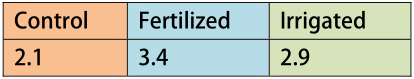
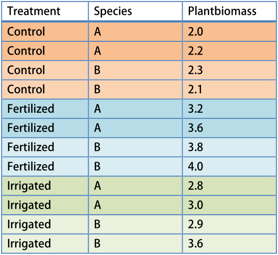
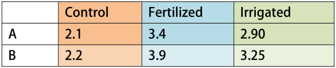
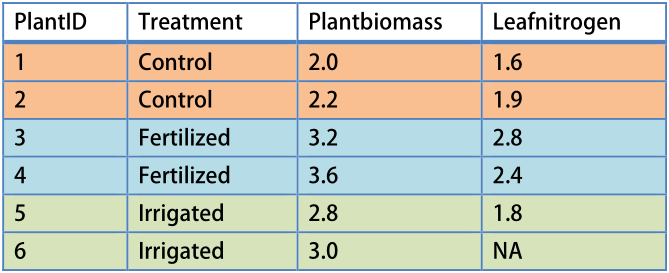
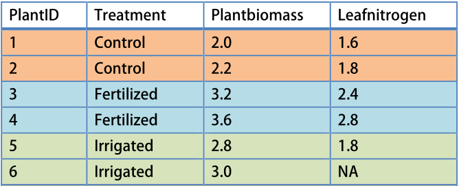
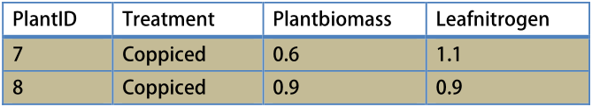
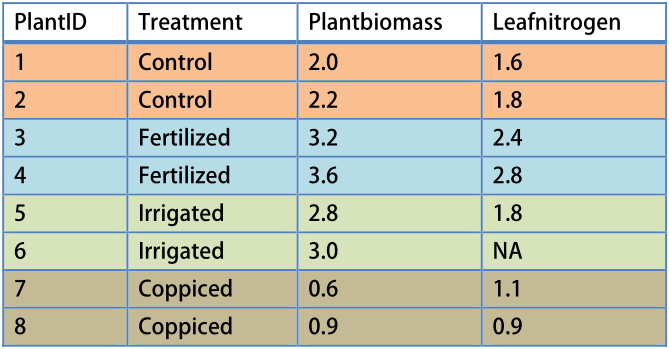

# Data skills {#summarize}


## Introduction


```{block2 type="rmdtry"}
Lorem ipsum dolor sit amet, consectetur adipiscing elit. Praesent vel mauris non urna feugiat vehicula. Ut nec aliquam magna. Sed ac elit in turpis porttitor lacinia a feugiat risus. In vitae nunc non purus venenatis iaculis. Sed feugiat lacus in est facilisis, in consectetur dui ultrices. Vestibulum non mi quis quam iaculis lacinia non id risus. Sed posuere libero vitae nisl malesuada, non

Try some code

`x <- 20`
`y <- mean(x)`

fringilla ipsum sodales. Pellentesque id mollis erat, ut volutpat felis. Aliquam congue viverra mauris quis porta. Donec maximus id libero non viverra.
```

```{block2 type="rmdcaution"}
Lorem ipsum dolor sit amet, consectetur adipiscing elit. Praesent vel mauris non urna feugiat vehicula. Ut nec aliquam magna. Sed ac elit in turpis porttitor lacinia a feugiat risus. In vitae nunc non purus venenatis iaculis. Sed feugiat lacus in est facilisis, in consectetur dui ultrices. Vestibulum non mi quis quam iaculis lacinia non id risus. Sed posuere libero vitae nisl malesuada, non fringilla ipsum sodales. Pellentesque id mollis erat, ut volutpat felis. Aliquam congue viverra mauris quis porta. Donec maximus id libero non viverra.
```

```{block2 type="rmdreading"}
Lorem ipsum dolor sit amet, consectetur adipiscing elit. Praesent vel mauris non urna feugiat vehicula. Ut nec aliquam magna. Sed ac elit in turpis porttitor lacinia a feugiat risus. In vitae nunc non purus venenatis iaculis. Sed feugiat lacus in est facilisis, in consectetur dui ultrices. Vestibulum non mi quis quam iaculis lacinia non id risus. Sed posuere libero vitae nisl malesuada, non fringilla ipsum sodales. Pellentesque id mollis erat, ut volutpat felis. Aliquam congue viverra mauris quis porta. Donec maximus id libero non viverra.
```

```{block2 type="rmdnote"}
Lorem ipsum dolor sit amet, consectetur adipiscing elit. Praesent vel mauris non urna feugiat vehicula. Ut nec aliquam magna. Sed ac elit in turpis porttitor lacinia a feugiat risus. In vitae nunc non purus venenatis iaculis. Sed feugiat lacus in est facilisis, in consectetur dui ultrices. Vestibulum non mi quis quam iaculis lacinia non id risus. Sed posuere libero vitae nisl malesuada, non fringilla ipsum sodales. Pellentesque id mollis erat, ut volutpat felis. Aliquam congue viverra mauris quis porta. Donec maximus id libero non viverra.
```


Analysing data is much more than applying the right statistics at the right time. A lot of effort and time is spent on reading, filtering, reshaping, bending and twisting your data before you can actually use the data for visualization and analysis.

In this chapter we learn many skills for working with data in R. All of these skills can be seen as mandatory skills before you learn new statistical techniques or fancy new visualizations. We first look at reading datasets into *dataframes*, filtering data when certain conditions are met, and learn in detail about the most important data types that can be stored in dataframes.

We will also look at various ways to summarize data, from simple summaries of what is contained in the original data, to more complex tables of statistics by grouping variables. Finally we will look at merging (joining) dataframes by one or more key-variables, and reshaping datasets (from long to wide, and back). 


**Packages used in this chapter**

The examples will generally let you know which packages are used, but for your convenience, here is a complete list of the packages used. 

For plotting, we often use `ggplot2` and `ggthemes` (these are usually omitted from the examples):

Otherwise:

- `lgrdata` (for the example datasets, see \@ref(exampledata))
- `lubridate` (for dates and times)
- `dplyr` (for various data skills)
- `padr` (for aggregating timeseries data)
- `doBy` (for `summaryBy`, handy for making summary tables)
- `Hmisc` (for `contents` and `describe`, both summarize dataframes)
- `tidyr` (for reshaping dataframes)
- `reshape2` (for reshaping dataframes)
- `data.table` (for `fread`, fast reading of dataframes)
- `readxl` (for reading Excel files)

```{r include=FALSE, message=FALSE, warning=FALSE}
suppressPackageStartupMessages(library(doBy))
suppressPackageStartupMessages(library(Hmisc))
suppressPackageStartupMessages(library(dplyr))
suppressPackageStartupMessages(library(lubridate))
suppressPackageStartupMessages(library(lgrdata))
suppressPackageStartupMessages(library(ggplot2))
suppressPackageStartupMessages(library(ggthemes))
suppressPackageStartupMessages(library(padr))
suppressPackageStartupMessages(library(gplots))
suppressPackageStartupMessages(library(reshape2))
```


## Reading data {#readingdata}

There are many ways to read data into R, but we are going to keep things simple and show only a couple of options to read data from text files. Throughout this book we focus on 'rectangular data', that is, data that can be organized in a table with columns and rows. A data table like this, with individual observations in rows, and various data fields in columns, is called a *data frame*. All example data in this book is provided as dataframes.

We first a few options to read text files into dataframes in R, and then provide the basics of working with dataframes in Section \@ref(dataframes).

In Section \@ref(otherdata), we summarize methods to read in data from other sources (SQL, JSON, proprietary formats).


### Reading CSV files {#readcsv}

A very common text format for data is 'Comma-Separated Values', or CSV. You can use `read.csv` to read these files (or `read.csv2` if the fields are separated by `;` instead of `,`). Suppose you have the file `Allometry.csv' in your working directory, you can read in the file into a dataframe with, 

```{r eval=FALSE}
allometry <- read.csv("Allometry.csv")
```

Make sure you fully understand the concept of a working directory (see Section \@ref(fileswd)) before continuing.

If the file is stored elsewhere, you can specify the entire path (this is known as an *absolute* path). It is generally not recommended to ever use absolute paths, because the script will then depend on an exact location of a datafile. But as always, there are exceptions.

```{r eval=FALSE}
allometry <- read.csv("c:/projects/data/Allometry.csv")
```

Or, if the file is stored in a sub-directory of your working directory, you can specify the *relative* path.

```{r eval=FALSE}
allometry <- read.csv("data/Allometry.csv")
```

The latter option is probably useful to keep your data files separate from your scripts and outputs in your working directory. We will not discuss how to organize your files here, but return to this important topic in Chapter \@ref(projectman).

The function `read.csv` has many options, let's look at some of them. We can skip a number of rows from being read, and only read a fixed number of rows. For example, use this command to read rows 10-15, skipping the header line (which is in the first line of the file) and the next 9 lines. \emph{Note:} you have to skip 10 rows to read rows 10-15, because the header line (which is ignored) counts as a row in the text file! 

```{r eval=FALSE}
allomsmall <- read.csv("Allometry.csv", skip=10, nrows=5, header=FALSE)
```

### Reading large CSV files

We used the built-in `read.csv` function above, but note that for large files, it is rather slow. The best alternative is to use `fread` from the `data.table` package. The `data.table` is an excellent resource if you need to do data manipulations on large files (though the syntax takes some getting used to).

```{r eval = FALSE}
library(data.table)
allom <- fread("Allometry.csv")
```

Of course, you could use `fread` even for small files, but I generally recommend to keep dependencies to a minimum. In other words, use built-in ('base') functions when you can, to develop more robust and reproducable code.


### Reading Tab-delimited text files {#tabdelimtext}

Sometimes, data files are provided as text files that are TAB-delimited. To read these files, use the following command:

```{r eval=FALSE}
mydata <- read.table("sometabdelimdata.txt", header=TRUE)
```

In fact, `read.table` is the more general function - `read.csv` is a specific case for comma-delimited files. When using `read.table`, you must specify whether a header (i.e., a row with column names) is present in the dataset (unlike `read.csv`, it is the default to not read the header). If you have a text file with some other delimiter, for example `;`, use the `sep` argument:

```{r eval=FALSE}
mydata <- read.table("somedelimdata.txt", header=TRUE, sep=";")
```


### Reading typed data

You can also write the dataset in a text file, and read it as in the following examples. This is useful if you have (found) a small dataset that you typed in by hand, or for making reproducible code snippets that include the dataset. 

```{r tidy=FALSE}
read.table(header=TRUE, text="
a b
1 2
3 4
")
```


### Other data formats


#### Excel spreadsheets {-}

Excel spreadsheets are *not* a recommended way to store data, but often you don't make that choice yourself. If you do need to read an XLS or XLSX file, the `readxl` package works very well. *Note*: avoid older implementations like the `xlsx` package and `read.xls` in the `gtools` package, which are less reliable.

```{r eval=FALSE}
library(readxl)
mydata <- read_excel("mspreadsheet.xlsx", sheet = 2)
```

Here, `sheet` will specify the sheet by number, alternatively you can refer to the sheet by name (e.g., `sheet = 'rawdata'`).


#### SQL {-}

If your data are stored in an SQL-like database, R provides new powerful methods to extract your data. The use of databases with R is outside the scope of this book, because this is a complex topic that depends very much on your exact situation. [Please consult this page by Rstudio](https://db.rstudio.com/getting-started/) for details to get you started.


#### JSON {-}

A very popular format for data, especially on the web, is JSON - a text-based format that can represent not just rectangular data (dataframes), but any complex nested data structure.

We can use the `jsonlite` package to read JSON data, and convert it to a dataframe if the data allows it, as in the following example.

```{r}
# Fake data can be read fro this site.
# Visit the link to see what the original data looks like.
url <- "https://jsonplaceholder.typicode.com/posts/1/comments"

# Package to read JSON; it is very fast.
library(jsonlite)

# fromJSON reads and simplifies the data into a dataframe (if possible)
comment_data <- fromJSON(url)

# We end up with a dataframe.
Hmisc::contents(comment_data)
```


#### Proprietary formats {-}

Many statistical software packages store data in their own format, not just text files. For data from **SPSS**, **SAS** or **Stata**, we recommend the `haven` package for reading the data into dataframes, and the `foreign` package provides further support for Minitab, **Systat**, and **Weka.** 


## Working with dataframes {#dataframes}

As mentioned, this book focuses heavily on dataframes, because this is the object you will use most of the time in data analysis. The following sections provide a brief introduction, but we will see many examples using dataframes throughout this manual. 

Like matrices, dataframes have two dimensions: they contain both columns and rows. Unlike matrices, each column can hold a different type of data. This is very useful for keeping track of different types of information about data points. For example, you might use one column to hold height measurements, and another to hold the matching species IDs. When you read in a file using `read.csv`, the data is automatically stored in a dataframe. Dataframes can also be created from scratch using the function `data.frame` (see Section \@ref(vecstodfr)), but usually we start with data read from a file.


```{block2 type="rmdinfo"}
**What is a tibble?**
Sometimes you will notice that some functions return objects that are very similar to
dataframes, but are actually called 'tibbles' (for example, `read_excel` returns one). A tibble is a newer format for dataframes, and is internally very nearly the same. You can pretty much always assume that dataframes and tibbles behave in the same way.
```


### Convert vectors into a dataframe {#vecstodfr}

Suppose you have two or more vectors (of the same length), and you want to include these in a new dataframe. You can use the function `data.frame}. Here is a simple example:

```{r }
vec1 <- c(9,10,1,2,45)
vec2 <- 1:5

data.frame(x = vec1, y = vec2)
```

Here, we made a dataframe with  columns named `x` and `y`. *Note*: take care to ensure that the vectors have the same length, otherwise it won't work!

```{block2 type="rmdtry"}
Modify the previous example so that the two vectors are *not* the same length. Then, attempt to combine them in a dataframe and inspect the resulting error message.
```


### Variables in the dataframe

We read the `allometry` data (make sure the `lgrdata` package is loaded) to practice basic dataframe skills.

```{r }
library(lgrdata)
data(allometry)
```

After reading the dataframe, it is good practice to always quickly inspect the dataframe to see if anything went wrong. I routinely look at the first few rows with `head`. Then, to check the types of variables in the dataframe, use the `str` function (short for 'structure'). This function is useful for other objects as well, to view in detail what the object contains.

```{r }
head(allometry)
str(allometry)
```

Individual variables in a dataframe can be extracted using the dollar `$` sign.
Let's print all the tree diameters here, after rounding to one decimal point:

```{r }
round(allometry$diameter,1)
```

It is also straightforward to add new variables to a dataframe. Let's convert the tree diameter to inches, and add it to the dataframe as a new variable:

```{r }
allometry$diameterInch <- allometry$diameter / 2.54
```

Instead of using the `$`-notation every time (which can result in lengthy, messy code, especially when your variable names are long) you can use `with` to indicate where the variables are stored. Let's add a new variable called `volindex`, a volume index defined as the square of tree diameter times height:

```{r }
allometry$volindex <- with(allometry, diameter^2 * height)
```

The `with` function allows for more readable code, while at the same time making sure that the variables `diameter` and `height` are read from the dataframe `allometry`. 

An even better approach is to use `mutate` from the `dplyr` package (similar to base R's `transform`, but with a useful advantage).

```{r}
library(dplyr)
allometry <- mutate(allometry, 
                diameterInch = diameter / 2.54,
                volindex = diameterInch^2 * height)
```

Where `mutate` adds new variables to the dataframe, and (unlike `transform`) it is able to use variables used just before in the same call (note `diameterInch` was created in the same call).

```{block2, type="rmdtry"}
The above examples are important - many times throughout this book you will be required to perform similar operations. As an exercise, also add the ratio of height to diameter to the dataframe.
```

A simple summary of the dataframe can be printed with the `summary` function; where we use indexing (`[,1:3]`) to use the first three columns of `allometry` only to save space.

```{r }
summary(allometry[,1:3])
```

For the numeric variables, the minimum, 1st quantile, median, mean, 3rd quantile, and maximum values are printed. For so-called 'factor' variables (i.e., categorical variables), a simple table is printed (in this case, for the `species` variable). We will come back to factors in Section sec:workingfactors. If the variables have missing values, the number of missing values is printed as well (see Section \@ref(workingmissing)).

If you are using an `rmarkdown` document - see Section \@ref(XXX) on how to make R output pretty when the document is converted to HTML.

To see how many rows and columns your dataframe contains (handy for double-checking you read the data correctly), use `nrow` and `ncol`. Alternatively, `dim` gives the 'dimension' of the dataframe (rows x columns).

```{r }
nrow(allometry)
ncol(allometry)
```


### Changing column names in dataframes {#namesdataframe}

To access the names of a dataframe as a vector, use the `names} function. You can also use this to change the names. Consider this example:

```{r }
# read names:
names(allometry)

# rename all (make sure vector is same length as number of columns!)
names(allometry) <- c("spec","diam","ht","leafarea","branchm")
```

We can also change some of the names, using simple indexing (see Section \@ref(vectorindexing)).

```{r }
# rename Second one to 'Diam'
names(allometry)[2] <- "Diam"

# rename 1st and 2nd:
names(allometry)[1:2] <- c("SP","D")
```

Better yet is to use `rename` from the `dplyr` package, which makes sure you change the right column names (indexing as above can be dangerous if the order of columns has changed!).

```{r eval=FALSE}
library(dplyr)

# The names on the right are the original names, on the left are the new ones.
allometry <- rename(allometry, 
                       spec = species,
                       diam = diameter)
```


## Extracting data

### Vectors {#vectorindexing}

Let's look at reordering or taking subsets of a vector, or `indexing` as it is commonly called. This is an important skill to learn, so we will look at several examples.

Let's define two `numeric vectors`:

```{r }
nums1 <- c(1,4,2,8,11,100,8)
nums2 <- c(3.3,8.1,2.5,9.8,21.2,13.8,0.9)
```

Individual elements of a vector can be extracted using square brackets, `[ ]`. For example, to extract the first and then the fifth element of a vector:

```{r }
nums1[1]
nums1[5]
```

You can also use another object to do the indexing, as long as it contains a integer number. For example,

```{r }
# Get last element:
nelements <- length(nums1)
nums1[nelements]
```

This last example extracts the last element of a vector. To do this, we first found the length of the vector, and used that to *index* the vector to extract the last element.

We can also select multiple elements, by *indexing* the vector with another vector. Recall how to construct sequences of numbers, explained in Section sec:sequences`.

```{r }
# Select the first 3:
nums1[1:3]

# Select a few elements of a vector:
selectthese <- c(1,5,2)
nums1[selectthese]

# Select every other element:
everyother <- seq(1,7,by=2)
nums1[everyother]

# Select five random elements:
ranels <- sample(1:length(nums2), 5)
nums2[ranels]

# Remove the first element:
nums1[-1]

# Remove the first and last element:
nums1[-c(1, length(nums1))]
```

Next, we can look at selecting elements of a vector based on the values in that vector. Suppose we want to make a new vector, based on vector `nums2` but only where the value within certain bounds. We can use simple logical statements to index a vector.

```{r }
# Subset of nums2, where value is at least 10 :
nums2[nums2 > 10]

# Subset of nums2, where value is between 5 and 10:
nums2[nums2 > 5 & nums2 < 10]

# Subset of nums2, where value is smaller than 1, or larger than 20:
nums2[nums2 < 1 | nums2 > 20]

# Subset of nums1, where value is exactly 8:
nums1[nums1 == 8]

# Subset nums1 where number is NOT equal to 100
nums1[nums1 != 100]

# Subset of nums1, where value is one of 1,4 or 11:
nums1[nums1 %in% c(1,4,11)]

# Subset of nums1, where value is NOT 1,4 or 11:
nums1[!(nums1 %in% c(1,4,11))]
```

These examples showed you several new logical operators (<, >, ==, &). See the help page `?Logic` for more details on logical operators. We will return to logical data in Section sec:workinglogic.


#### Assigning new values to subsets

All of this becomes very useful if we realize that new values can be easily assigned to subsets. This works for any of the examples above. For instance,

```{r }
# Where nums1 was 100, make it -100
nums1[nums1 == 100] <- -100

# Where nums2 was less than 5, make it zero
nums2[nums2 < 5] <- 0
```

```{block2, type="rmdtry"}
Using the first set of examples in this section, practice assigning new values to subsets of vectors.
```

### Dataframes {#subsetdataframes}

In base R, there are two ways to take a subset of a dataframe: using the square bracket notation (`[]`) as in the above examples, or using the `filter` function from the `dplyr` package. We will learn both, as they are both useful from time to time. 

Similar to vectors, dataframes can be indexed with row and column numbers using `mydataframe[row,column]`.

Here, `row` refers to the row number (which can be a vector of any length), and `column` to the column number (which can also be a vector). You can also refer to the column by its *name* rather than its number, which can be very useful. All this will become clearer after some examples.

Let's look at a few examples using the Allometry dataset.

```{r }
# Load data
data(allometry)

# Extract tree diameters: take the 4th observation of the 2nd variable:
allometry[4,2]

# We can also index the dataframe by its variable name:
allometry[4,"diameter"]

# Extract the first 3 rows of 'height':
allometry[1:3, "height"]

# Extract the first 5 rows, of ALL variables
# Note the use of the comma followed by nothing
# This means 'every column' and is very useful!
allometry[1:5,]

# Extract the fourth column
# Here we use nothing, followed by a comma,
# to indicate 'every row'
allometry[,4]

# Select only 'height' and 'diameter', store in new dataframe:
allomhd <- allometry[,c("height", "diameter")]
```

As we saw when working with vectors (see Section sec:vectorindexing), we can use expressions to extract data. Because each column in a dataframe is a vector, we can apply the same techniques to dataframes, as in the following examples. 

We can also use one vector in a dataframe to find subsets of another. For example, what if we want to find the value of one vector, if another vector has a particular value?

```{r out.lines=9}
# Extract diameters larger than 60
allometry$diameter[allometry$diameter > 60]

# Extract all rows of allom where diameter is larger than 60.
# Make sure you understand the difference with the above example!
allometry[allometry$diameter > 60,]

# We can use one vector to index another. For example, find the height of the tree
# that has the largest diameter, we can do:
allometry$height[which.max(allometry$diameter)]

# Recalling the previous section, this is identical to:
allometry[which.max(allometry$diameter), "height"]

# Get 10 random observations of 'leafarea'. Here, we make a new vector 
# on the fly with sample(), which we use to index the dataframe.
allometry[sample(1:nrow(allometry),10),"leafarea"]

# As we did with vectors, we can also use %in% to select a subset.
# This example selects only two species in the dataframe.
allometry[allometry$species %in% c("PIMO","PIPO"),]

# Extract tree diameters for the PIMO species, as long as diameter > 50
allometry$diameter[allometry$species == "PIMO" & allometry$diameter > 50]

# (not all output shown)
```

```{block2, type="rmdtry"}
As with vectors, we can quickly assign new values to subsets of data using the `<-` operator. Try this on some of the examples above.
```

### A faster method

While the above method to index dataframes is very flexible and concise, sometimes it leads to code that is difficult to understand. It is also easy to make mistakes when you subset dataframes by the column or row number (imagine the situation where the dataset has changed and you redo the analysis). Consider the `filter` function as a convenient and safe alternative, from the `dplyr` package. (Note that base R provides a nearly identical function, `subset`, but `filter` is much faster). 

With `filter`, you can select rows that meet a certain criterion, and columns as well. This example uses the pupae data. The last example shows the use of `select` from `dplyr` to keep only certain columns, conveniently with the pipe operator.

```{r out.lines=6}
# Read data
data(pupae)

# For filter(), select().
library(dplyr)

# Take subset of pupae, ambient temperature treatment and CO2 is 280.
# Note: statements separated by commas are interpreted as AND by filter()
filter(pupae, 
       T_treatment == "ambient",
       CO2_treatment == 280,
       Gender == 0)

# (not all output shown)

# Take subset where Frass is larger than 2.9. 
# Also, keep only variables 'PupalWeight' and 'Frass'.
filter(pupae, Frass > 2.6) %>%
  select(PupalWeight, Frass)

```


### Deleting columns

It is rarely necessary to delete columns from a dataframe, unless you want to save a copy of the dataframe to disk (see Section \@ref(exportingdata)). Instead of deleting columns, you can take a subset and make a new dataframe to continue with. Also, it should not be necessary to delete columns from the dataframe that you have accidentally created in a reproducible script: when things go wrong, simply clear the workspace and run the entire script again.

That aside, you have the following options to delete a column from a dataframe. 

```{r eval=FALSE}
# A simple example dataframe
dfr <- data.frame(a=-5:0, b=10:15)

# Delete the second column (make a new dataframe 'dfr2' that does not include that column)
# This only works if you know the column index (here, 2) for sure,
# it does not work with a column name!
dfr2 <- dfr[,-2]

# Using select() from the dplyr, we can drop columns by name:
dfr2 <- select(dfr, -a)
```


## Exporting data {#exportingdata}

To write a dataframe to a comma-separated values (CSV) file, use the `write.csv` function. For example,

```{r eval=FALSE}
# Some data
dfr <- data.frame(x=1:3, y=2:4)

# Write to disk (row names are generally not wanted in the CSV file).
write.csv(dfr,"somedata.csv", row.names=FALSE)
```

If you want more options, or a different delimiter (such as TAB), look at the `write.table` function. Note that if you write a dataset to a text file, and read it back in with `read.csv` (or `read.table`), the dataset will not be exactly the same. One reason is the number of digits used in the text file, or that you have converted some columns to character, numeric, or whatever. 

If you want to store a dataframe to disk, and later read it back into R exactly as it was before, it is preferred to use a **binary format**. This idea works for any R object, not just dataframes:

```{r eval=FALSE}
# Much faster than writing text files, resulting files are much smaller,
# and objects are saved exactly as they were in R.
saveRDS(dfr, "somefile.rds")

# To read the object back in, do:
dfr <- readRDS("somefile.rds")
```

It is also possible to save all objects that are currently loaded in memory (everything that shows up with `ls()`) with the command `save.image`. However, we strongly urge against it, as it is easy to lose track of which objects are important, and it is too easy to make a mess of things. A fresh installation of Rstudio saves all your objects after you quit Rstudio, but as we mentioned in Section \@ref(installingr), we suggest you switch that behaviour off.


## Data types

Now that we know how to read in dataframes, it is time we take a closer look at the types of data that can be contained in a dataframe. For the purpose of this book, a dataframe can contain six types of data. These are summarized in the table below:


```{r echo=FALSE}
suppressPackageStartupMessages(library(tibble))

numeric_descriptor <- "Any number, including `double` (double precision floating point) and `integer` (whole numbers). In R you very rarely have to worry about the exact nature of numeric values."
factor_descriptor <- "Categorial variable. Preferred over character when few unique levels (values) present in the data. Must use in statistical models, plotting. Internally stored as an integer corresponding to the *level* of the?options factor variable."

dfr <- frame_data(~`Data type`, ~Description,        ~Example, ~Section,
                  "*numeric*",  numeric_descriptor, "`c(1, 12.3491, 10/2, 10^6, pi)`", "",
                  "*character*", "Strings of text", "`c('apple', 'pear', letters[1:3])`", "\\@ref(workingtext)",
                  "*factor*", factor_descriptor, "`factor(c('Control','Fertilized','Irrigated'))`", "\\@ref(workingfactors)",
                  "*logical*", "Either TRUE or FALSE. Internally stored as 0 (FALSE) or 1 (TRUE).", "`10 == 100/10`", "\\@ref(workinglogic)",
                  "*Date*", "Special Date class. Internally stored as number of days since 1970-1-1.", "`as.Date(Sys.time())`", "\\@ref(readingdates) ",
                  "*POSIXct*", "Special Date-time class. Internally stored as number of seconds since 1970-1-1, and may have timezone attributes.", "`lubridate::ymd_hms('1883-08-26 14:00')`","\\@ref(datetime)"
                  
                  )
knitr::kable(dfr)
```


Also, R has a very useful built-in data type to represent **missing values**. This is represented by `NA` (Not Available) (see Section \@ref(workingmissing)).

We will show how to convert between data types at the end of this chapter (Section \@ref(converttype)).


## Working with factors {#workingfactors}

The *factor* data type is used to represent qualitative, categorical data. 

When reading data from file, for example with `read.csv`, R will automatically convert any variable to a factor if it is unable to convert it to a numeric variable. If a variable is actually numeric, but you want to treat it as a factor, you can use `as.factor` to convert it, as in the following example.

```{r }
# Make sure you have loaded the lgrdata package
data(pupae)

# This dataset contains a temperature (T_treatment) and CO2 treatment (CO2_treatment).
# Both should logically be factors, however, CO2_treatment is read as numeric:
str(pupae)

# To convert it to a factor, we use:
pupae$CO2_treatment <- as.factor(pupae$CO2_treatment)

# Compare with the above,
str(pupae)
```

In the `allometry` example dataset, the `species` variable is a good example of a factor. A factor variable has a number of 'levels', which are the text values that the variable has in the dataset. Factors can also represent treatments of an experimental study. For example,

```{r }
data(allometry)
levels(allometry$species)
```

Shows the three species in this dataset. We can also count the number of rows in the dataframe for each species, like this:

```{r }
table(allometry$species)
```

Note that the three species are always shown in the order of the **levels of the factor**: when the dataframe was read, these levels were assigned based on alphabetical order. Often, this is not a very logical order, and you may want to rearrange the levels to get more meaningful results.

In our example, let's shuffle the levels around, using `factor`.

```{r eval=FALSE}
allometry$species <- factor(allometry$species, levels=c("PSME","PIMO","PIPO"))
```

Now revisit the commands above, and note that the results are the same, but the order of the `levels` of
the `factor` is different. You can also reorder the levels of a factor by the values of another variable, see the example in Section \@ref(reorder).

We can also generate new factors, and add them to the dataframe. This is a common application:
 

```{r }
# Add a new variable to allom:  'small' when diameter is less than 10, 'large' otherwise.
allometry$treeSizeClass <- factor(ifelse(allometry$diameter < 10, "small", "large"))

# Now, look how many trees fall in each class.
# Note that somewhat confusingly, 'large' is printed before 'small'.
# Once again, this is because the order of the factor levels is alphabetical by default.
table(allometry$treeSizeClass)
```

What if we want to add a new factor based on a numeric variable with more than two levels? In that case, we cannot use `ifelse`. We must find a different method. Look at this example using `cut`.

```{r tidy=FALSE}
# The cut function takes a numeric vectors and cuts it into a categorical variable.
# Continuing the example above, let's make 'small','medium' and 'large' tree size classes:
allometry$treeSizeClass <- cut(allometry$diameter, breaks=c(0,25,50,75), 
                           labels=c("small","medium","large"))

# And the results,
table(allometry$treeSizeClass)
```


### Empty factor levels

It is important to understand how factors are used in R: they are not simply text variables, or 'character strings'. Each unique value of a factor variable is assigned a *level*, which is used every time you summarize your data by the factor variable.

Crucially, even when you delete data, the original factor *level* is still present. Although this behaviour might seem strange, it makes a lot of sense in many cases (zero observations for a particular factor level can be quite informative!).

Sometimes it is more convenient to drop empty factor levels with the `droplevels` function. Consider this example:

```{r }
# Note that 'T_treatment' (temperature treatment) is a factor with two levels,
# with 37 and 47 observations in total:
table(pupae$T_treatment)

# Suppose we decide to keep only the ambient treatment:
pupae_amb <- dplyr::filter(pupae, T_treatment == "ambient")

# Now, the level is still present, although empty:
table(pupae_amb$T_treatment)

# In this case, we don't want to keep the empty factor level.
# Use droplevels to get rid of any empty levels:
pupae_amb2 <- droplevels(pupae_amb)
```

```{block2 type="rmdtry"}
Compare the `summary` of `pupae_amb` and `pupae_amb2`, and note the differences.
```


### Changing the levels of a factor {#changelevels}

Sometimes you may want to change the levels of a factor, for example to replace abbreviations with more readable labels. To do this, we can assign new values with the `levels` function, as in the following example using the pupae data:

```{r eval=FALSE}
# Change the levels of T_treatment by assigning a character vector to the levels.
levels(pupae$T_treatment) <- c("Ambient","Ambient + 3C")

# Or only change the first level, using subscripting.
levels(pupae$T_treatment)[1] <- "Control"
```


```{block2 type="rmdtry"}
Using the method above, you can also merge levels of a factor, simply by assigning the same new level to both old levels. Try this on a dataset of your choice (for example, in the `allom` data, you can assign new species levels, 'Douglas-fir' for PSME, and 'Pine' for both PIMO and PIPO). Then check the results with `levels()`.
```


## Working with logical data {#workinglogic}

Some data can only take two values: true, or false. For data like these, R has the *logical* data type. Logical data are coded by integer numbers (0 = `FALSE`, 1 = `TRUE`), but normally you don't see this, since R will only *print* `TRUE` and `FALSE` 'labels'. However, once you know this, some analyses become even easier. Let's look at some examples,


```{r }
# Answers to (in)equalities are always logical:
10 > 5
101 == 100 + 1

# ... or use objects for comparison:
apple <- 2
pear <- 3
apple == pear

# NOT equal to.
apple != pear

# Logical comparisons like these also work for vectors, for example:
nums <- c(10,21,5,6,0,1,12)
nums > 5

# Find which of the numbers are larger than 5:
which(nums > 5)

# Other useful functions are 'any' and 'all':
# Are any numbers larger than 25?
any(nums > 25)
# Are all numbers less than or equal to 10?
all(nums <= 10)

# Use & for AND, for example to take subsets where two conditions are met:
subset(pupae, PupalWeight > 0.4 & Frass > 3)

# Use | for OR
nums[nums < 2 | nums > 20]

# How many numbers are larger than 5?
#- Short solution
sum(nums > 5)
#- Long solution
length(nums[nums > 5])
```

The help page `?Syntax` has a comprehensive list of operators in R (including the logical operators).


## Working with missing values {#workingmissing}

In R, missing values are represented  with `NA`, a special data type that indicates the data is simply *Not Available*.

Many functions can handle missing data, usually in different ways. For example, suppose we have the following vector:

```{r }
myvec1 <- c(11,13,5,6,NA,9)
```

In order to calculate the mean, we might want to either exclude the missing value (and calculate the mean of the remaining five numbers), or we might want `mean(myvec1)` to fail (produce an error). This last case is useful if we don't expect missing values, and want R to only calculate the mean when there are no `NA`'s in the dataset.

These two options are shown in this example:

```{r }
# Calculate mean: this fails if there are missing values
mean(myvec1)

# Calculate mean after removing the missing values
mean(myvec1, na.rm=TRUE)
```

Many functions have an argument `na.rm`, or similar. Refer to the help page of the function to learn about the various options (if any) for dealing with missing values. For example, see the help pages `?lm` and `?sd`.

The function `is.na` returns `TRUE` when a value is missing, which can be useful to see which values are missing, or how many,


```{r }
# Is a value missing? (TRUE or FALSE)
is.na(myvec1)

# Which of the elements of a vector is missing?
which(is.na(myvec1))

# How many values in a vector are NA?
sum(is.na(myvec1))  
```

### Making missing values

In many cases it is useful to change some bad data values to `NA`. We can use our indexing skills to do so,

```{r }
# Some vector that contains bad values coded as -9999
datavec <- c(2,-9999,100,3,-9999,5)

# Assign NA to the values that were -9999
datavec[datavec == -9999] <- NA 

```

In other cases, missing values arise when certain operations did not produce the desired result. Consider this example,


```{r }
# A character vector, some of these look like numbers:
myvec <- c("101","289","12.3","abc","99")

# Convert the vector to numeric:
as.numeric(myvec)
```

The warning message **NAs introduced by coercion** means that missing values were produced by when we tried to turn one data type (character) to another (numeric).


### Not A Number

Another type of missing value is the result of calculations that went wrong, for example:

```{r }
# Attempt to take the logarithm of a negative number:
log(-1)
```

The result is `NaN`, short for *Not A Number*. 

Dividing by zero is not usually meaningful, but R does not produce a missing value:

```{r }
1000/0
```

It produces 'Infinity' instead. 


### Missing values in dataframes {#naindataframe}

When working with dataframes, you often want to remove missing values for a particular analysis. We'll use the `pupae` dataset for the following examples. Note we use the `dplyr` package for `filter`.

```{r }
# (re-)load data
data(pupae)

# Look at a summary to see if there are missing values:
summary(pupae)
# Notice there are 6 NA's (missing values) for Gender, and 1 for Frass.

# Option 1: take subset of data where Gender is not missing:
pupae_subs1 <- filter(pupae, !is.na(Gender))

# Option 2: take subset of data where Frass AND Gender are not missing
pupae_subs2 <- filter(pupae, 
                      !is.na(Frass),
                      !is.na(Gender))

# A more rigorous subset: remove all rows from a dataset where ANY variable 
# has a missing value:
pupae_nona <- pupae[complete.cases(pupae),]

# This was an example where indexing (using square brackets) is a bit more 
# convenient than the dplyr approach, where we have to write the following.
# A number of similar looking statements do not work!
pupae_nona <- pupae %>% filter(complete.cases(.))
```


### Subsetting when there are missing values {#subsetmissing}

When there are missing values in a vector, and you take a subset (for example all data larger than some value), should the missing values be included or dropped? There is no one answer to this, but it is important to know that `subset` drops them, but the square bracket method (`[]`) keeps them. See also Section \@ref(subsetdiff), where we showed that these two methods to subset data differ in their behaviour. 

Consider this example, and especially the use of `which` to drop missing values when subsetting.

```{r }
# A small dataframe
dfr <- data.frame(a=1:4, b=c(4,NA,6,NA))

# subset drops all missing values
# Note: dplyr::filter also drops NA
subset(dfr, b > 4, select=b)

# square bracket notation keeps them
dfr[dfr$b > 4,"b"]

# ... but drops them when we use 'which'
dfr[which(dfr$b > 4),"b"]
```


## Working with text {#workingtext}

Many datasets include variables that are text only (think of comments, species names, locations, sample codes, and so on), it is useful to learn how to modify, extract, and analyse text-based ('character') variables.

Consider the following simple examples when working with a single character string:
 
```{r }
# Count number of characters in a bit of text:
sentence <- "Not a very long sentence."
nchar(sentence)

# Extract the first 3 characters:
substr(sentence, 1, 3)
```

It gets more interesting when we have character vectors, for example,
```{r }
# Substring all elements of a vector
substr(c("good","good riddance","good on ya"),1,4)

# Number of characters of all elements of a vector
nchar(c("hey","hi","how","ya","doin"))
```

To glue bits of text together, use the `paste` function, like so:
```{r }
# Add a suffix to each text element of a vector:
txt <- c("apple","pear","banana")
paste(txt, "-fruit")

# Glue them all together into a single string using the collapse argument
paste(txt, collapse="-")

# Combine numbers and text:
paste("Question", 1:3)

# This can be of use to make new variables in a dataframe,
# as in this example where we combine two factors to create a new one:
pupae$T_CO2 <- with(pupae, paste(T_treatment, CO2_treatment, sep="-"))
head(pupae$T_CO2)
```

```{block2 type="rmdtry"}
Run the final example above, and inspect the variable `T\_CO2` (with `str`) that we added to the dataframe. Make it into a factor variable using `as.factor`, and inspect the variable again.
```


### Text in dataframes and `grep` {#textgrep}

When you read in a dataset (with `read.csv`, `read.table` or similar), any variable that R cannot convert to numeric *is automatically converted to a factor*. This means that if a column has even just one value that is text (or some garble that does not represent a number), the column cannot be numeric. 

When you want non-numeric columns to be read in as *character* instead of *factor*, you must do:

```{r eval=FALSE}
cereals <- read.csv("cereals.csv", stringsAsFactors = FALSE)
```

Here, the argument `stringsAsFactors=FALSE` avoided the automatic conversion of character variables to factors. 

While we know that factors are very useful, sometimes we want a variable to be treated like text. For example, if we plan to analyse text directly, or extract numbers or other information from bits of text. Let's look at a few examples using the `titanic` dataset.

```{r }
# Load dataset
data(titanic)

# Is passenger name stored as a character?
is.character(titanic$Name)

# Evidently not. We can convert it to character:
titanic$Name <- as.character(titanic$Name)

# ... or as part of a dplyr chain:
titanic <- titanic %>% mutate(Name = as.character(Name))

```

The following example uses `grep`, a very powerful function. This function can make use of *regular expressions*, a flexible tool for text processing.

```{r }
# Extract cereal names (for convenience).
data(cereals)
cerealnames <- cereals$Cereal.name

# Find the cereals that have 'Raisin' in them.
# grep() returns the index of values that contain Raisin
grep("Raisin",cerealnames)

# grepl() returns TRUE or FALSE
grepl("Raisin",cerealnames)

# That result just gives you the indices of the vector that have 'Raisin' in them.
# these are the corresponding names:
cerealnames[grep("Raisin",cerealnames)]

# Now find the cereals whose name starts with Raisin.
# The ^ symbol is part of a 'regular expression', it indicates 'starts with':
grep("^Raisin",cerealnames)

# Or end with 'Bran'
# The $ symbol is part of a 'regular expression', and indicates 'ends with':
grep("Bran$", cerealnames)
```

As mentioned, `grep` can do a *lot* of different things, so don't be alarmed if you find the help page *a bit overwhelming*. However, there are a few options worth knowing about. One very useful option is to turn off the case-sensitivity, for example:

```{r }
grep("bran", cerealnames, ignore.case=TRUE)
```
finds `Bran` and `bran` and `BRAN`.

Finally, using the above tools, let's add a new variable to the `cereal` dataset that is `TRUE` when the name of the cereal ends in 'Bran', otherwise it is `FALSE`. For this example, the `grepl` function is more useful (because it returns TRUE and FALSE).

```{r }
# grepl will return FALSE when Bran is not found, TRUE otherwise
cereals$BranOrNot <- grepl("Bran$", cerealnames)

# Quick summary:
table(cereals$BranOrNot)
```

```{block2 type="rmdreading"}
A clear explanation of regular expressions is on the Wikipedia page <http://en.wikipedia.org/wiki/Regular_expressions>. Also worth a look is Robin Lovelace's introduction specifically for R and RStudio at <https://www.r-bloggers.com/regular-expressions-in-r-vs-rstudio/>. 
```


## Working with dates and times {#workingwithdates}

Admittedly, working with dates and times in R is somewhat annoying at first. The built-in help files on this subject describe all aspects of this special data type, but do not offer much for the beginning R user. This section covers basic operations that you may need when analysing and formatting datasets.

For working with dates, we use the `lubridate` package, which simplifies it tremendously. 


### Reading dates {#readingdates}

The built-in `Date` class in R is encoded as an integer number representing the number of days since 1-1-1970 (but this actual origin does not matter for the user). Converting a character string to a date with `as.Date` is straightforward if you use the standard order of dates: `YYYY-MM-DD`. So, for example,

```{r }
as.Date("2008-5-22")
```

The output here is not interesting, R simply prints the date. Because dates are represented as numbers in R, we can do basic arithmetic:


```{r tidy=TRUE}
# First load lubridate when working with dates or date-time combinations.
# (as.Date and difftime are part of the base package, but lubridate provides
# years(), months(), and many more functions used below).
library(lubridate)

# A date, 7 days later:
as.Date("2011-5-12") + 7

# Difference between dates.
as.Date("2009-7-1") - as.Date("2008-12-1")

# With difftime, you can specify the units:
difftime(as.Date("2009-7-1"), as.Date("2008-12-1"), units="weeks")

# To add other timespans, use functions months(), years() or weeks() 
# to avoid problems with leap years
as.Date("2013-8-18") + years(10) + months(1)
```

```{block2 type="rmdtry"}
The previous example showed a very useful trick for adding numbers to a `Date` to get a new `Date` a few days later. Confirm for yourself that this method accounts for leap years. That is, the day before `2011-3-1` should be `2011-2-28` (2011 is not a leap year). But what about `2012-3-1`?
```

Often, text strings representing the date are not in the standard format. Fortunately, it is possible to convert any reasonable sequence to a `Date` object in R. All we have to do is provide a character string to `as.Date` and tell the function the order of the fields.

To convert any format to a Date, we can use the `lubridate` package, which contains the functions `ymd`, `mdy`, and all other combinations of y, m, and d. These functions are pretty smart, as can be seen in these examples:

```{r }
# Day / month / year
as.Date(dmy("31/12/1991"))

# Month - day - year (note, only two digits for the year)
as.Date(mdy("4-17-92"))

# Year month day
as.Date(ymd("1976-5-22"))

#-- Unusual formatting can be read in with the 'format' argument
# in as.Date. See ?strptime for a list of codes.
# For example, Year and day of year ("%j" stands for 'Julian date')
as.Date("2011 121", format="%Y %j")
```

Another method to construct date objects is when you do not have a character string as in the above example, but separate numeric variables for year, month and day. In this case, use the `ISOdate` function:

```{r }
as.Date(ISOdate(2008,12,2))
```

Finally, here is a simple way to find the number of days since you were born, using `today` from the lubridate package.

```{r }
# Today's date (and time) can be with the today() function
today()

# We can now simply subtract your birthday from today's date.
today() - as.Date("1976-5-22")
```


#### Example: using dates in a dataframe

The `as.Date` function that we met in the previous section also works with vectors of dates, and the `Date` class can also be part of a dataframe. Let's take a look at the Hydro data to practice working with dates.

```{r }
# Load the hydro dataset
data(hydro)

# Now convert this to a Date variable. 
# If you first inspect head(hydro$Date), you will see the format is DD/MM/YYYY
hydro$Date <- as.Date(dmy(hydro$Date))
```

If any of the date conversions go wrong, the `dmy` function (or its equivalents) should print a message letting you know. You can double check if `any` of the converted dates is `NA` like this:

```{r }
any(is.na(hydro$Date))
```

We now have successfully read in the date variable. The `min` and `max` functions are useful to check the range of dates in the dataset:

```{r }
# Minimum and maximum date (that is, oldest and most recent),
min(hydro$Date)
max(hydro$Date)

#... and length of measurement period:
max(hydro$Date) - min(hydro$Date)
```

Finally, the `Date` class is very handy when plotting. Let's make a simple graph of the Hydro dataset. The following code produces Fig. \@ref(fig:hydroplot). Note how the `X` axis is automatically formatted to display the date in a (fairly) pretty way.

```{r hydroplot, opts.label="smallsquare", fig.cap='A simple plot of the hydro data.'}
ggplot(hydro, aes(x = Date, y = storage)) +
  geom_line() + 
  theme_tufte(base_family="sans")
```


### Date-Time combinations {#datetime}

For dates that include the time, R has a special class called `POSIXct`. The `lubridate` package makes it easy to work with this class. 

Internally, a date-time is represented as the number of seconds since the 1st of January, 1970. Time zones are also supported, but we will not use this functionality in this book (as it can be quite confusing).

From the lubridate package, we can use any combination of (y)ear,(m)onth,(d)ay, (h)our, (m)inutes, (s)econds. For example `ymd_hms` converts a character string in that order.

Let's look at some examples,

```{r }
# Load lubridate
library(lubridate)

# The standard format is YYYY-MM-DD HH:MM:SS
ymd_hms("2012-9-16 13:05:00")

# Read two times (note the first has no seconds, so we can use ymd_hm)
time1 <- ymd_hm("2008-5-21 9:05")
time2 <- ymd_hms("2012-9-16 13:05:00")

# Time difference:
time2 - time1

# And an example with a different format, DD/M/YY H:MM
dmy_hm("23-1-89 4:30")

# To convert a date-time to a Date, you can also use the as.Date function,
# which will simply drop the time.
as.Date(time1)
```

As with `Date` objects, we can calculate timespans using a few handy functions. 
```{r }
# What time is it 3 hours and 15 minutes from now?
now() + hours(3) + minutes(15)
```

```{block2 type="rmdtry"}
The 2012 Sydney marathon started at 7:20AM on September 16th. The winner completed the race in 2 hours, 11 minutes and 50 seconds. What was the time when the racer crossed the finish line? Using the `weekdays` function, which day was the race held? 
```


#### Example:  date-times in a dataframe

Now let's use a real dataset to practice the use of date-times. We also introduce the functions `month`, `yday`, `hour` and `minute` to conveniently extract components of date-time objects.

The last command produces Fig. \@ref(fig:hfemetdate).
```{r hfemetdate, opts.label="smallsquare", fig.cap='Air temperature for June at the HFE'}
# Read the 2008 met dataset from the HFE.
data(hfemet2008)

# Convert 'DateTime' to POSIXct class.
# The order of the original data is MM/DD/YYYY HH:MM
# We also add various date and time fields to the dataframe.
hfemet <- hfemet2008 %>%
  mutate(DateTime = mdy_hm(DateTime),
         Date = as.Date(DateTime),
         DOY = yday(DateTime),
         hour = hour(DateTime),
         minute = minute(DateTime),
         month = month(DateTime))

# Make sure all datetimes were converted OK (if not, NAs would be produced)
any(is.na(hfemet$DateTime))
# FALSE is good here!

# Make a simple line plot for data from one month.
filter(hfemet, month ==  6) %>%
  ggplot(aes(x = DateTime, y =  Tair)) +
  geom_line() + theme_tufte()

# We can also take a subset of just one day, using the Date variable we added:
hfemet_oneday <- filter(hfemet, Date == as.Date("2008-11-1"))
```


#### Sequences of dates and times {#seqdates}


It is often useful to generate sequences of dates. We can use `seq` as we do for numeric variables (as we already saw in Section \@ref(sequences)).

```{r }
# A series of dates, by day:
seq(from=as.Date("2011-1-1"), to=as.Date("2011-1-5"), by="day")

# Two-weekly dates:
seq(from=as.Date("2011-1-1"), length=4, by="2 weeks")

# Monthly:
seq(from=as.Date("2011-12-13"), length=4, by="months")
```

Similarly, you can generate sequences of date-times.

```{r }
# Generate a sequence with 30 min timestep:
# Here, the 'by' field specifies the timestep in seconds.
fromtime <- ymd_hm("2012-6-1 14:30")
seq(from=fromtime, length=3, by=30*60)
```


### Converting between data types {#converttype}

It is often useful, or even necessary, to convert from one data type to another. For example, when you read in data with `read.csv` or `read.table`, any column that contains some non-numeric values (that is, values that cannot be converted to a number) will be converted to a factor variable. Sometimes you actually want to convert it to numeric, which will result in some missing values (`NA`) when the value could not be converted to a number.

Another common example is when one of your variables should be read in as a factor variable (for example, a column with treatment codes), but because all the values are numeric, R will simply assume it is a numeric column.

Before we learn how to convert, it is useful to make sure you know what type of data you have to begin with. To find out what type of data a particular vector is, we use `str` (this is also useful for any other object in R).

```{r }
# Numeric
y <- c(1,100,10)
str(y)
# This example also shows the dimension of the vector ([1:3]).

# Character
x <- "sometext"
str(x)

# Factor
p <- factor(c("apple","banana"))
str(p)

# Logical
z <- c(TRUE,FALSE)
str(z)

# Date
sometime <- as.Date("1979-9-16")
str(sometime)

# Date-Time
library(lubridate)
onceupon <- ymd_hm("1969-8-18 09:00")
str(onceupon)
```


To test for a particular type of data, use the `is.*something*` functions,
which give `TRUE` if the object is of that type, for example:


```{r }
# Test for numeric data type:
is.numeric(c(10,189))

# Test for character:
is.character("HIE")
```

We can convert between types with the `as.*something*` class of functions.

```{r }
# First we make six example values that we will use to convert
mynum <- 1001
mychar <- c("1001","100 apples")
myfac <- factor(c("280","400","650"))
mylog <- c(TRUE,FALSE,FALSE,TRUE)
mydate <- as.Date("2015-03-18")
mydatetime <- ymd_hm("2011-8-11 16:00")

# A few examples:

# Convert to character
as.character(mynum)
as.character(myfac)

# Convert to numeric
# Note that one missing value is created
as.numeric(mychar)

# Warning!!!
# When converting from a factor to numeric, first convert to character
# !!!
as.numeric(as.character(myfac))

# Convert to Date
as.Date(mydatetime)

# Convert to factor
as.factor(mylog)
```

```{block2 type="rmdwarning"}
When converting a factor to numeric (i.e. when the factor labels can be converted to numeric values), first convert it to character: `x <- as.numeric(as.character(somefactor))`. The reason for this is that factor variables are internally stored as integer numbers, referring to the *levels* of the factor.
```

## Summarizing dataframes

There are a few useful functions to print general summaries of a dataframe, to see which variables are included, what types of data they contain, and so on. We already looked at `summary` and `str` in Section \@ref(dataframes).

Two more very useful functions are from the `Hmisc` package. The first, `describe`, is much like `summary`, but offers slightly more sophisticated statistics. The second, `contents`, is similar to `str`, but does a very nice job of summarizing the `factor} variables in your dataframe, prints the number of missing variables, the number of rows, and so on. 

```{r echo=FALSE}
suppressPackageStartupMessages(library(Hmisc))
```
 
```{r}
# Load data
data(pupae)

# Make sure CO2_treatment is a factor (it will be read as a number)
pupae$CO2_treatment <- as.factor(pupae$CO2_treatment)

# Show contents:
library(Hmisc)  
contents(pupae)
```

```{r echo=FALSE}
detach("package:Hmisc")
```

Here, `storage` refers to the internal storage type of the variable: note that the factor variables are stored as 'integer', and other numbers as 'double' (this refers to the precision of the number).


## Making summary tables {#tapplyaggregate}

### Summarizing vectors with `tapply` {#tapply}

If we have the following dataset called `plantdat`,

```{r echo=FALSE, out.width='33%'}
knitr::include_graphics("screenshots/exampledata.png")
```

and execute the command

```{r eval=FALSE}
with(plantdat, tapply(Plantbiomass, Treatment, mean))
```

we get the result

```{r echo=FALSE, out.width='33%'}

```

Note that the result is a `vector` (elements of a vector can have names, like columns of a dataframe).


If we have the following dataset called `plantdat2},

```{r echo=FALSE, out.width='33%'}

```

and execute the command

```{r eval=FALSE}
with(plantdat2, tapply(Plantbiomass, list(Species, Treatment), mean))
```

we get the result

```{r echo=FALSE, out.width='33%'}

```

Note that the result here is a `matrix`, where `A` and `B`, the species codes, are the rownames of this matrix.

Often, you want to summarize a variable by the levels of another variable. For example, in the `rain` data (see Section sec:raindata}), the `Rain` variable gives daily values, but we might want to calculate annual sums,

```{r}
# Read data
data(rain)

# Annual rain totals.
with(rain, tapply(Rain, Year, FUN=sum))
```

The `tapply` function applies a function (`sum`) to a vector (`Rain`), that is split into chunks depending on another variable (`Year`). 

We can also use the `tapply` function on more than one variable at a time. Consider these examples on the `pupae` data. 

```{r}
# Average pupal weight by CO2 and T treatment:
with(pupae, tapply(PupalWeight, list(CO2_treatment, T_treatment), FUN=mean))

# Further split the averages, by gender of the pupae.
with(pupae, tapply(PupalWeight, list(CO2_treatment, T_treatment, Gender), FUN=mean))
```

As the examples show, the `tapply` function produces summary tables by one or more factors. The resulting object is either a vector (when using one factor), or a matrix (as in the examples using the pupae data).

The limitations of `tapply` are that you can only summarize one variable at a time, and that the result is not a dataframe.

The main advantage of `tapply` is that we can use it as input to `barplot`, as the following example demonstrates (Fig. fig:pupgroupedbar})

```{r pupgroupedbar, fig.cap="A grouped barplot of average pupal weight by CO2 and Gender for the pupae dataset. This is easily achieved via the use of tapply.", opts.label="smallsquare"}
# Pupal weight by CO2 and Gender. Result is a matrix.
pupm <- with(pupae, tapply(PupalWeight, list(CO2_treatment,Gender), 
                           mean, na.rm=TRUE))

# When barplot is provided a matrix, it makes a grouped barplot.
# We specify xlim to make some room for the legend.
barplot(pupm, beside=TRUE, legend.text=TRUE, xlim=c(0,8),
        xlab="Gender", ylab="Pupal weight")
```
  

### Making summary tables with `summaryBy` {#summaryby}
  

If we have the following dataset called `plantdat`,

```{r echo=FALSE, out.width='33%'}
knitr::include_graphics("screenshots/exampledata.png")
```

and execute the command

```{r eval=FALSE}
library(doBy)
summaryBy(Plantbiomass ~ treatment, FUN=mean, data=plantdat)
```
  
we get the result

```{r echo=FALSE, out.width='33%'}
knitr::include_graphics("screenshots/summarybyresult.png")
```

Note that the result here is a `dataframe`.


If we have the following dataset called `plantdat2`,

```{r echo=FALSE, out.width='33%'}

```

and execute the command

```{r eval=FALSE}
summaryBy(Plantbiomass ~ Species + Treatment, FUN=mean, data=dfr)
```

we get the result

```{r echo=FALSE, out.width='33%'}
knitr::include_graphics("screenshots/summarybyresultlarger.png")
```

Note that the result here is a `dataframe`.

In practice, it is often useful to make summary tables of multiple variables at once, and to end up with a dataframe. In this book we first use `summaryBy`, from the `doBy` package, to achieve this.

With `summaryBy`, we can generate multiple summaries (mean, standard deviation, etc.) on more than one variable in a dataframe at once. We can use a convenient formula interface for this. It is of the form,

```{r eval=FALSE}
summaryBy(Yvar1 + Yvar2 ~ Groupvar1 + Groupvar2, FUN=c(mean,sd), data=mydata)
```

where we summarize the (numeric) variables `Yvar1` and `Yvar2` by all combinations of the (factor) variables `Groupvar1` and `Groupvar2`.

```{r echo=FALSE}
suppressPackageStartupMessages(library(doBy))
```

```{r}
# Load the doBy package
library(doBy)

# read pupae data if you have not already
data(pupae)

# Get mean and standard deviation of Frass by CO2 and T treatments
summaryBy(Frass ~ CO2_treatment + T_treatment,
          data=pupae, FUN=c(mean,sd))

# Note that there is a missing value. We can specify na.rm=TRUE,
# which will be passed to both mean() and sd(). It works because those
# functions recognize that argument (i.e. na.rm is NOT an argument of 
# summaryBy itself!)
summaryBy(Frass ~ CO2_treatment + T_treatment,
          data=pupae, FUN=c(mean,sd), na.rm=TRUE)

# However, if we use a function that does not recognize it, we first have to
# exclude all missing values before making a summary table, like this:
pupae_nona <- pupae[complete.cases(pupae),]

# Get mean and standard deviation for
# the pupae data (Pupal weight and Frass), by CO2 and T treatment.
# Note that length() does not recognize na.rm (see ?length), which is
# why we have excluded any NA from pupae first.
summaryBy(PupalWeight+Frass ~ CO2_treatment + T_treatment,
          data=pupae_nona,
          FUN=c(mean,sd,length))
```

You can also use any function that returns a vector of results. In the following example we calculate the 5% and 95% quantiles of all numeric variables in the allometry dataset. To do this, use `.} for the left-hand side of the formula.

```{r}
# . ~ species means 'all numeric variables by species'.
# Extra arguments to the function used (in this case quantile) can be set here as well,
# they will be passed to that function (see ?quantile).
summaryBy(. ~ species, data=allometry, FUN=quantile, probs=c(0.05, 0.95))
```


### Summarizing dataframes with `dplyr` {#dplyr}

We started with the `summaryBy` package, since it is so easy to use. A more modern and popular approach is to use `dplyr` for all your dataframe summarizing needs. The main advantage is that `dplyr` is very, very fast. For datasets with > hundreds of thousands of rows, you will notice an incredible speed increase. For millions of rows, you really have to use `dplyr` (or `data.table`, but we don't cover that package in this book).

Making summary tables as we did in the above examples requires two steps:

1. Group your dataframe by one or more factor variables
2. Apply summarizing functions to each of the groups

As is the norm, we use the pipe operator (`%>%`) to keep the steps apart. Here is a simple example to get started.

```{r eval=TRUE, echo=TRUE}
library(dplyr)

group_by(pupae, CO2_treatment, T_treatment) %>%
  summarize(Frass_mean = mean(Frass, na.rm=TRUE),
            Frass_sd = sd(Frass, na.rm=TRUE))
```


I used `as.data.frame` at the end, so we arrive at an actual dataframe, not a tibble (only for the reason so you can compare the output to the previous examples). The `dplyr` package (and others) always produce tibbles, which are really just dataframes but with some adjusted printing methods.

In `summarize` you can specify each of the new variables that should be produced, in this case giving mean and standard deviation of Frass. If we want to apply a number of functions over many variables, we can use `summarize_at`, like so:

```{r}
group_by(pupae, CO2_treatment, T_treatment) %>%
  summarize_at(.vars = c("Frass", "PupalWeight"),
                .funs = c("mean", "sd"))
```

The result is identical to our last example with `summaryBy`.

Let's look at a more advanced example using weather data collected at the Hawkesbury Forest Experiment in 2008. The data given are in half-hourly time steps. It is a reasonable request to provide data as daily averages (for temperature) and daily sums (for precipitation). 

The following code produces a daily weather dataset, and Fig. \@ref(fig:hfemetaggregate).

```{r hfemetaggregate,  fig.cap='Daily rainfall at the HFE in 2008', opts.label="smallsquare", warning=FALSE}

# Read data, convert DateTime field to a proper Datetime class using
# lubridate's mdy_hm function, and add a Date column with as.Date.
# Instead of loading packages, we use :: in the example below to make sure
# the functions are used from the right package.
data(hfemet2008)

hfemet_agg <- hfemet2008 %>%
  mutate(DateTime = lubridate::mdy_hm(DateTime),
         Date = as.Date(DateTime)) %>%
  group_by(Date) %>%
  summarize(Rain = sum(Rain),
            Tair = mean(Tair))

# A simple plot of daily rainfall.
library(ggplot2)
ggplot(hfemet_agg, aes(x = Date, y = Rain)) + 
  geom_bar(stat="identity") +
  theme_minimal()

```


#### Using `padr` to aggregate timeseries data

In the previous example we saw a quick and concise methods to aggregate and filter a dataframe that includes a single date-time column (here roughly referred to as timeseries data). In the example, we calculated daily totals and averages, but what if we want to aggregate by other timespans, like two-week intervals, 6 months, or 15 minutes? The `padr` package is very convenient for this sort of mutation.

```{r}
# padr
library(padr)
```


## Tables of counts {#xtabs}

It is often useful to count the number of observations by one or more multiple factors. One option is to use `tapply` or `summaryBy` in combination with the `length` function. A much better alternative is to use the `xtabs` and `ftable` functions, in addition to the simple use of `table`. Alternatively, `dplyr` provides a `count` function. We will look at both options.

Consider these examples using the Titanic data (see Section sec:titanic}).

```{r tidy = FALSE}
# Read titanic data
data(titanic)

# Count observations by passenger class
table(titanic$PClass)

# With more grouping variables, it is more convenient to use xtabs.
# Count observations by combinations of passenger class, sex, and whether they survived:
xtabs( ~ PClass + Sex + Survived, data=titanic)

# The previous output is hard to read, consider using ftable on the result:
ftable(xtabs( ~ PClass + Sex + Survived, data=titanic))

# Using dplyr, the result is a dataframe (actually, a tibble)
library(dplyr)
titanic %>% count(PClass, Sex, Survived)

```

## Adding summary variables to dataframes {#summaryvars}

We saw how `tapply` can make simple tables of averages (or totals, or other functions) of some variable by the levels of one or more factor variables. The result of `tapply` is typically a vector with a length equal to the number of levels of the factor you summarized by (see examples in Section sec:tapply}). 

Consider the `allometry` dataset, which includes tree height for three species. Suppose you want to add a new variable 'MaxHeight', that is the maximum tree height observed per species. We can use `ave` to achieve this:

```{r}
# Read data
allom <- allometry %>%
  mutate(MaxHeight = ave(height, species, FUN=max))

# Look at first few rows (or just type allom to see whole dataset)
head(allom)
```

Note that you can use any function in place of `max`, as long as that function can take a vector as an argument, and returns a single number. 

```{block2, type="rmdtry"}
If you want results similar to `ave`, you can use `summaryBy` with the argument `full.dimension=TRUE`. Try `summaryBy` on the `pupae` dataset with that argument set, and compare the result to `full.dimension=FALSE`, which is the default. 
```


## Reordering factor levels based on a summary variable {#reorder}

It is often useful to tabulate your data in a meaningful order. We saw that, when using `summaryBy`, `tapply` or similar functions, that the results are always in the order of your factor levels. Recall that the default order is alphabetical. This is rarely what you want.

You can reorder the factor levels by some summary variable. For example,

```{r warning=FALSE}
# Reorder factor levels for 'Manufacturer' in the cereal data 
# by the mean amount of sodium.

# Read data, show default (alphabetical) levels:
data(cereals)
levels(cereals$Manufacturer)

# Now reorder:
cereals <- mutate(cereals, 
                 Manufacturer = reorder(Manufacturer, sodium, 
                                        median, na.rm=TRUE))

# And inspect the new levels
levels(cereals$Manufacturer)

# Tables are now printed in order:
with(cereals, tapply(sodium, Manufacturer, median))
```

This trick comes in handy when making barplots; it is customary to plot them in ascending order if there is no specific order to the factor levels, as in this example.

The following code produces Fig. \@ref(fig:coweetabar).


```{r coweetabar, fig.cap='An ordered barplot for the coweeta tree data (error bars are 1 SD).', warning=FALSE, opts.label="largesquare"}

# Here we read the data, add a reordered factor variable,
# and continue with making the summary table used in the plot.
data(coweeta)

coweeta_table <- coweeta %>%
  mutate(species = reorder(species, height, mean, na.rm=TRUE)) %>%
  group_by(species) %>%
  dplyr::summarize(height_mean = mean(height, na.rm=TRUE),
            height_sd = sd(height, na.rm=TRUE))

ggplot(coweeta_table, aes(x = species, y = height_mean)) +
  geom_bar(stat="identity", fill="red") +
  theme_minimal() +
  geom_errorbar(aes(ymin = height_mean - height_sd,
                    ymax = height_mean + height_sd), width=0.2) +
  labs(y = "Height (m)", x = "Species")
```

The above example uses the more modern approach with `ggplot2`  and `dplyr`, but we can get practically the same result with `doBy` and `gplots` - below is the code for comparison (output not shown).

```{r results='hide', fig.keep='none'}
library(doBy)
coweeta$species <- with(coweeta, reorder(species, height, mean, na.rm=TRUE))
coweeta_agg <- summaryBy(height ~ species, data=coweeta, FUN=c(mean,sd))

# For barplot2, which adds options for error bars
library(gplots)

# This par setting makes the x-axis labels vertical, so they don't overlap.
par(las=2)
with(coweeta_agg, barplot2(height.mean, names.arg=species,
                           space=0.3, col="red",plot.grid=TRUE,
                           ylab="Height (m)",
                           plot.ci=TRUE,
                           ci.l=height.mean - height.sd,
                           ci.u=height.mean + height.sd))
```


```{block2 type="rmdtry"}
The above example orders the factor levels by increasing median sodium levels. 
Try reversing the factor levels, using the following code after `reorder`.
`coweeta$species <- factor(coweeta$species, levels=rev(levels(coweeta$species)))`
Here we used `rev` to reverse the levels.
```


## Combining dataframes


### Merging dataframes {#merge}

If we have the following dataset called `plantdat},

```{r echo=FALSE, out.width='33%'}
knitr::include_graphics("screenshots/exampledata.png")
```

and we have another dataset, that includes the same `PlantID` variable (but is not necessarily ordered, nor does it have to include values for every plant):
  
```{r echo=FALSE, out.width='33%'}
knitr::include_graphics("screenshots/leafnitrogendata.png")
```

and execute the command

```{r eval=FALSE}
merge(plantdat, leafnitrogendata, by="PlantID")
```

we get the result

```{r echo=FALSE, out.width='33%'}

```

Note the missing value (`NA}) for the plant for which no leaf nitrogen data was available.

In many problems, you do not have a single dataset that contains all the measurements you are interested in -- unlike most of the example datasets in this tutorial. Suppose you have two datasets that you would like to combine, or `merge`. This is straightforward in R, but there are some pitfalls.

Let's start with a common situation when you need to combine two datasets that have a different number of rows. 

```{r}
# Two dataframes
data1 <- data.frame(unit=c("x","x","x","y","z","z"),Time=c(1,2,3,1,1,2))
data2 <- data.frame(unit=c("y","z","x"), height=c(3.4,5.6,1.2))

# Look at the dataframes
data1
data2

# Merge dataframes:
combdata <- merge(data1, data2, by="unit")

# Combined data
combdata
```

Sometimes, the variable you are merging with has a different name in either dataframe. In that case, you can either rename the variable before merging, or use the following option:

```{r eval = FALSE}
merge(data1, data2, by.x="unit", by.y="item")
```

Where `data1` has a variable called 'unit', and `data2` has a variable called 'item'.

Other times you need to merge two dataframes with multiple key variables. Consider this example, where two dataframes have measurements on the same units at some of the the same times, but on different variables:

```{r} 
# Two dataframes
data1 <- data.frame(unit=c("x","x","x","y","y","y","z","z","z"),
Time=c(1,2,3,1,2,3,1,2,3),
Weight=c(3.1,5.2,6.9,2.2,5.1,7.5,3.5,6.1,8.0))
data2 <- data.frame(unit=c("x","x","y","y","z","z"),
Time=c(1,2,2,3,1,3),
Height=c(12.1,24.4,18.0,30.8,10.4,32.9))

# Look at the dataframes
data1
data2

# Merge dataframes:
combdata <- merge(data1, data2, by=c("unit","Time"))

# By default, only those times appear in the dataset that have measurements
# for both Weight (data1) and Height (data2)
combdata

# To include all data, use this command. This produces missing values for some times:
merge(data1, data2, by=c("unit","Time"), all=TRUE)
# Compare this result with 'combdata' above!
```


### Using join from `dplyr`

We showed how to use the `merge` function above, which is provided by base R. For larger datasets, it is advisable to use the `join*` functions from `dplyr`.

Instead of specifying which rows to keep with arguments `all.x`, `all`, etc., `dplyr` provides several functions that should make some intuitive sense. The table below compares `merge` and `join*`.

+------------------------------------+-------------------------------+
| `merge()`                          | `dplyr::join*`                |
+====================================+===============================+
| `merge(dat1, dat2, all = FALSE)`   | `inner_join(dat1, dat2)`      |
+------------------------------------+-------------------------------+
| `merge(dat1, dat2, all.x = TRUE)`  | `left_join(dat1, dat2)`       |
+------------------------------------+-------------------------------+
| `merge(dat1, dat2, all.y = TRUE)`  | `right_join(dat1, dat2)`      |
+------------------------------------+-------------------------------+
| `merge(dat1, dat2, all = TRUE)`    | `full_join(dat1, dat2)`       |
+------------------------------------+-------------------------------+

One other function is provided that has no simple equivalent in base R, `anti_join`, which can be used to find all observations that have *no match* between the two datasets. This can be handy for error-checking.

Consider the cereal dataset, which gives measurements of all sorts of contents of cereals. Suppose the measurements for 'protein', 'vitamins' and 'sugars' were all produced by different laboratories, and each lab sent you a separate dataset. To make things worse, some measurements for sugars and vitamins are missing, because samples were lost in those labs. 

```{r}
# Read the three datasets given to you from the three different labs:
data(cereal1)
data(cereal2)
data(cereal3)

# As always, look at the first few rows of each dataset.
head(cereal1, 3)
head(cereal2, 3)
head(cereal3, 3)

# The name of the variable that ties the datasets together, 
# the 'cereal name' differs between the datasets, as do the number of rows.
# We can use merge() three times, but the data are easiest to merge with dplyr:
library(dplyr)

cereal_combined <- full_join(cereal1, cereal2, by=c("Cereal.name" = "cerealbrand")) %>%
                   full_join(cereal3, by=c("Cereal.name" = "cerealname"))

cereal_combined

# Note that missing values (NA) have been inserted where some data were not available.
```


### Row-binding dataframes {#rbind}

If we have the following dataset called `plantdat`,

```{r echo=FALSE, out.width='33%'}

```

and we have another dataset (`plantdatmore`), *with exactly the same columns* (including the names and order of the columns),


```{r echo=FALSE, out.width='33%'}

```

and execute the command

```{r eval=FALSE}
rbind(plantdat, plantdatmore)
```

we get the result

```{r echo=FALSE, out.width='33%'}

```


Using `merge`, we were able to glue dataframes together side-by-side based on one or more 'index' variables. Sometimes you have multiple datasets that can be glued together top-to-bottom, for example when you have multiple very similar dataframes. We can use the `rbind` function, like so:

```{r}
# Some fake data
mydata1 <- data.frame(var1=1:3, var2=5:7) 
mydata2 <- data.frame(var1=4:6, var2=8:10) 

# The dataframes have the same column names, in the same order:
mydata1
mydata2

# So we can use rbind to row-bind them together:
rbind(mydata1, mydata2)
```

Let's look at the above `rbind` example again but with a modification where some observations are duplicated between dataframes. This might happen, for example, when working with files containing time-series data and where there is some overlap between the two datasets. The `union` function from the `dplyr` package only returns unique observations:
  

```{r}
# Some fake data
mydata1 <- data.frame(var1=1:3, var2=5:7) 
mydata2 <- data.frame(var1=2:4, var2=6:8) 

# The dataframes have the same column names, in the same order:
mydata1
mydata2

# 'rbind' leads to duplicate observations, 'union' removes these:
dplyr::union(mydata1, mydata2)
rbind(mydata1, mydata2)
```

  
Sometimes, you want to `rbind` dataframes together but the column names do not exactly match. One option is to first process the dataframes so that they do match (using subscripting). Or, just use the `bind_rows` function from `dplyr`. Look at this example where we have two dataframes that have only one column in common, but we want to keep all the columns (and fill with `NA` where necessary),

```{r}
# Some fake data
mydata1 <- data.frame(index=c("A","B","C"), var1=5:7) 
mydata2 <- data.frame(var1=8:10, species=c("one","two","three")) 

# smartbind the dataframes together
dplyr::bind_rows(mydata1, mydata2)
```

*Note:* an equivalent function to bind dataframes side-by-side is `cbind`, which can be used instead of `merge` when no index variables are present. However, in this book, the use of `cbind` is discouraged for dataframes as it can lead to problems that are difficult to fix, and in all practical applications a merge is preferable.


## Reshaping data

### From wide to long

In the majority of analyses in R, we like to have our data in 'long' format (nowadays sometimes called the 'tidy' format), where the data for some kind of measurement are in one column, and we have one or more factor variables distinguishing groups like individual, date, treatment, and so on. It is however common encounter data in 'wide format', which can be converted to long format by reshaping appropriately.

The first example uses the dutch election data.

```{r}
data(dutchelection)
head(dutchelection,3)
```

The data include percentage votes for 11 Dutch political parties in a 2012 election, and somewhat intuitively the parties have been ordered as columns (so that each row adds up to ca. 100%, ignoring some tiny parties). For purposes of analysis, we would like to reshape this dataset to long format, so that we have just columns 'Date', 'Party', and 'Poll'. Right now 'Party' is in the column names, and 'Poll' represents the polling numbers; the actual data in the cells.

As is often the case, there are many ways to solve this. For most basic reshaping tasks we recommend the `tidyr` package, however some other methods may be needed for more complex tasks, as we find in further examples below. 

```{r}
library(tidyr)
# The new dataframe will have a column 'Party' with current columns,
# *except* Date (hence the -Date),
# and values will be stored in 'Poll'
elect_long <- gather(dutchelection, Party, Poll, -Date)
head(elect_long,3)
```

```{r eval=FALSE}
# Identical results can be had with melt() from reshape2 - a function which otherwise includes more options.
# See `?melt.data.frame` for more options (not `?melt`, which is the generic function).
library(reshape2)
elect_long <- melt(dutchelection, variable.name="Party", value.name="Poll", id.vars="Date")
```

The advantage of `melt` is that we can include more than one ID variables, like in the following example. This example also shows the common need for some text processing after reshaping.

In this simple dataset, length of feet and hands was measured on two persons on three consecutive days. We want to reshape it to end up with columns 'Day', 'Person', 'Length' and 'BodyPart' (feet or hands). 

```{r}
dat <- data.frame(Day=rep(1:3, each=2), Person=rep(letters[1:2], 3), 
                  Length.feet = rep(c(2,3), 3),
                  Length.hands=rep(c(3,4),3))
dat

# Now reshape to long format, using melt.data.frame
dat_long <- melt(dat, id.vars=c("Day","Person"), value.name="Length", variable.name="BodyPart") %>%
  mutate(BodyPart = gsub("Length.", "", BodyPart))

dat_long
```


### From long to wide

Occasionally we like to use wide format, where groups of data are placed next to each other instead of on top of each other. For the first example consider this simple dataset with a set of questions asked to two persons,

```{r}
survey <- read.table(text="user	question	answer
a	question_1	hi
a	question_2	hey
a	question_3	oh
a	question_4	no
a	question_5	yes
a	question_6	obv
b	question_1	cool
b	question_2	good
b	question_3	yes
b	question_4	sweet
b	question_5	wow
b	question_6	no", header=TRUE)

survey
```

In this case we actually want to have all data for each 'user' in a single row, thus creating columns 'question_1', 'question_2' and so on. The first solution uses `spread` from `tidyr`.

```{r}
library(tidyr)
spread(survey, question, answer)
```

The second solution uses `dcast` from `reshape2`. I show this solution because unlike `spread`, `dcast` can be used for more complicated reshaping problems.

```{r}
library(reshape2)
dcast(survey, user ~ question, value.var="answer")
```

Here, the formula indicates 'user goes in rows, question in columns', and `value.var` is the name of the variable used to populate the cells.

For the second, more complex, example we use a small version of the `eucface_gasexchange` dataset, which includes measurements of photosynthesis (`Photo`) on two experimental plots (`Plot`) on three Dates (`Date`), under two experimental treatments (`treatment`). Clearly we have multiple levels of nesting of our data, and each of these nesting levels is represented by a different variable. 

```{r}
gas <- read.table(text="Date	Plot	treatment	Photo
A	1	Amb	14.4
A	1	Ele	16.3
A	2	Amb	17.8
A	2	Ele	13.3
B	1	Amb	16.4
B	1	Ele	19
B	2	Amb	15
B	2	Ele	10.8
C	1	Amb	17.5
C	1	Ele	19.8
C	2	Amb	13.5
C	2	Ele	12.1
", header=TRUE)
```

Now we have two variables that describe which measurements 'belong together' (experimental plot, and treatment). We can no longer use `spread` (which uses just one of those variables), but `dcast` does work nicely with multiple groupings:

```{r}
dcast(gas, Date + Plot ~ treatment, value.var="Photo")
```

We have another possibility here, to instead place the values for the individual plots and treatments next to each other. Note we now move `Plot` to the right-hand side of the formula in `dcast`.

```{r}
dcast(gas, Date ~ Plot + treatment, value.var="Photo")
```


## More complex `dplyr` examples

In this chapter, we have learned many new tools to work with data - filtering, summarizing, reshaping, and so on. One advantage of the `dplyr` package over functions in base R is that the various operations can be efficiently combined with the `%>%` operator, combining all your data converting and shaping steps into one. 

This will become clear with some examples. 

The first example uses the `hfeifbytree` data from the `lgrdata` package. This dataset contains measurements of height and stem diameter on nearly 1200 Eucalyptus trees in Sydney, repeated 17 times. The trees grow in plots subjected to different treatments (control, fertilization, irrigation, or both).

On some of the dates, all trees were measured, while on other dates a small subsample was taken (ca. 10% of all trees). We want to make a plot of average tree height by treatment over time, but use only the dates were all trees were measured. The following code makes Fig. \@ref(fig:hfeifmeanplot).

```{r hfeifmeanplot, fig.cap="Average tree height by treatment over time, for the hfeifbytree data"}
data(hfeifbytree)

library(dplyr)
library(ggplot2)   
library(ggthemes)

hfeif_meanh <- 
  mutate(hfeifbytree, Date = as.Date(Date)) %>%  # Convert to proper Date
  group_by(Date) %>%                    # Set up the grouping variable
  filter(n() > 500) %>%                 # Keep groups with more than 500 observations
  group_by(Date, treat) %>%             # New grouping; to get average by Date and treatment
  summarize(height = mean(height, na.rm=TRUE)) %>% # Average height, discard NA.
  rename(treatment = treat)             # rename a variable
  
# It is possible to make the plot inside the data pipeline, but
# we recommend separating them!
ggplot(hfeif_meanh, aes(x = Date, y = height, col = treatment)) +
  geom_point(size = 2) + 
  geom_line() +
  scale_colour_tableau() +
  theme_minimal() +
  ylim(c(0,20))
```


In the second example we will use the `oil` data, a dataset with annual crude oil production for the top 8 oil-producing countries since 1971. We want to find the top three countries for the period 1980-1985, sort them, and replace the country abbreviations with country names.

```{r}
data(oil)

# First we make a dataframe with the abbreviations.
# Very handy here is tribble from tibble; making it easier to write
# small dataframes directly into your script.
library(tibble)
abb_key <- tribble(~country, ~country_full,
                      "MEX",    "Mexico",
                      "USA",    "USA",
                      "CHN",    "China",
                      "IRN",    "Iran",
                      "SAU",    "Saudi-Arabia",
                      "IRQ",    "Iraq",
                      "KWT",    "Kuwait",
                      "VEN",    "Venezuela")

# To avoid a warning, we first convert country to character
# (not strictly necessary)
oil_top <-
  mutate(oil, 
         country = as.character(country),
         production_M = production / 1000) %>%  # Convert to million tonnes.
  full_join(abb_key, by="country") %>%          # Add full country name
  filter(year %in% 1980:1985) %>%               # Subset for years between 1980-1985
  group_by(country_full) %>%
  summarize(production_M = mean(production_M)) %>%
  arrange(desc(production_M)) %>%               # Sort by production; in descending order
  as.data.frame %>%                             # To be consistent, output a dataframe
  head(., 3)                                    # Only show the top 32

# Finally make a table that looks nice in an rmarkdown document
library(pander)
oil_top %>% pander(., 
                   caption = "Top three oil producing countries, 1980-1985.",
                   col.names = c("Country", "Annual production (MTOE)"))

```


