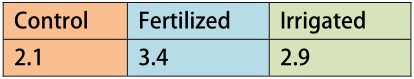
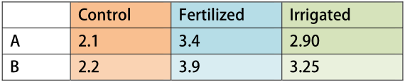
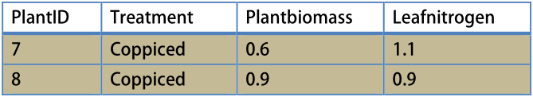
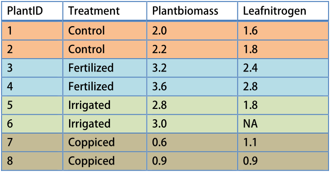

# Summarizing, merging and reshaping data {#summarize}


## Introduction

In this chapter we will look at various ways to summarize data, from simple summaries of what is contained in the original data, to more complex tables of statistics by grouping variables. We will also treat other data skills that are frequently needed, including merging (joining) dataframes by one or more key-variables, and reshaping datasets (from long to wide, and back). 

For each of these operations, the `dplyr` package will be used, since it is very fast, and uses a quite intuitive syntax. However in a few cases we will also look at functions from base R (including `merge`, `summary`, `str`), and useful functions from other packages (especially the handy `summaryBy` function from the `doBy` package).


## Summarizing dataframes

There are a few useful functions to print general summaries of a dataframe, to see which variables are included, what types of data they contain, and so on. We already looked at some of these in Section`sec:dataframes.

The most basic function is `summary`, which works on many types of objects. 

Let's look at the output for the `allom} dataset.

```{r}
allom <- read.csv("Allometry.csv")
summary(allom)
```

For each factor variable, the levels are printed (the `species` variable, levels `PIMO`, `PIPO` and `PSME`. For all numeric variables, the minimum, first quantile, median, mean, third quantile, and the maximum values are shown.

To simply see what types of variables your dataframe contains (or, for objects other than dataframes, to summarize sort of object you have), use the `str` function (short for 'structure').

```{r}
str(allom)
```

Finally, there are two very useful functions in the `Hmisc} package (recall how to install and load packages from Section sec:packages}). The first, `describe`, is much like `summary`, but offers slightly more sophisticated statistics.

The second, `contents`, is similar to `str`, but does a very nice job of summarizing the `factor} variables in your dataframe, prints the number of missing variables, the number of rows, and so on. 

```{r echo=FALSE}
suppressPackageStartupMessages(library(Hmisc))
```
 
```{r}
# read data
pupae <- read.csv("pupae.csv")

# Make sure CO2_treatment is a factor (it will be read as a number)
pupae$CO2_treatment <- as.factor(pupae$CO2_treatment)

# Show contents:
library(Hmisc)  
contents(pupae)
```


Here, `storage` refers to the internal storage type of the variable: note that the factor variables are stored as 'integer', and other numbers as 'double' (this refers to the precision of the number).


## Making summary tables {#tapplyaggregate}

### Summarizing vectors with `tapply` {#tapply}

If we have the following dataset called `plantdat},

```{r echo=FALSE, out.width='33%'}
knitr::include_graphics("screenshots/exampledata.png")
```

and execute the command

```{r eval=FALSE}
with(plantdat, tapply(Plantbiomass, Treatment, mean))
```

we get the result

```{r echo=FALSE, out.width='33%'}

```

Note that the result is a `vector` (elements of a vector can have names, like columns of a dataframe).


If we have the following dataset called `plantdat2},

```{r echo=FALSE, out.width='33%'}
knitr::include_graphics("screenshots/exampledatalarger.png")
```

and execute the command

```{r eval=FALSE}
with(plantdat2, tapply(Plantbiomass, list(Species, Treatment), mean))
```

we get the result

```{r echo=FALSE, out.width='33%'}

```

Note that the result here is a `matrix`, where `A` and `B`, the species codes, are the rownames of this matrix.

Often, you want to summarize a variable by the levels of another variable. For example, in the `rain` data (see Section sec:raindata}), the `Rain` variable gives daily values, but we might want to calculate annual sums,

```{r}
# Read data
rain <- read.csv("Rain.csv")

# Annual rain totals.
with(rain, tapply(Rain, Year, FUN=sum))
```

The `tapply` function applies a function (`sum`) to a vector (`Rain`), that is split into chunks depending on another variable (`Year`). 

We can also use the `tapply` function on more than one variable at a time. Consider these examples on the `pupae` data. 

```{r}
# Read data
pupae <- read.csv("pupae.csv")

# Average pupal weight by CO2 and T treatment:
with(pupae, tapply(PupalWeight, list(CO2_treatment, T_treatment), FUN=mean))

# Further split the averages, by gender of the pupae.
with(pupae, tapply(PupalWeight, list(CO2_treatment, T_treatment, Gender), FUN=mean))
```

As the examples show, the `tapply` function produces summary tables by one or more factors. The resulting object is either a vector (when using one factor), or a matrix (as in the examples using the pupae data). 

The limitations of `tapply` are that you can only summarize one variable at a time, and that the result is not a dataframe.

The main advantage of `tapply` is that we can use it as input to `barplot`, as the following example demonstrates (Fig. fig:pupgroupedbar})

```{r pupgroupedbar, fig.cap="A grouped barplot of average pupal weight by CO2 and Gender for the pupae dataset. This is easily achieved via the use of tapply.", opts.label="smallsquare"}
  # Pupal weight by CO2 and Gender. Result is a matrix.
  pupm <- with(pupae, tapply(PupalWeight, list(CO2_treatment,Gender), 
                             mean, na.rm=TRUE))
  
  # When barplot is provided a matrix, it makes a grouped barplot.
  # We specify xlim to make some room for the legend.
  barplot(pupm, beside=TRUE, legend.text=TRUE, xlim=c(0,8),
          xlab="Gender", ylab="Pupal weight")
```
  
  
  
### Summarizing dataframes with `summaryBy` {#summaryby}
  

If we have the following dataset called `plantdat`,

```{r echo=FALSE, out.width='33%'}
knitr::include_graphics("screenshots/exampledata.png")
```

and execute the command

```{r eval=FALSE}
library(doBy)
summaryBy(Plantbiomass ~ treatment, FUN=mean, data=plantdat)
```
  
we get the result

```{r echo=FALSE, out.width='33%'}
knitr::include_graphics("screenshots/summarybyresult.png")
```

Note that the result here is a `dataframe`.


If we have the following dataset called `plantdat2`,

```{r echo=FALSE, out.width='33%'}
knitr::include_graphics("screenshots/exampledatalarger.png")
```

and execute the command

```{r eval=FALSE}
summaryBy(Plantbiomass ~ Species + Treatment, FUN=mean, data=dfr)
```

we get the result

```{r echo=FALSE, out.width='33%'}
knitr::include_graphics("screenshots/summarybyresultlarger.png")
```

Note that the result here is a `dataframe`.

In practice, it is often useful to make summary tables of multiple variables at once, and to end up with a dataframe. In this book we first use `summaryBy`, from the `doBy` package, to achieve this.

With `summaryBy`, we can generate multiple summaries (mean, standard deviation, etc.) on more than one variable in a dataframe at once. We can use a convenient formula interface for this. It is of the form,

```{r eval=FALSE}
summaryBy(Yvar1 + Yvar2 ~ Groupvar1 + Groupvar2, FUN=c(mean,sd), data=mydata)
```

where we summarize the (numeric) variables `Yvar1` and `Yvar2` by all combinations of the (factor) variables `Groupvar1` and `Groupvar2`.

```{r echo=FALSE}
suppressPackageStartupMessages(library(doBy))
```

```{r}
# Load the doBy package
library(doBy)

# read pupae data if you have not already
pupae <- read.csv("pupae.csv")

# Get mean and standard deviation of Frass by CO2 and T treatments
summaryBy(Frass ~ CO2_treatment + T_treatment,
          data=pupae, FUN=c(mean,sd))

# Note that there is a missing value. We can specify na.rm=TRUE,
# which will be passed to both mean() and sd(). It works because those
# functions recognize that argument (i.e. na.rm is NOT an argument of 
# summaryBy itself!)
summaryBy(Frass ~ CO2_treatment + T_treatment,
          data=pupae, FUN=c(mean,sd), na.rm=TRUE)

# However, if we use a function that does not recognize it, we first have to
# exclude all missing values before making a summary table, like this:
pupae_nona <- pupae[complete.cases(pupae),]

# Get mean and standard deviation for
# the pupae data (Pupal weight and Frass), by CO2 and T treatment.
# Note that length() does not recognize na.rm (see ?length), which is
# why we have excluded any NA from pupae first.
summaryBy(PupalWeight+Frass ~ CO2_treatment + T_treatment,
          data=pupae_nona,
          FUN=c(mean,sd,length))
```

You can also use any function that returns a vector of results. In the following example we calculate the 5% and 95% quantiles of all numeric variables in the allometry dataset. To do this, use `.} for the left-hand side of the formula.

```{r}
# . ~ species means 'all numeric variables by species'.
# Extra arguments to the function used (in this case quantile) can be set here as well,
# they will be passed to that function (see ?quantile).
summaryBy(. ~ species, data=allom, FUN=quantile, probs=c(0.05, 0.95))
```


## Using `dplyr`

We started with the `summaryBy` package, since it is so easy to use. A more modern and popular approach is to use `dplyr` for all your dataframe summarizing needs. The main advantage is that `dplyr` is very, very fast. For datasets with > hundreds of thousands of rows, you will notice an incredible speed increase. For millions of rows, you really have to use `dplyr` (or `data.table`, but we don't cover that package in this book).

Making summary tables as we did in the above examples requires two steps:

1. Group your dataframe by one or more factor variables
2. Apply summarizing functions to each of the groups

As is the norm, we use the pipe operator (`%>%`) to keep the steps apart. Here is a simple example to get started.

```{r}
library(dplyr)

group_by(pupae, CO2_treatment, T_treatment) %>%
  summarize(Frass_mean = mean(Frass, na.rm=TRUE),
            Frass_sd = sd(Frass, na.rm=TRUE)) %>%
  as.data.frame
```

I used `as.data.frame` at the end, so we arrive at an actual dataframe, not a tibble (only for the reason so you can compare the output to the previous examples). The `dplyr` package (and others) always produce tibbles, which are really just dataframes but with some adjusted printing methods.

In `summarize` you can specify each of the new variables that should be produced, in this case giving mean and standard deviation of Frass. If we want to apply a number of functions over many variables, we can use `summarize_at`, like so:

```{r}
group_by(pupae, CO2_treatment, T_treatment) %>%
  summarize_at(.vars = c("Frass", "PupalWeight"),
                .funs = c("mean", "sd")) %>%
  as.data.frame
```

The result is identical to our last example with `summaryBy`.


### Working example : Calculate daily means and totals {#dailymeansexample}

Let's look at a more advanced example using weather data collected at the Hawkesbury Forest Experiment in 2008 (see Section sec:hfemet}). The data given are in half-hourly time steps. It is a reasonable request to provide data as daily averages (for temperature) and daily sums (for precipitation). 

The following code produces a daily weather dataset, and Fig. fig:hfemetaggregate.

```{r hfemetaggregate,  fig.cap='Daily rainfall at the HFE in 2008', opts.label="smallsquare"}

# Read data, convert DateTime field to a proper Datetime class using
# lubridate's mdy_hm function, and add a Date column with as.Date.
library(dplyr)
library(lubridate)

hfemet <- read.csv("HFEmet2008.csv") %>%
  mutate(DateTime = mdy_hm(DateTime),
         Date = as.Date(DateTime))

# Summarize data into daily variables, total daily rain, and average temperature
hfemet_agg <- group_by(hfemet, Date) %>%
  summarize(Rain = sum(Rain),
            Tair = mean(Tair))

# A simple plot of daily rainfall.
library(ggplot2)
ggplot(hfemet_agg, aes(x = Date, y = Rain)) + 
  geom_bar(stat="identity") +
  theme_minimal()

```


## Tables of counts {#xtabs}

It is often useful to count the number of observations by one or more multiple factors. One option is to use `tapply` or `summaryBy` in combination with the `length` function. A much better alternative is to use the `xtabs` and `ftable` functions, in addition to the simple use of `table`. Alternatively, `dplyr` provides a `count` function. We will look at both options.

Consider these examples using the Titanic data (see Section sec:titanic}).

```{r tidy = FALSE}
# Read titanic data
titanic <- read.table("titanic.txt", header=TRUE)

# Count observations by passenger class
table(titanic$PClass)

# With more grouping variables, it is more convenient to use xtabs.
# Count observations by combinations of passenger class, sex, and whether they survived:
xtabs( ~ PClass + Sex + Survived, data=titanic)

# The previous output is hard to read, consider using ftable on the result:
ftable(xtabs( ~ PClass + Sex + Survived, data=titanic))

# Using dplyr, the result is a dataframe (actually, a tibble)
library(dplyr)
titanic %>% count(PClass, Sex, Survived)

```

## Adding summary variables to dataframes {#summaryvars}

We saw how `tapply` can make simple tables of averages (or totals, or other functions) of some variable by the levels of one or more factor variables. The result of `tapply` is typically a vector with a length equal to the number of levels of the factor you summarized by (see examples in Section sec:tapply}). 

Consider the `allometry` dataset, which includes tree height for three species. Suppose you want to add a new variable 'MaxHeight', that is the maximum tree height observed per species. We can use `ave` to achieve this:

```{r}
# Read data
allom <- read.csv("Allometry.csv") %>%
  mutate(MaxHeight = ave(height, species, FUN=max))

# Look at first few rows (or just type allom to see whole dataset)
head(allom)
```

Note that you can use any function in place of `max`, as long as that function can take a vector as an argument, and returns a single number. 

> **Try this yourself**
> If you want results similar to `ave`, you can use `summaryBy` with the argument `full.dimension=TRUE`. Try `summaryBy` on the `pupae` dataset with that argument set, and compare the result to `full.dimension=FALSE`, which is the default. 


## Reordering factor levels based on a summary variable {#reorder}

It is often useful to tabulate your data in a meaningful order. We saw that, when using `summaryBy`, `tapply` or similar functions, that the results are always in the order of your factor levels. Recall that the default order is alphabetical. This is rarely what you want.

You can reorder the factor levels by some summary variable. For example,

```{r warning=FALSE}
# Reorder factor levels for 'Manufacturer' in the cereal data 
# by the mean amount of sodium.

# Read data, show default (alphabetical) levels:
cereal <- read.csv("cereals.csv")
levels(cereal$Manufacturer)

# Now reorder:
cereal <- mutate(cereal, 
                 Manufacturer = reorder(Manufacturer, sodium, 
                                        median, na.rm=TRUE))

# And inspect the new levels
levels(cereal$Manufacturer)

# Tables are now printed in order:
with(cereal, tapply(sodium, Manufacturer, median))
```

This trick comes in handy when making barplots; it is customary to plot them in ascending order if there is no specific order to the factor levels, as in this example.

The following code produces Fig. fig:coweetabar.

```{r echo = FALSE}
suppressPackageStartupMessages(library(gplots))
suppressPackageStartupMessages(library(doBy))
```

```{r coweetabar, fig.cap='An ordered barplot for the coweeta tree data (error bars are 1 SD).', warning=FALSE, opts.label="largesquare"}

# Here we read the data, add a reordered factor variable,
# and continue with making the summary table used in the plot.
coweeta_table <- read.csv("coweeta.csv") %>%
  mutate(species = reorder(species, height, mean, na.rm=TRUE)) %>%
  group_by(species) %>%
  summarize(height_mean = mean(height, na.rm=TRUE),
            height_sd = sd(height, na.rm=TRUE))

ggplot(coweeta_table, aes(x = species, y = height_mean)) +
  geom_bar(stat="identity", fill="red") +
  theme_minimal() +
  geom_errorbar(aes(ymin = height_mean - height_sd,
                    ymax = height_mean + height_sd), width=0.2) +
  labs(y = "Height (m)", x = "Species")
```

The above example uses the more modern approach with `ggplot2`  and `dplyr`, but we can get practically the same result with `doBy` and `gplots` - below is the code for comparison (output not shown).

```{r results='hide', fig.keep='none'}
library(doBy)
coweeta <- read.csv("coweeta.csv")
coweeta$species <- with(coweeta, reorder(species, height, mean, na.rm=TRUE))
coweeta_agg <- summaryBy(height ~ species, data=coweeta, FUN=c(mean,sd))

# For barplot2, which adds options for error bars
library(gplots)

# This par setting makes the x-axis labels vertical, so they don't overlap.
par(las=2)
with(coweeta_agg, barplot2(height.mean, names.arg=species,
                           space=0.3, col="red",plot.grid=TRUE,
                           ylab="Height (m)",
                           plot.ci=TRUE,
                           ci.l=height.mean - height.sd,
                           ci.u=height.mean + height.sd))
```


> **Try this yourself**
> The above example orders the factor levels by increasing median sodium levels. 
> Try reversing the factor levels, using the following code after `reorder`.
> `coweeta$species <- factor(coweeta$species, levels=rev(levels(coweeta$species)))`
> Here we used `rev` to reverse the levels.


## Combining dataframes


### Merging dataframes {#merge}

If we have the following dataset called `plantdat},

```{r echo=FALSE, out.width='33%'}
knitr::include_graphics("screenshots/exampledata.png")
```

and we have another dataset, that includes the same `PlantID` variable (but is not necessarily ordered, nor does it have to include values for every plant):
  
```{r echo=FALSE, out.width='33%'}
knitr::include_graphics("screenshots/leafnitrogendata.png")
```

and execute the command

```{r eval=FALSE}
merge(plantdat, leafnitrogendata, by="PlantID")
```

we get the result

```{r echo=FALSE, out.width='33%'}
knitr::include_graphics("screenshots/mergeresult.png")
```

Note the missing value (`NA}) for the plant for which no leaf nitrogen data was available.

In many problems, you do not have a single dataset that contains all the measurements you are interested in -- unlike most of the example datasets in this tutorial. Suppose you have two datasets that you would like to combine, or `merge`. This is straightforward in R, but there are some pitfalls.

Let's start with a common situation when you need to combine two datasets that have a different number of rows. 

```{r}
# Two dataframes
data1 <- data.frame(unit=c("x","x","x","y","z","z"),Time=c(1,2,3,1,1,2))
data2 <- data.frame(unit=c("y","z","x"), height=c(3.4,5.6,1.2))

# Look at the dataframes
data1
data2

# Merge dataframes:
combdata <- merge(data1, data2, by="unit")

# Combined data
combdata
```

Sometimes, the variable you are merging with has a different name in either dataframe. In that case, you can either rename the variable before merging, or use the following option:

```{r eval = FALSE}
merge(data1, data2, by.x="unit", by.y="item")
```

Where `data1` has a variable called 'unit', and `data2` has a variable called 'item'.

Other times you need to merge two dataframes with multiple key variables. Consider this example, where two dataframes have measurements on the same units at some of the the same times, but on different variables:

```{r} 
# Two dataframes
data1 <- data.frame(unit=c("x","x","x","y","y","y","z","z","z"),
Time=c(1,2,3,1,2,3,1,2,3),
Weight=c(3.1,5.2,6.9,2.2,5.1,7.5,3.5,6.1,8.0))
data2 <- data.frame(unit=c("x","x","y","y","z","z"),
Time=c(1,2,2,3,1,3),
Height=c(12.1,24.4,18.0,30.8,10.4,32.9))

# Look at the dataframes
data1
data2

# Merge dataframes:
combdata <- merge(data1, data2, by=c("unit","Time"))

# By default, only those times appear in the dataset that have measurements
# for both Weight (data1) and Height (data2)
combdata

# To include all data, use this command. This produces missing values for some times:
merge(data1, data2, by=c("unit","Time"), all=TRUE)
# Compare this result with 'combdata' above!
```


### Merging multiple datasets {#multmerge}


Consider the cereal dataset (Section sec:cerealdata}), which gives measurements of all sorts of contents of cereals. Suppose the measurements for 'protein', 'vitamins' and 'sugars' were all produced by different labs, and each lab sends you a separate dataset. To make things worse, some measurements for sugars and vitamins are missing, because samples were lost in those labs. 

How to put things together?

```{r}
# Read the three datasets given to you from the three different labs:
cereal1 <- read.csv("cereal1.csv")
cereal2 <- read.csv("cereal2.csv")
cereal3 <- read.csv("cereal3.csv")

# Look at the datasets:
cereal1
cereal2
cereal3

# Note that the number of rows is different between the datasets, 
# and even the index name ('Cereal.name') differs between the datasets.

# To merge them all together, use merge() twice, like this.
cerealdata <- merge(cereal1, cereal2, 
                    by.x="Cereal.name", 
                    by.y="cerealbrand", all.x=TRUE)
# NOTE: all.x=TRUE specifies to keep all rows in cereal1 that do not exist in cereal2.

# Then merge again:
cerealdata <- merge(cerealdata, cereal3, 
                    by.x="Cereal.name", 
                    by.y="cerealname", all.x=TRUE)

# And double check the final result
cerealdata
# Note that missing values (NA) have been inserted where some data was not available.
```

### Using join from `dplyr`

We showed how to use the `merge` function above, which is provided by base R. For larger datasets, it is advisable to use the `join*` functions from `dplyr`.

Instead of specifying which rows to keep with arguments `all.x`, `all`, etc., `dplyr` provides several functions that should make some intuitive sense. The table below compares `merge` and `join*`.

+------------------------------------+-------------------------------+
| `merge()`                          | `dplyr::join*`                |
+====================================+===============================+
| `merge(dat1, dat2, all = FALSE)`   | `inner_join(dat1, dat2)`      |
+------------------------------------+-------------------------------+
| `merge(dat1, dat2, all.x = TRUE)`  | `left_join(dat1, dat2)`       |
+------------------------------------+-------------------------------+
| `merge(dat1, dat2, all.y = TRUE)`  | `right_join(dat1, dat2)`      |
+------------------------------------+-------------------------------+
| `merge(dat1, dat2, all = TRUE)`    | `full_join(dat1, dat2)`       |
+------------------------------------+-------------------------------+

One other function is provided that has no simple equivalent in base R, `anti_join`, which can be used to find all observations that have *no match* between the two datasets. This can be handy for error-checking.


### Row-binding dataframes {#rbind}

If we have the following dataset called `plantdat`,

```{r echo=FALSE, out.width='33%'}
knitr::include_graphics("screenshots/rbindinput.png")
```

and we have another dataset (`plantdatmore`), *with exactly the same columns* (including the names and order of the columns),


```{r echo=FALSE, out.width='33%'}

```

and execute the command

```{r eval=FALSE}
rbind(plantdat, plantdatmore)
```

we get the result

```{r echo=FALSE, out.width='33%'}

```


Using `merge`, we were able to glue dataframes together side-by-side based on one or more 'index' variables. Sometimes you have multiple datasets that can be glued together top-to-bottom, for example when you have multiple very similar dataframes. We can use the `rbind` function, like so:

```{r}
# Some fake data
mydata1 <- data.frame(var1=1:3, var2=5:7) 
mydata2 <- data.frame(var1=4:6, var2=8:10) 

# The dataframes have the same column names, in the same order:
mydata1
mydata2

# So we can use rbind to row-bind them together:
rbind(mydata1, mydata2)
```

Let's look at the above `rbind` example again but with a modification where some observations are duplicated between dataframes. This might happen, for example, when working with files containing time-series data and where there is some overlap between the two datasets. The `union` function from the `dplyr` package only returns unique observations:
  

```{r}
# Some fake data
mydata1 <- data.frame(var1=1:3, var2=5:7) 
mydata2 <- data.frame(var1=2:4, var2=6:8) 

# The dataframes have the same column names, in the same order:
mydata1
mydata2

# 'rbind' leads to duplicate observations, 'union' removes these:
dplyr::union(mydata1, mydata2)
rbind(mydata1, mydata2)
```

  
Sometimes, you want to `rbind` dataframes together but the column names do not exactly match. One option is to first process the dataframes so that they do match (using subscripting). Or, just use the `bind_rows` function from `dplyr`. Look at this example where we have two dataframes that have only one column in common, but we want to keep all the columns (and fill with `NA` where necessary),

```{r}
# Some fake data
mydata1 <- data.frame(index=c("A","B","C"), var1=5:7) 
mydata2 <- data.frame(var1=8:10, species=c("one","two","three")) 

# smartbind the dataframes together
dplyr::bind_rows(mydata1, mydata2)
```

*Note:* an equivalent function to bind dataframes side-by-side is `cbind`, which can be used instead of `merge` when no index variables are present. However, in this book, the use of `cbind` is discouraged for dataframes as it can lead to problems that are difficult to fix, and in all practical applications a merge is preferable.


