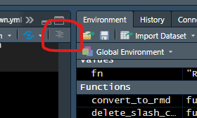

# Project management and workflow {#projectman}


```{r include=FALSE, message=FALSE, warning=FALSE}
suppressPackageStartupMessages({
  library(lubridate)
  library(doBy)
})

source("R/theme_datapelikaan.R")
library(showtext)
font_add_google(name = "Lato", family = "Lato", regular.wt = 400, bold.wt = 700)
library(ggplot2)
theme_set(theme_datapelikaan(base_family = "Lato"))

library(knitr)
current_output <- opts_knit$get("rmarkdown.pandoc.to")
opts_knit$set(kable.force.latex = TRUE)
knit_theme$set("earendel")
opts_chunk$set(background="grey94", 
               fig.showtext = TRUE,
               dev = ifelse(current_output == "latex", "pdf", "svg"))
```
 
## Tips on organizing your code

In this chapter, we present a few tips on how to improve your workflow and organization of scripts, functions, raw data, and outputs (figures, processed data, etc.). The structure that we present below is just an example, and will depend on the particular project, your requirements, how much time you have, and personal preference. 

The main **challenge** in developing more complex workflows, where you have multiple data sources, scripts for various analyses, and outputs of various kinds (figures, markdown documents, prepared data etc.) is to keep things organized, avoid *clutter*, and make sure you know how the outputs were produced.

All projects are different, and we encourage you to experiment with different workflows and organization of your script(s) and outputs. 

The following is a **rule of thumb** list for R project management:

- Use 'projects' in Rstudio to manage your files and workspace.
- Use *git* version control (see Chapter \@ref(versioncontrol)).
- Use a logical folder structure inside your projects, keeping similar files together (data, scripts, output, etc.).
- Avoid writing long scripts, instead break them into a logical collection of shorter scripts.
- Load all required packages in a separate script.
- Outputs (figures, processed datasets) are *disposable*, your scripts can always re-produce the output.
- Keep function declarations separate from other code.
- Write functions as much as possible.
- Add a 'README.md' file to your project, markdown-formatted file explaining what the project does, a list of any dependencies, how to run the code, where to find the output, etc.


In this chapter we show an example project structure, which uses most of the above rules to come up with a transparent project workflow. If you follow (something like) the structure we show here, you have the added benefit that your directory is fully portable. That is, you can zip it, email it to someone, they can unzip it and run the entire analysis. 

For effective project management we find using custom functions to organize our work most useful. See Chapter \@ref(programming) for general introduction to functions, and Section \@ref(scriptstructure) on how to organize your code with functions.


## Set up a project in Rstudio {#rstudioprojects}

The most important tip is to *use projects in Rstudio*. Projects are an efficient method to keep your files organized, and to keep all your different projects separated. There is a natural tendency for analyses to grow over time, to the point where they become too large to manage properly. The way we usually deal with this is to try to split projects into smaller ones, even if there is some overlap between them. 

```{block2, type = "rmdcaution"}
Stop using `setwd()` in any of your scripts. This is never a good idea, for various reasons. Instead use Rstudio projects as a way to set the working directory automatically (and cleanly).

You can also stop using `rm(list=ls())` in any of your scripts. The problem with this command is that it does not clean *everything* : all packages are still loaded, and hidden objects also remain (ones starting with `.`), and certain `options` may have been set. Instead, test reproducing your project by selecting `Session/Restart R` and running the project.
```


In Rstudio, click on the menu item `File/New Project...`. If you already have a folder for the project, take the 2nd option (`Existing directory`), otherwise create a folder as well by choosing the 1st option (`New project`). We will discuss "version control" in the next chapter.

Browse for the directory you want to create a project in, and click `Choose`. This creates a file with extension `.Rproj`. Whenever you open this project, Rstudio will set the working directory to the location of the project file. If you use projects, you no longer need to set the working directory manually as we showed in Section \@ref(fileswd).

Rstudio has now switched to your new project. Notice in the top-right corner there is a button that shows the current project. For the example project 'facesoil', it looks like this:

```{r echo=FALSE, out.width='30%'}
knitr::include_graphics("screenshots/projectbutton.png")
```

**The Project button in Rstudio**

By clicking on that button you can easily switch over to other projects. The working directory is automatically set to the right place, and all files you had open last time are remembered as well. As an additional bonus, the workspace is also cleared. This ensures that if you switch projects, you do not inadvertently load objects from another project.


## Directory structure

For the 'facesoil' project, we came up with the following directory structure. Each item is described further below.

```{r echo=FALSE, out.width='70%'}
knitr::include_graphics("screenshots/folderstructure.png")
```

**Folder structure; just an example**


### `rawdata`

If your project contains any raw data files (within ) *keep your raw data separate from everything else*. Here we have placed our raw CSV files in the `rawdata` directory.

In some projects it makes sense to further keep raw data files separate from each other, for example you might have subfolders in the rawdata folder that contain different types of datasets (e.g. 'rawdata/leafdata', 'rawdata/isotopes'). Again, the actual solution will depend on your situation, but it is at least very good practice to store your raw data files in a separate folder.

### `Rfunctions`

If you do not frequently write functions already, you should force yourself to do so. Particularly for tasks that you do more than once, functions can greatly improve the clarity of your scripts, helps you avoid mistakes, and makes it easier to reuse code in another project. 

It is good practice to keep functions in a separate folder, for example `Rfunctions`, with each function in a separate file (with the extension `.R`). It may look like this,

```{r echo=FALSE, out.width='70%'}
knitr::include_graphics("screenshots/rfunctions.png")
```

**Contents of Rfunctions folder, example.**

We will use `source()` to load these functions, see further below.

### `output`

It is a good idea to send all output from your R scripts to a separate folder. This way, it is very clear what the *outputs* of the analysis are. It may also be useful to have subfolders specifying what type of output it is. Here we decided to split it into figures, processeddata, and text :

```{r echo=FALSE, out.width='70%'}
knitr::include_graphics("screenshots/output.png")
```

**Contents of Rfunctions folder, example.**


## The R scripts

A few example scripts are described in the following sections. Note that these are just examples, the actual setup will depend on your situation, and your personal preferences. The main point to make here is that it is tremendously useful to separate your code into a number of separate scripts. This makes it easier to maintain your code, and for an outsider to follow the logic of your workflow.

### `facesoil_analysis.R`

This is our 'master' script of the project. It calls (i.e., executes) a couple of scripts using `source`. First, it 'sources' the `facesoil\_load.R` script, which loads packages and functions, and reads raw data. Next, we do some analyses (here is a simple example where we calculate daily averages), and call a script that makes the figures (`facesoil_figures.R`).

Note how we direct all output to the `output` folder, by specifying the *relative path*, that is, the path relative to the current working directory.

```{r eval=FALSE}
# Calls the load script.
source("facesoil_load.R")

# Export processed data
write.csv(allTheta, "output/processeddata/facesoil_allTheta.csv",
          row.names=FALSE)

## Aggregate by day

# Make daily data
allTheta$Date <- as.Date(allTheta$DateTime)
allTheta_agg <- summaryBy(. ~ Date + Ringnr, data=allTheta,
                          FUN=mean, keep.names=TRUE)

# Export daily data
write.csv(allTheta_agg, "output/processeddata/facesoil_alltheta_daily.csv",
          row.names=FALSE)

## make figures
source("figures.R")

```


### `facesoil_figures.R`

In this example we make the figures in a separate script. If your project is quite small, perhaps this makes little sense. When projects grow in size, though, I have found that collecting the code that makes the figures in a separate script really helps to avoid clutter.

Also, you could have a number of different 'figure' scripts, one for each 'sub-analysis' of your project. These can then be sourced in the master script (here `facesoil\_analysis.R`), for example, to maintain a transparent workflow.

Here is an example script that makes figures only. Note the use of `dev.copy2pdf`, which will produce a PDF and place it in the `output/figures` directory.

```{r eval=FALSE}
# Make a plot of soil water content over time
pdf("./output/figures/facesoil_overtime.pdf")
with(allTheta, plot(DateTime, R30.mean, pch=19, cex=0.2,
                    col=Ringnr))
dev.off()

# More figures go here!
```


The above is OK, but we can do better by writing it into a function, and then calling it to make the PDF. Even better, the PDF making can be done Here we also use `on.exit` to safely close the PDF, see Section \@ref(onexit.

Like so,

```{r, eval=FALSE}

# A function that defines our plot
# Write functions like these, and collect them in a separate script,
# for example "figure_definitions.R".
soilplot_1 <- function(data){
  with(data, plot(DateTime, R30.mean, pch=19, cex=0.2,
                    col=Ringnr))  
}

# A generic function that makes a PDF of a provided function call
# Place this function in a script with a collection of functions.
to.pdf <- function(expr, filename, ...) {
  
  pdf(filename, ...)
  on.exit(dev.off())
  
  # A trick to run the provided function call in the global environment
  eval.parent(substitute(expr))
}


# Finally, after having sourced both our function definition, 
# and the generic function to.pdf, we can make the PDFs.
to.pdf(
  soilplot_1(allTheta), 
  filename = "output/figures/figure1.pdf")
)

```


### `facesoil_load`

This script contains all the bits of code that are 

- Cleaning the workspace
- Loading homemade functions
- Reading and pre-processing the raw data


It is useful to load all packages in one location in your, which makes it easy to fix problems should they arise (i.e., some packages are not installed, or not available).

```{r eval=FALSE}
# Load packages
source("load_packages.R")

# Source functions (this loads functions but does no actual work)
source("Rfunctions/rmDup.R")

# Make the processed data (this runs a script)
source("facesoil_readdata.R")
```


### `load_packages.R`

We find it very convenient to collect all `library` calls throughout your project in a single script. The advantage is that at the top of one of the main analysis scripts, we can simply call `source("load_packages.R")`. If any packages are missing, or something else failed, we know before try to we execute any other code.

It may also be convenient to suppress all messages we see when loading packages. An example script may look like:


```{r, eval = FALSE}
suppressPackageStartupMessages({
  library(dplyr)
  library(lubridate)
  library(glue)
})
```

The *disadvantage* of a loading script like this is that we assume that the user has installed all of the required packages. In Rstudio, however, if you open this script - a small message will appear at the top of the script, "Would you like to install missing packages?". If you click OK all packages mentioned in the script that you have not installed will be installed for you.

Another approach uses the `pacman` package, which automatically installs missing packages (see also Section \@ref(pacman)):

```{r}
if(!require(pacman))install.packages("pacman")
pacman::p_load(gplots, geometry, rgl, remotes, svglite)
```

```{block2 type = "rmdreading"}
To learn more about advanced management of R package dependencies, read Section \@ref(masteringpackages)
```


```{block2, type = "rmdcaution"}
Never include `install.packages` in any of your *scripts* in your project. You do not want to call it more than once, otherwise the execution of the project will be much slower (and require an internet connection).
```


### `facesoil_readdata.R`

This script produces a dataframe based on the raw CSV files in the `rawdata` folder. The example below just reads a dataset and changes the DateTime variable to a POSIXct class. In this script, I normally also do all the tedious things like deleting missing data, converting dates and times, merging, adding new variables, and so on. The advantage of placing all of this in a separate script is that you keep the boring bits separate from the code that generates results, such as figures, tables, and analyses.

```{r eval=FALSE}
# Read raw data from 'rawdata' subfolder
allTheta <- read.csv("rawdata/FACE_SOIL_theta_2013.csv")

# Convert DateTime
allTheta$DateTime <- ymd_hms(as.character(allTheta$DateTime))

# Add Date
allTheta$Date <- as.Date(allTheta$DateTime)

# Etc.
```


## Archiving the output


In the example workflow we have set up in the previous sections, all items in the output folder will be automatically overwritten every time we run the master script `facesoil_analysis.R`. One simple way to back up your previous results is to create a zipfile of the entire output directory, place it in the `archive` folder, and rename it so it has the date as part of the filename.

After a while, that directory may look like this:

```{r echo=FALSE, out.width='70%'}
knitr::include_graphics("screenshots/archive.png")
```

**Contents of Rfunctions folder, example.**

If your `processData` folder is very large, this may not be the optimal solution. Perhaps the `processedData` can be in a separate output folder, for example.


### Adding a Date stamp to output files

Another option is to use a slightly different output filename every time, most usefully with the current Date as part of the filename. The following example shows how you can achieve this with the `today` from the `lubridate` package, and the `glue` package:

```{r }
# For the following to work, load lubridate
# Recall that in your workflow, it is best to load all packages in one place.
library(lubridate)
library(glue)

# Make a filename with the current Date:
fn <- glue("output/figures/FACE_soilfigure1_{today()}.pdf")
fn

# Also add the current time, make sure to reformat as ':' is not allowed!
fn <- glue("output/figures/FACE_soilfigure1_{format(now(),'%Y-%m-%d_%H-%M')}.pdf")
fn
```


## A logical structure for your scripts {#scriptstructure}


### Write functions, not long scripts

If a script becomes too long, write more functions. Writing your own functions is the most important advise if you want to write and maintain robust, complex projects.

As pointed out in the Chapter on Project management (\@ref(projectman)), save these functions separately, for example "R/functions.R", and `source` them with:

```{r, eval = FALSE}
source("R/functions.R")
```

Unfortunately `source` is not vectorized, so to read all R scripts from a subdirectory you can simply do,

```{r, eval = FALSE}
for(fn in dir("R", pattern = "[.]R$", full.names = TRUE)){
  source(fn)
}
```


```{block2, type = "rmdtry"}
Write the above snippet into a function, which takes the directory to search as an argument.
```


### Divide your script into functional blocks


Dividing your scripts into a few functional blocks can help readability and reliability. 
With special formatting, you can even improve the *table of contents* (TOC) menu in Rstudio for a script. Run the example below, and then find the TOC button in Rstudio:

```{r echo=FALSE, out.width='30%'}

```

**Access the (nearly) automatic TOC in Rstudio**


In the following example script, note that we load all packages at the beginning of the script, so that when something goes wrong at that stage, we know before executing any of the 'real' code.

Also note the use of `#-----`, this helps to make the TOC as mentioned above.

```{r eval = FALSE}
# An example script
# 2020, Author


#----- Load packages -----
library(dplyr)
library(rvest)
library(stringr)
library(glue)

#----- Custom functions -----
source("R/functions.R")
source("R/database_functions.R")

#----- Configuration -----

# Load configuration (passwords etc., see next Section!)
.conf <- yaml::read_yaml(file = "config.yml")

#----- Database -----

# Make database connection
db_con <- make_database_connection_knmi(.conf)

# Download data
cloud_data <- download_cloud_data(con = db_con)

# Archive the data
fn <- glue("archive/out_{Sys.Date()}.rds")
try(saveRDS(cloud_data, fn), silent = TRUE)

#----- Visualization -----

# Make visuals
make_cloud_maps(data = cloud_data)

#----- Model -----

# Do some advanced modelling
model_run <- run_cloudy_model(data = cloud_data)

# Upload the model results to a remote database
upload_model_db16(model_run, config = .conf)

```

The *fictional* script above is just an example how you can divide a *master script* into logical statements, using functions that perform all the underlying tasks.

One major advantage of the above approach is because functions execute their "inner workings" in a **separate environment**, which means that objects inside a function are not visible either outside the function (like the main script) or in any other script. 

That way, executing the script above does not produce any objects in the environment (the memory) other than the ones *returned* by the functions. All the intermediate objects that were executed inside each function have disappeared, freeing memory and avoiding conflicts.


