# Version control with git {#versioncontrol}

## Should I learn version control? {#shouldigit}

When you use version control, you can do the following:


- Keep a history of all the changes you have made to your code.
- Be able to revert to an old version, or briefly look around in old code, or find any code you have written at some time in the past.
- Undo fatal coding mistakes.
- Avoid having multiple versions of the same script (`myscrip_v1.R`, `myscript_v1_mod2.R` etc.), and commented-out bits of code that you no longer need.
- Collaborate with others on the same code, and easily merge the changes you and your collaborators make.
- Maintain an online backup of your code base.


These are all basic capabilities of version control, and as you can see an absolute requirement for even the somewhat serious coder. Here we use version control with *git*, the most popular system. In this chapter, I will give an informal introduction to version control, and focus on its use in Rstudio. The command line will also be introduced, particularly for somewhat more advanced options.


## Basics of git

### Basic principles

With git, every folder that you work in can have its own version control repository. This allows you to keep your projects neatly organized in separate folders, each with its own history and set of files that belong together. Organizing code in smaller projects also makes for a natural connection to *projects* in Rstudio, as we will see shortly. 

Not all files in the folder need to be kept track of in the git repository. You can specify yourself which files you want to have under version control. Generally speaking it's up to you which files to track, but a few guidelines are helpful. Mind you that exceptions will arise for each of these ideas; every project is different.

- It is useful to follow the idea that *input files* (code, data) are the most important files in your project, whereas *output files* (figures, processed data, markdown reports, etc.) should be treated as temporary. If you set up your workflow well, you should always be able to generate all outputs from the inputs. As a result, generally speaking **it is a good idea to version control all input files, but none of your output files}.
- Avoid tracking binary files (non-text files). The two reasons are that a) git cannot see incremental changes to these files (only that the entire file has changed), and b) continuously updating larger binary files will increase the size of the git repository (a collection of hidden files storing your history) - eventually to unmanageable bloatedness.
- There is no need to track the Rstudio project file (*.Rproj), and probably better if you don't especially when collaborating.
- Text-based datasets can be stored very well in git repositories, but that git is not a data management tool per se. It is therefore a bad idea to include *large* datasets, only smallish datasets in the repository.


You can decide manually which files to track, and you can also "ignore" files by listing them in a special file, `.gitignore`, as we will see later.

With git, you can 'store' a snapshot of all the tracked files in your repository as often as you like. Normally, this snapshot represents a significant change you made to your code, some new feature added, new figures coded, or whatever. It can be any point during your work where you think it may be useful to return to. With every snapshot, you can decide which changes to the tracked files should be included ('staged'). It is thus **important to realize that a version control repository acts on multiple files in the folder**, not separately for each file. This way we can also add and delete files, and keep track of their histories as well (e.g. return to a version of the repository when a particular file was not deleted).

When we store a snapshot of the repository, this is called a **commit**. When we commit changes to the files in the repository, we do this because we may wish to return to this point, or clearly document the changes we have made. When a commit is made, a message has to be written to document what we have done (as we will see further below). Every time we commit, we can manually select which files should be added to the next snapshot. This process is called **staging**, and it allows you to decide to keep some changes, and undo all other changes, for example. 

```{block2 type="rmdreading"}
It needs to be stressed that this chapter is a brief non-technical introduction to the topic. It only covers the basic capabilities of git. A very good collection of tutorials and more advanced books is listed on SixRevisions\footnote{<http://sixrevisions.com/resources/git-tutorials-beginners/}>. 
```


#### Local and remote repositories

An important concept when starting with git is that there is a distinction between **local** and **remote** repositories. With git, your version control **is fundamentally done on your computer, that is, it is a local repository**. Optionally, this local repository may be synced with a remote repository (on some online web service). It is thus important to understand that **a)** you do not need to have a remote repository for git to function (you do not need an internet connection) and **b)** you must have a local repository even if you also have a remote one. 

Finally, do not confuse 'github' with 'git', the former is a website (github.com) used for hosting remote git repositories, the latter is the actual version control system. There are other websites of that kind (for example bitbucket.org). The inventor of git has nothing to do with these websites.


#### Rstudio projects

If you end up working primarily from Rstudio, we very strongly recommend the use of **Projects** in Rstudio to keep your work organized, and to help set the working directory.

Rstudio projects are really just small files added to a certain folder, which "tags" that folder as containing a particular project. You can switch easily between different projects, or have multiple instances of Rstudio open, all with different projects (something I do a lot). When you switch to a project, *it also sets the working directory* to the folder where the .Rproj file is located.

#### Set up a project in Rstudio

In a later section (\@ref(firstgitsession)) we look at setting up a project based on a remote git repository (for example, github), but first we show how to make a new project in Rstudio.

In Rstudio, click on the menu item `File/New Project...`. If you already have a folder for the project, take the 2nd option (`Existing directory`), otherwise create a folder as well by choosing the 1st option (`New project`). We will discuss "version control" in the next chapter.

Browse for the directory you want to create a project in, and click `Choose`. This creates a file with extension `.Rproj`. Whenever you open this project, Rstudio will set the working directory to the location of the project file. If you use projects, you no longer need to set the working directory manually as we showed in Section \@ref(fileswd).

Rstudio has now switched to your new project. Notice in the top-right corner there is a button that shows the current project. For the example project 'facesoil', it looks like this:

```{r echo=FALSE, out.width='30%'}
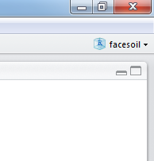
```

**Create a new Rstudio project**

By clicking on that button you can easily switch over to other projects. The working directory is automatically set to the right place, and all files you had open last time are remembered as well. As an additional bonus, the workspace is also cleared. This ensures that if you switch projects, you do not inadvertently load objects from another project.


### Installing git

To get started, first install the actual git program from <https://git-scm.com/>. During the installation process, do not change any of the defaults, just press OK when prompted.

The first time you use git on a computer, you have to set your name and email. These will be appended to each time you commit (very useful when collaborating!). 

Normally you can open a 'git bash shell' (a command line window) from Rstudio, as we show in Section \@ref(commandline). This first time, however, you *might* have to find `Git Bash` in the list of installed programs.

With the shell open, type the following commands, using the name and email address you want appended to each commit. You can change this setting any time, the current setting will be applied to the next commit.

```
git config --global user.name "My Name"
git config --global user.email "myemail@somewhere.com"
```

To check the settings configuration file (which is stored in your home directory), use :

```
git config --list
```

You can now close the shell. We return to the shell in a later section. The built-in menu's in Rstudio are fine for 95% of our work with git.


### Using git in Rstudio

After installation, Rstudio may have trouble finding the git executable (a reboot may help, but this does not always fix the problem). We can let Rstudio know where git was installed by clicking `Browse` in the following screenshot (on Windows it will most likely be installed in this exact directory).

```{r echo=FALSE, out.width='75%'}
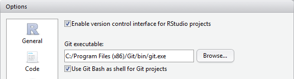
```

**Click `Browse` to find the directory where git.exe is installed, on Windows it will be this exact directory. You may not have to do this if you rebooted after installing git.**


## Local git repositories {#localgit}

Before we turn to remote repositories, we first need a basic understanding of local repositories. Unlike some version control systems, git can work with only a local repository; this can be very useful when you want to commit changes when you are offline. 

The workflow with a local git repository is as follows:

- Make changes to your code
- Stage changes, this will mark the changes to the files to be added to the next 'commit'.
- Commit your changes to the local git repository.
- Repeat.


### A first session with version control in Rstudio {#firstgitsession}

Let's start a new Rstudio project with version control. In this example we will make a simple local project, with no remote repository defined. We do that in Section \@ref(remotegit).

```{r echo=FALSE, out.width='75%'}
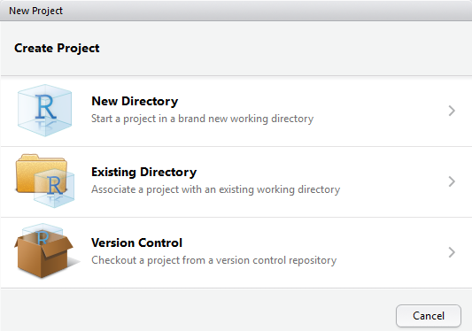
```

**To start a new, local, project with git enabled click 'New Directory' (not Version Control!). Alternatively you can use an 'Existing Directory' and create a project there.**

On the next tab, select `Empty Project`, and the following window appears. Here, give the project a reasonable name- it will be used to create a new folder if you selected 'New Directory' in the above window. Now, also check the box that says 'Create git repository'. 

```{r echo=FALSE, out.width='75%'}
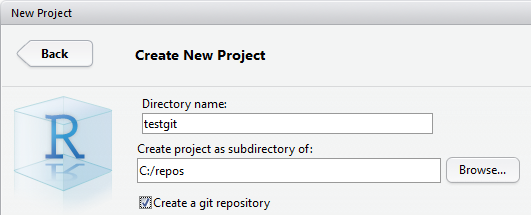
```

**Enter a name for the new project, the directory where the project will be created (as a sub-directory with the project's name). Check 'Create a git repository' to enable git.**

Click OK, and if successful, you wil switch to a new instance of Rstudio. The git tab should look like the following figure.

```{r echo=FALSE, out.width='75%'}
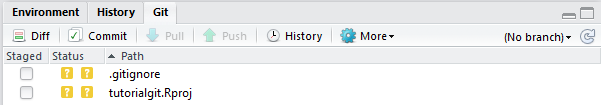
```

**What your git tab should look like if you started an empty project in a new directory.**

The two files in the folder show up with two question marks. This means that git is not sure if you want to track these files. By default, it won't track them. The `.gitignore` file is a special file that lists all the files you always will want to ignore. It is very useful and we will use it later.

Now, let's open two new scripts and write some code. I have called my new scripts `analysis.R` and `figures.R`. As you expect, these two files will show up in the git tab with two question marks. Notice the `Staged` column in the above figure? Let's stage both files by checking them, as in the below figure.

```{r echo=FALSE, out.width='75%'}

```

**Two new files are staged for the next commit. The green 'A' means 'Add', because these files were not already being tracked by the git repository.**

We will now make our **first commit**. With the files staged as in the screenshot, click the 'Commit' button. 

```{r echo=FALSE, out.width='75%'}
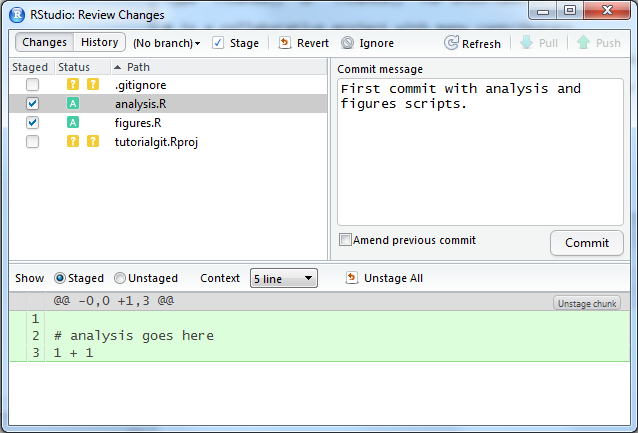
```

**With the two new files staged, you can commit their changes to the local git repository. You must first write a meaningul message in the box on the right.**

The files will now have disappeared from the git tab. That's good - their versions are the same as the last time you committed, that is, they have not changed in content. Now let's modify `analysis.R`, and delete `figures.R` (maybe you decided to combine code from these files into a single file), and see what happens.

```{r echo=FALSE, out.width='75%'}
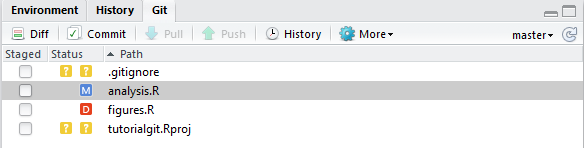
```

**Here we have modified (M) and deleted (D) files that are being tracked by git.**

Now, stage both files, and press Commit. Write a message that briefly describes your changes and click 'Commit' in the next window as well:

```{r echo=FALSE, out.width='75%'}
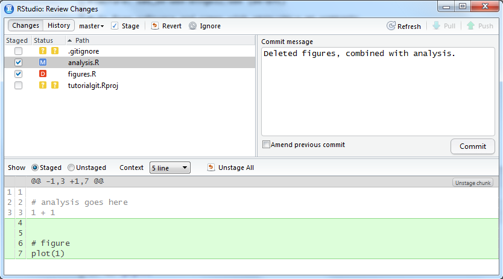
```

**With the modified and deleted file selected, write a message and click Commit.**

Let's now look at the history of our first project sofar. Find the 'History' button in the git tab. It will look like the following screenshot.

```{r echo=FALSE, out.width='75%'}
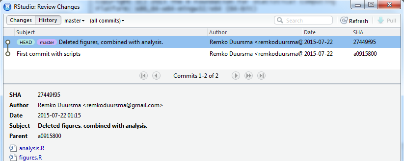
```

**History of the project sofar. The HEAD tag means this is the current location of the working directory. As we will see later, we can check out older versions, in which case HEAD will move to whatever commit we are looking at. Shown are the messages we wrote when committing, the author and date (taken from the git configuration), and the SHA (explained in the next section).**

Finally, the question marks for `.gitignore` and the `Rproj` files can be annoying, and in many projects you will have a long list of files that are in the working directory but you don't want to track them. 


### Deleting files and sensitive information

Some new users are surprised by how git deals with deleting files in your repository. If you delete a file, git will mark the file as deleted (with a red D in the Rstudio interface), and you can stage the change to also remove the file from git (so it won't be tracked anymore). Even though the file is deleted, it is still contained in the *history* of your repository. That means you (or someone else) can return to a state of the repository that included the file, and read its contents.

If you accidentally committed a file with sensitive information, such as passwords, deleting the file does not remove it from the history. There is also a way to completely remove files, even from the history, but this is a bit cumbersome and best avoided. Normally we do not like to change history unless some of the files are very large or contain sensitive information. 


### A few hints

- The 'SHA' is the unique code given to each commit. You normally don't have to use it in Rstudio, but it is important in the command line commands given below. We never need all characters from the SHA, only the first few (normally 5 or so). You can find the (abbreviated) SHA in the right-hand column of the history.
- Not all local files are tracked. 
- You do not have to commit all changes to the files every time (you can select which ones you want by staging them)
- Write useful commit messages that make sense a long time from now (saying 'changed file.txt' is useless because it will be clear which files you changed anyway). When you reach a particular milestone, include it in the commit message ("version submitted for publication").
- Commit **often**. Don't wait days to commit all enormous changes to your code. Commit smaller increments of progress ("updated figure 1", "defined new function for barplots"). 
- **only commit code that actually works**. There may be exceptions, but you can see this is a good idea. Basically assume that a commit is a point to which you might want to return (for whatever reason).  


### Reverting changes

To undo changes to files in Rstudio, and reset to the last known version of that file (i.e. the the last commit), select the file and click the 'Revert' button (this button is only visible in the Commit window, otherwise it is grouped under the 'More' button).
Sometimes this menu in Rstudio is a little *buggy*, reverting only one file at a time.


## Remote git repositories {#remotegit}

Version control with git becomes especially useful if you host your code in an online ('remote') repository. It is an essential step for collaboration (even if this is just with yourself, on multiple computers). Popular sites to host git repositories are <www.github.com> and <www.bitbucket.org>. I will not provide a guide to using either site, I will leave this to you to figure out. Either way, the first step is to create a user account, and set up the remote to be able to communicate with your computer.

A few tips to get started:

- A remote repository is simply a copy of your local project, think of it as a backup (with few extras).
- It is generally a good idea to organize your local repositories in a single directory, a location with a short path is useful since you will be accessing your repositories via the command line.
- You can add git version control to an existing project, but the easiest, most fail-safe way is to create a remote repository, then make a new project in Rstudio pulling from that repository, and adding your files into the project. We will follow this approach below.


#### HTTPS or SSH?

There are two ways to connect to a git repository hosted on a remote (like github). The easiest setup is connecting via HTTPS, but this will require you to enter your password every time you try to update the remote. I recommend HTTPS only when you are using a public computer.

A better approach is to use SSH, since you never have to type your password - a sort of password will be saved on your computer. 


#### Setting up SSH

If you are using SSH for authentication, you must first make a sort of password (an 'SSH key'), which is stored on your computer as well as on the hosting site. This is a straightforward process thanks to Rstudio.

- Go to `Tools/Global Options...` then click on the `Git/SVN` button, and note the 'SSH/RSA key' field.
- This field is probably blank, now click on `Create RSA Key`. Leave the passphrase blank (unless you would like an extra layer of security), and click OK.
- Next, click 'View RSA Key' (a small link), and copy the key (Ctrl-C).

The next step is to paste the SSH key in the remote hosting site, so it knows who you are when you try to use the repository.

On bitbucket, when logged in, click 'Manage Account', and find 'SSH Keys' on the left. Then click 'Add Key', and you now have to paste the key that you copied in the previous step.

On github, go to Settings/SSH and GPG keys and make a "New SSH key", and paste it in as above.

You can now paste it into the field. Also add a nice label for the key (identifying the computer you are working on).


### Making a remote repository {#makeremotegit}

Now, let's create a remote repository. On bitbucket (when you are logged in), click the "+" in the left-hand side menu, on github click the plus ('+') button in the top right and `Create repository`. Decide for yourself on the settings for the repository, such as Private/Public etc. 

The key thing for us is to find the address of the repository, we need this to use the remote in Rstudio. When using SSH, it will look like (on bitbucket):

```
git@bitbucket.org:remkoduursma/tutorialgit.git
```

When using HTTPS, it will look like this:

```
https://remkoduursma@bitbucket.org/remkoduursma/tutorialgit.git
```

#### Adding a remote repository to an existing project

To do this, you have to use the command line. If you want to use only Rstudio's menu's, skip to the next section.

With the command line (bash) open in the working directory, type the following two commands where you replace the *github* URL with the one matching your remote repository.

```
git remote add origin git@github.com:USERNAME/REPOSITORY.git
git push -u origin master
```

The remote repository will now be an exact copy of your local one (besides untracked files).


#### Cloning : make a local copy of a remote repository

The easiest approach is to start with an empty remote repository and use it as the basis for a new project in Rstudio. Then, you can add your files to this repository and start tracking (a selection of) them. 

First, make a remote repository, find the address (SSH or HTTPS, see previous section), and copy it. In Rstudio, go `File/New Project.../Version Control/Git` and paste the address in the URL box (HTTPS or SSH, it will be recognized). Rstudio is going to create a (nearly empty) folder with a git repository. It will create this as a subfolder of the directory in the window you see (the third field). I recommend you keep your git repositories in a local folder in the root, **that contains no spaces in the name**. For example, `c:/repos/`. 

```{r echo=FALSE, out.width='75%'}
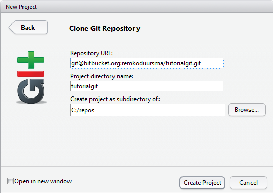
```

**Paste the remote address of the repository in the first field, the second field will automatically get the name of the remote repository, and for the third field select a directory yourself (but see text).**


When you click OK, Rstudio should open up with the new project.

### Workflow {#gitremoteworkflow}

Whether or not you have a remote repository enabled, you will still work in a local repository as explained in Section \@ref(localgit), and occassionally synchronize the two. In other words, **committing changes is always local**. When you want to sync with a remote, you either do a **push** (send your commits to the remote repository), or a **pull** (get the latest commits from the remote that you don't have).

It is important to note that **you can only push if the local up to date with remote**. We will see in the working example how to deal with the situation where we are 'behind' the remote (that is, have not included some commits stored in the remote repository).

The standard workflow for code stored in a remote repository is:

1. Pull - this makes sure you start with the version contained in the remote repository.
1. Write code, commit changes.
1. Repeat step 2. until you are finished with this session.
1. Push - this sends all the commits you made to the remote repository.

It is thus important to understand that **you don't have to push every time you commit changes**. In fact it is better if you don't, because it is easier to fix problems in the local repository, than when the commits have been pushed to the remote.


### A session with a remote repository

In this section, I will show a typical workflow with a remote repository. In this example I assume you have made a remote repository, and we will clone the empty repository into a new Rstudio project (see 'Cloning' in Section \@ref(makeremotegit).

If these first two steps - explained in the previous section - were successful, you now have a new, empty project open in Rstudio. I have copied two scripts that I wrote previously into the folder. In the git tab in Rstudio, you have to 'stage' the added files by clicking the check box. The two new files now show up with a green 'A' : 

```{r echo=FALSE, out.width='75%'}
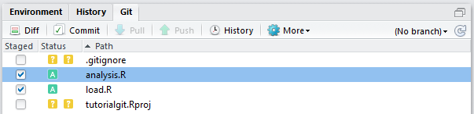
```

**Adding two files to be included in the next commit. Note that 'Push' and 'Pull' are greyed out, this is normal because we have no commits in the repository.**

Next, click commit (opens up a new window), write a reasonable message in the text box on the right, and click 'Commit'. You now have a single commit in the **local** repository. Again, it is crucial you understand that this commit is not yet on the remote.

Let's **push** this first commit to the remote repository. Just click 'Push' on the git tab, and a new window opens up in Rstudio with the response from the remote. It will say something like,

```{r echo=FALSE, out.width='75%'}
knitr::include_graphics("screenshots/session2firstpush")
```

**Response of the remote after the first push (opens in Rstudio when you click 'push'). Note that a new branch is created because this is the very first commit on the remote repository. All commits will always go to the 'master' branch (in this tutorial, at least).**

Now go to the online version (on github.com or bitbucket.org), and check that your code is really there. Also look for the 'commits' (a list of all your commits) and the source code (you can, quite conveniently, browse the code online). 

Next, suppose you start a new session with this project. As described in Section \@ref(gitremoteworkflow), you should always start with a **pull**, except when you are really 100% sure that your local is already up to date with the remote. If you are already up to date, the output will be:

```{r echo=FALSE, out.width='75%'}
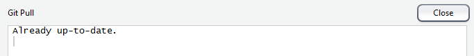
```

**Output from a 'pull' when the local repository is already synced with the remote.**

In the next example, I added the file `README.md` to the repository on another computer. This time, the output from 'pull' looks like:

```{r echo=FALSE, out.width='75%'}
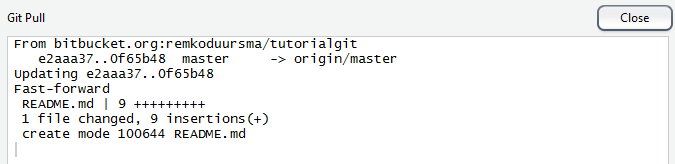
```

**Output from a 'pull' when the local repository is behind the remote. This is a successful message. It says that the two repositories have been successfully merged.**

Finally, a common situation arises where you have not pulled from the remote, have done work locally and committed the changes. It is possible that the remote includes changes that you don't have, for example commits created by a collaborator and pushed to the same remote repository, or work done by you on another computer. If the remote is ahead of you, and you are trying to push local commits that the remote does not yet have, you will see the output as in the following screenshot.

```{r echo=FALSE, out.width='75%'}
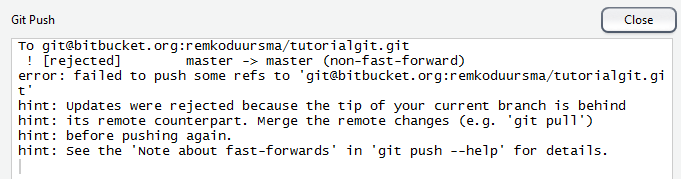
```

**Output when attempting to push to a remote when the remote is ahead of the local repository.**

The solution to this problem is to first do a pull, and then try to push again. The amazing thing about git is that even if your local commits and the commits on the remote that you don't yet have include changes on the same files, they will be automatically merged in the new commit. 

There are cases, however, where **conflicts** arise - if the local and remote changes are on the same line of text. In that case, you will have to fix the conflicts manually. It is however much better to avoid these conflicts by always  **beginning your session with a pull, and ending with a push**. That way you minimize the risk of changing the same line of code twice.  


## Ignoring files

As discussed, you don't want all of your local files to be copied to the remote repository. These include private data, large files, most binary files, sensitive information like passwords. 

You can keep a list of files to ignore in the file `.gitignore`, which will most likely already be generated for you in the working directory. 

Here is an example, with some useful settings

```
# No need to track the Rproj file
*.Rproj

# Private data: all files in data/ and config/
data/
config/

# Ignore all these types
*.xlsx
*.pdf

# ... except this file
!public_result.pdf
```


You can inspect which files are being tracked with the command line:

```
git ls-files
```

It is also always a good idea to inspect the remote repository to see if anything was uploaded you did not want to share. If you accidentally do push passwords to a remote repository, the best way is to **delete the remote repository and make a new one with the same name**. 


## Using the command line {#commandline}

Rstudio is very convenient for day-to-day version control, but for more advanced options, you must know how to use the command line. You may also find that when you gain more *git skills*, that using the command line is just as convenient while providing more control.

First, we show you how to open the 'shell', a command window where the full capabilities of git can be used.

```{r echo=FALSE, out.width='75%'}
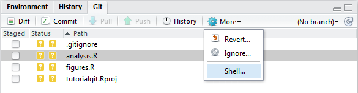
```

**From the 'Git' tab in Rstudio (same pane as Environment and History), open the Shell like this.**

The shell is different from the Windows command line! It comes installed with git, and recognizes most unix commands. 

Note that **if the output is longer than the screen, output will end  with a ':'. In that case, press `q` to return to the command prompt}.

### Basic commands

I will not cover git via the command line in detail here, there are many excellent resources available. Needless to say, everything you can do in Rstudio with a click of a button can be achieved in the command line, and much, much more. Quite useful is a sort of 'history', 

```
git log
```

which lists each commit (and its SHA and commit message). If you only want to see the last, say 2 commits, do,

```
git log -2
```

and remember to press `q` when the output is longer than the window to return to the prompt.


### Useful tasks

This section lists a number of useful things you can do with git from the command line. It is by no means exhaustive.


#### Adding a remote to a local repository

Suppose you have a local project as the example workflow in Section \@ref(firstgitsession), and you want to start a remote repository. You now simply have to let git know that you have a remote as well. To do this, you have to open a Console (see Section \@ref(commandline)) and use this command:

```
git remote add origin git@bitbucket.org:remkoduursma/tutorialgit.git
```

where the right-hand side is the address of your remote (found in the last section).

Then, make your changes as usual, and use this special `push` command the first time you push to the remote (after that, you can do the usual simple 'git push').

```
git push -u origin master
```


#### List all tracked files

If you are unsure which files are being tracked, you could browse the remote repository (if you have one), or use this command:

```
git ls-files
```

#### Looking around in an old version

Perhaps you don't actually want to undo changes, but instead inspect some older code, from which you can copy-paste bits you accidentally deleted. We can use the `checkout` command for this, which let's you temporarily look at an old commit.

First we find the SHA of the commit, either in the history (in Rstudio), or via `git log` as shown above. 

```
git log -2
```

Now suppose we want to 'check out' (look around and browse) the commit with SHA `fbd966` (recall, you only ever need the first 5 or 6 characters of the commit). 

```
git checkout fbd966
```

It is crucial you understand that you can now only look around, but you have not reverted to this old version! This is very useful to take a look at old code, maybe copy some bits and pieces to a new file, and then return to the current version. To make sure you know this, git tells you as much:

```{r echo=FALSE, out.width='75%'}
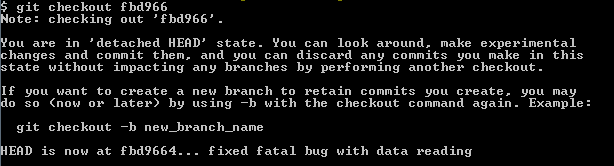
```

**Output of the command line after doing a checkout. Basically git is trying to tell you your visit to this old version of the code is for looking around only.**

To return back to the current, last version, do:

```
git checkout master
```


#### Undoing uncommited changes

Suppose you have committed your work, then made a bunch more changes that you are very unhappy with. But, luckily, you haven't committed them yet. You can use the 'Revert' button in Rstudio (as mentioned previously), but this really removes any chance that you *maybe* want to use the new edits.

Using the command line, you can use the `git stash` command as follows:

```
git stash
```

The files will not automatically appear as they were in the last commit. The advantage of using `stash` here - instead of the Revert button in Rstudio - is that if you change your mind you can do `git stash apply`. Basically your uncommitted changes are kept in a 'stash', not deleted.


#### Deleting the last commit

Suppose you have made changes, committed them, and then found out these are terrible and you want to get rid of them. We can use the `reset` command. **Use this at your own risk, it cannot be undone!**.

First let's look at the last two commits,

```
git log -2
```

So we want to get rid of commit `f76gb`, and revert back to `hu88e`. 

```
git reset --hard hu88e
```

Instead of `--hard`, you can use the `--soft` option to revert back to the old commit, but keep the changes since then as unstaged changes to the files. This is useful if you want to keep some of the changes, but manually remove or fix some other changes. 


#### Deleting files

We already saw that when you delete a tracked file from a git repository, you have to stage the change just like you stage a modification to a file. Here are a couple of useful commands related to deleting files locally.

Remove from local repository (i.e. stop tracking) all locally deleted files:
```
git rm $(git ls-files --deleted)
```

The next command is handy to clean your working directory. Use this at your own risk though! 

Delete all untracked files:
```
git clean -f
```

To do the same, but include subdirectories (use this at even more own risk!):
```
git clean -f -d
```


#### Searching the history

There are a few ways to search the history - all of them require the command line. It may be useful to find code you deleted (on purpose), or to find all the occassions where some word occurs in changed lines of code, or list all the commits that acted on a particular file.

Find all commits with 'someword' in the commit message. 
```
git log --grep=someword
```

Find all commits where 'someword' occurs in changed lines of code
```
git log -G someword
```

List all commits that include changes on 'somefile.R'. This even works when the file was deleted at some point.
```
git log -- somefile.R
```


#### Accessing git help files

You can learn more about the many options of git via the help files, each of these can be accessed like this.

Show help file for 'log'.
```
git log --help
```

Perhaps more usefully, if you don't know how to do something in git, simply type your question in Google ("git how to delete untracked files").


