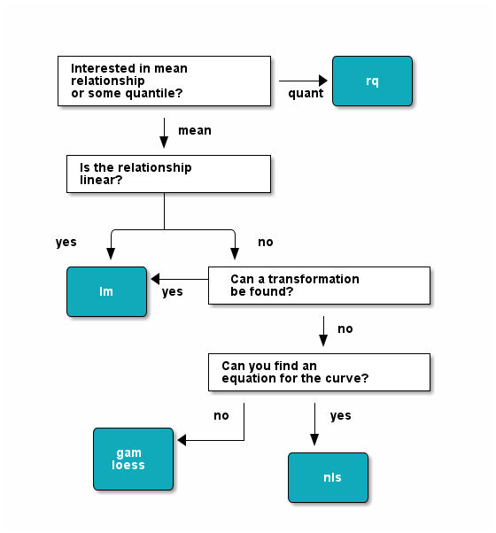

# Non-linear Modelling

## Introduction

This chapter introduces alternatives to linear models, with an emphasis on non-linear least-squares regression (Section \@ref(nls)). Very brief introductions to local regression smoothers (loess, Section \@ref(loess) and quantile regression (Section \@ref(rq)) are also included. In each case, we avoid technical descriptions of theory and implementation, and instead illustrate each technique with examples, and many figures.

Before we delve into non-linear regression, we first briefly describe when each of these techniques is useful. In general, linear models are preferable when you can use them, since they are robust, easy to use, and the theory for inference (hypothesis testing) is well developed and not very sensitive to violation of the usual assumptions. 

In general, as the name suggests, non-linear methods are to be used when the relationship between your response variable and predictor is not linear. 

#### Packages used


Packages used in this chapter. The `nls` function and associated methods are in the `stats` package, which is base R, and therefore not mentioned in this table.

+------------------+------------------------------------------------+
| Package          | Key functions                                   |
+==================+================================================+
| `nlstools`       |   `overview`, `confint2`                        |
+------------------+------------------------------------------------+
| `nlshelper`      |  `plot_nls`, `anova_nlslist`, `tidy.nlsList`    |
+------------------+------------------------------------------------+
| `nlme`           |  `nlsList`                                      |
+------------------+------------------------------------------------+
| `car`            |   `qqPlot`, `bootCase`                          |
+------------------+------------------------------------------------+
| `mgcv`           |   `gam`                                         |
+------------------+------------------------------------------------+
| `quantreg`       |   `rq`, `nlrq`                                  |
+------------------+------------------------------------------------+
| `broom`          |  `tidy`, `glance`                              |
+------------------+------------------------------------------------+


```{r echo=FALSE, message=FALSE}
suppressPackageStartupMessages(library(nlshelper))
suppressPackageStartupMessages(library(nlstools))
suppressPackageStartupMessages(library(car))
suppressPackageStartupMessages(library(nlme))
suppressPackageStartupMessages(library(mgcv))
suppressPackageStartupMessages(library(quantreg))
suppressPackageStartupMessages(library(tidyr))
suppressPackageStartupMessages(library(broom))
suppressPackageStartupMessages(library(ggplot2))
suppressPackageStartupMessages(library(ggthemes))
suppressPackageStartupMessages(library(lgrdata))

```


#### Transformations

In this case, one common approach is to transform the predictor and/or response so as to linearize the relationship between the two. When this is possible, it is usually the preferred approach. For example, you may find that your data can be well described with an equation of the form:

$$Y = a \cdot X^b$$

This is the so-called power function. You could go ahead and use non-linear regression to fit this curve, but it would be better to linearize this relationship by taking the logarithm of both sides, which gives:

$$log(Y) = a + b \cdot log(X)$$

And thus we can use linear regression of $log(Y)$ against $log(X)$.

In a number of cases, though, there is no simple transformation that linearizes the relationship. Typical cases are relationships with a clear asymptote (though exceptions exist), peaked relationships, or very irregular relationships with lots of peaks and curves.


#### Parametric or non-parametric?

In the case where no transformation can be found, or you have a specific equation that you want to fit to your data, non-linear regression may be an appropriate technique. This is an example of a parametric method, because you end up estimating specific parameters, and in doing so making assumptions about the underlying distribution. This can be useful because a fitted non-linear regression model can be applied in a new setting, for example predicting for a new dataset, or reliably extrapolating beyond your data. 

In non-parametric approaches, you either cannot find or are not interested in finding an equation that describes your data. You may simply be interested in describing or visualizing a (potentially irregular) trend, maybe comparing groups, but not estimating specific parameters or predicting for new situations (let alone extrapolation). In this chapter we will briefly look at `loess` (Section \@ref(loess), a flexible non-parametric regression method, and generalized additive models (Section \@ref(gam)), a semi-parametric approach.


#### Means or quantiles?

In the usual linear models, as well as non-parametric regression, we are usually forced to be interested in the mean relationship between response and predictor. Often this is what you want, but there are many cases in which you are actually interested in questions like 'What is the maximum value of my response as a function of my predictors?'. Instead of actually estimating the maximum, a particular quantile will be much more robust to outliers (for example, the 95% quantile). In this case we can use quantile regression, which will be introduced in Section \@ref(rq). This is not strictly a non-linear method, but we present it in this chapter because it is such a constrast to the usual linear models, and because non-linear quantile regression can also be applied (Section \@ref(rqnonlinear)).


```{r echo=FALSE, out.width='66%'}

```
*A simple flow chart to select regression methods.*


```{block2 type="rmdreading"}
As mentioned, we present a practical, visual approach to non-linear models in this chapter. We recommend further reading if you are interested in technical aspects of non-linear regression :

- Ritz, C., Streibig, J.C., 2008. Nonlinear regression with R. Springer. (from the developers of the `nlstools` package)
- Fox, J. Nonlinear regression and nonlinear least squares in R (Online appendix to 'Companion to applied regression', <http://socserv.mcmaster.ca/jfox/Books/Companion/appendix/Appendix-Nonlinear-Regression.pdf>).

For generalized additive models, the book by Simon Wood accompanies the `mgcv` package:

- Wood, S.N., 2006. Generalized additive models: an introduction with R, Texts in Statistical Science. Chapman & Hall/CRC.

```


## Non-linear regression {#nls}

### Introduction

A model is *linear* when you can write it like this:

$$
Y = b_0 + b_1 \cdot X_1 + b_2 \cdot X_2 + b_3 \cdot X_3
$$

where Y is the dependent variable, and the X's are the predictors. The predictors can be any variable or some transformation thereof (for example, squared terms, two variables multiplied together, etc.). This model is *linear in the coefficients* $b_1$, $b_2$, etc, though it may contain terms that are non-linear in the X's (such as squared terms of X).

A non-linear model is anything that cannot be written in a linear form. An example of a non-linear model is the Chapman-Richards growth equation,

$$
Y = Y_{max}\cdot(1-e^{-b \cdot x})^c
$$

Here the coefficients (*Ymax*, *b* and *c*) occur non-linearly in the equation, and you cannot write this in a form similar to the linear model as shown above. We can look at the shape of this curve by using `curve`, like in the following example (Fig. \@ref(fig:chapmcurve)).

```{r chapmcurve, opts.label="smallsquare", fig.cap='The Chapman-Richards growth equation.', fig.align='center'}
# Define function
chapm <- function(x,Asym,b,c)Asym*(1-exp(-b*x))^c

# Plot (curve must use an x argument)
curve(chapm(x, Asym=100, b=0.15, c=3), from=0, to=50, ylab="Y")
```

We can use non-linear regression to fit curves like that one to data, which gives estimates of the coefficients `Ymax`, `b` and `c`. The majority of useful applications of non-linear regression are when you have an equation already specified (arising from theory), and you wish the estimate the parameters of the curve, or use the curve for prediction (as in lots of modelling applications). 

In the following examples of non-linear regression, we use the `nls` function, but point out the `nlsLM` function (in package `minpack.lm`) for a very promising alternative, and `nls2` (package of same name) for an alternative that can be used to find starting values.


### Model selection

How do you choose the right model to fit to your data? In some applications of non-linear regression, you already know the model you want to fit, as it arises from theory. The Michaelis-Menten model, very commonly applied in enzyme kinetics, is an example.

In other cases you have to choose a model from various options, and select the best fitting one, or the one that has certain properties. One reason to apply non-linear regression, as stated above, is that the model can be expected to behave well outside the range of the data used for fitting. Models with an asymptote are a good example. Take the following equation, 
$$Y = Y_{max}(1 - e^{-kX})$$

we can see that this model reaches an asymptote for very large X (because $e^{-x}$ goes to zero for large $x$), given by the parameter $Y_{max}$. Also, this model has the, possible useful, quality that Y is zero when X is zero. 


### Self-starting functions {#selfstart}

To avoid the need for starting values, we can use one of many 'self-starting functions'. These are common non-linear models that do not require starting values, and instead estimate them from the data with clever methods. In the Appendix (see Chapter \@ref(nonlinearappendix)) we have listed nearly all available self-starting models in R, together with a visualization of the kinds of curves that can be fit. It is also possible to develop your own models, but this is tricky, and outside the scope of this book.

I won't go into much detail on these functions, but simply show an example with the built-in `Loblolly` dataset. We decide to fit the 'Gompertz' growth model to the data, using the `SSgompertz` function.


```{r }
# Fit same model, using a self-starting model
nlsfitSS <- nls(height ~ SSgompertz(age, Asym, b2, b3),
              data=Loblolly)
```


Next, it is useful to add the fitted curve to a plot, which is particularly easy to do with the `nlshelper` package. In Section \@ref(nlspredict), we return to predicting from a non-linear regression model, using the `predict` function. The following code makes Fig. \@ref(fig:plotnlslob1).


```{r plotnlslob1, opts.label="smallsquare", fig.cap='The Chapman-Richards growth equation fitted to the Loblolly data, using the nlshelper package.', fig.align='center', echo=-1}
par(mar=c(4,4,1,1), mgp=c(2.5,0.8,0))
library(nlshelper)
plot_nls(nlsfitSS,  ylim=c(0,80), xlim=c(0,30))
```


### Custom models require starting values

In this section, we define our model by hand, which is the most flexible approach but it comes at a cost: you have to specify suitable *starting values* for the parameters, otherwise `nls` will in many cases not converge to a solution. Depending on the situation, these starting values need to be quite good. This will depend a lot on the type of curve you are fitting, the number of data points, and the number of parameters describing the curve. 

To find suitable starting values, you can either guess them based on the meaning of the parameters (for example, the asymptote, or value of y when x is zero, and so on), or otherwise find them with trial and error. 

Here we use the built-in `Loblolly` data (see `?Loblolly`), which contains age and height of Loblolly pine (*Pinus taeda*), for several seedlots. We will fit the Chapman-Richards equation, a type of sigmoidal curve that fits these data quite well. 

To try out some starting values, you can use `curve` to plot the model on top of the data, and adjust the parameters until the curve is 'pretty close' to the data:

```{r}
# Using the built-in Loblolly data
with(Loblolly, plot(age, height))
curve(chapm(x, Asym=30, b=0.2, c=2), add=TRUE)
```

Now that you are satisfied with the starting values, we can use them to fit the non-linear model, like so:

```{r }
# Define function to fit
chapm <- function(x,Asym,b,c)Asym*(1-exp(-b*x))^c

# Note the specification of the starting values.
nls_lob <- nls(height ~ chapm(age, Asym, b,c),
               data=Loblolly,
               start=list(Asym=100, b=0.1, c=2.5))
```

If the model does not converge, it will report an error. Note that you do not have to write a function first and use it within `nls`, you can also write the equation in the formula interface of `nls` directly. However, it is usually convenient to have the function defined separately.


### Model summary and diagnostics {#nlsdiagnos}

#### Summarizing the fit

The usual `summary` does not print a lot of useful information for `nls` models - a much better alternative is the `overview` function from the `nlstools` package:

```{r }
library(nlstools)
overview(nlsfitSS)
```

The `overview` statement shows:

-  The parameter estimates, standard error (`Std. Error`), and a t-test against zero (`t value` and the p-value, `Pr(>|t|)`). The test against zero is rarely useful.
-  The residual standard error, calculated as $\sqrt{\sum{r^2}/df}$, where $r$ is the residual, and df the residual degrees of freedom (sample size minus number of estimated parameters). This metric is also known as the root-mean square error (RMSE).
-  Some information on the convergence, normally can be ignored.
-  The residual sum of squares, simply the sum of the squared residuals.
-  Confidence intervals for the parameters. Note that these will be somewhat different from those calculated with `confint`.
-  Correlation matrix of the parameters.

The disadvantage of `overview` is that none of the printed results can be extracted. A convenient way to print the coefficients, standard error and confidence interval is the `tidy` function from the `broom` package. The `glance` function returns things like the RMSE (`sigma`), log-likelihood, AIC, etc. Both functions return a dataframe and are thus convenient as a basis for further calculation, or use in tables.

```{r }
library(broom)
tidy(nlsfitSS, conf.int=TRUE)
glance(nlsfitSS)
```

If you only want to extract the coefficients, use the base function `coef`, which gives a named vector as a result:

```{r }
coef(nlsfitSS)
```


#### Residual diagnostics

As in linear regression, an important assumption in non-linear regression is that the residuals are normally distributed. This can be inspected visually, as we strongly recommend against the use of tests for normality. The `qqPlot` function from the `car` package is very handy because it adds a confidence region for the qq-plot. The following example makes Fig. \@ref(fig:carqq).


```{r carqq, opts.label="smallsquare", fig.cap="Normal QQ plot for the Chapman-Richards growth equation fitted to the Loblolly dataset."}
library(car)
qqPlot(residuals(nlsfitSS))
```

When interpreting QQ plots for non-linear regression models, don't get too upset if the residuals aren't perfectly normal. This is rarely a problem unless the deviation is very large. Most importantly, it does not affect the estimates of your parameters, but it does affect the estimated standard errors and confidence intervals. If you are mostly interested in fitting the curve and moving on, it is not important.

A more important test, again visually, is to check whether there is no pattern in the residuals with respect to the predictor(s). If there is, clearly the model does not fit very well and another model should be chosen. The following code makes a plot of the residuals against the fitted values, and a plot of the fitted values against the predictor (with a comparison to a 1:1 line) (Fig. \@ref(fig:diagfit)).

```{r diagfit, opts.label="wide", echo=-1, fig.cap="Residuals against fitted values, and fitted values against the predictor for a non-linear regression model (nls) fit to the Loblolly data."}
par(mfrow=c(1,2))
plot(fitted(nlsfitSS), residuals(nlsfitSS), pch=16, col="dimgrey")
abline(h=0)

plot(Loblolly$height, fitted(nlsfitSS), pch=16, col="dimgrey")
abline(0,1)
```


#### Goodness of fit

It is well known that the R^2^ is a very poor measure of goodness of fit in non-linear models. Much better is the RMSE (the residual standard error), which can be conveniently computed with `glance`. The RMSE can be roughly interpreted as the standard deviation of the residuals ('roughly' because it is adjusted slightly for the number of fitted parameters).

```{r }
glance(nlsfitSS)$sigma
```


#### Correlation between parameters 

This is not a problem in model fitting, but it is important that you are aware that the coefficients in a non-linear regression models are often highly correlated. A correlation matrix between the parameters is shown with the `overview` function from the `nlstools` package (see example above).

A nice way to visualize the correlation between parameters is the `ellipse` function from the `ellipse` package. For a fitted nls model, try the following code after setting the `which` argument to two parameters of interest:

```{r eval=FALSE}
# (results not shown)
library(ellipse)
plot(ellipse::ellipse(nlsfitSS, which=c("Asym","b2")), type='l')

# Optionally, add the estimated coefficients as a point
p <- coef(nlsfitSS)
points(p["Asym"], p["b2"], pch=19)


#It is also possible to plot all confidence ellipses with the `plotcorr` function, 
# for a quick visualization of correlation and confidence regions of the 
plotcorr(summary(nlsfitSS, correlation=TRUE)$correlation)

```


### Comparing models

Thus, when comparing different models *fit to the same dataset*, we can use the RMSE as a basis for comparing their relative goodness of fit. Probably even better (though in practice usually equivalent), we can use Akaike's Information Criterion (AIC) as a basis for ranking model fit. This is quickly done with `AIC`,

```{r eval=FALSE}
AIC(model1, model2, model3)
```

The model with the lowest AIC can be deemed the 'best'. 

When comparing two (or more) models fit to the same dataset, but with different number of parameters, an F-test can be applied providing a direct test of model superiority. For example,

```{r }
# Chapman-Richard model (equivalent to nls_lob used above)
nls_fit1 <- nls(height ~ Asym*(1-exp(-b*age))^c,
               data=Loblolly,
               start=list(Asym=100, b=0.1, c=2.5))

# Drop the 'c' parameter
nls_fit2 <- nls(height ~ Asym*(1-exp(-b*age)),
               data=Loblolly,
               start=list(Asym=100, b=0.1))

anova(nls_fit2, nls_fit1)
```

The F-test in the above `anova` statement shows overwhelming support for a better fit for the model that includes the `c` parameter. 

```{block2 type="rmdtry"}
In the example above, confirm that use of `AIC` would give the same conclusions.
```


### Adding factor variables {#nlsfactor}

A very common question in non-linear modelling is whether estimated coefficients are different between groups, for example species, treatment, location. It is not straightforward to compare coefficients by group, unfortunately, but we can produce estimates and confidence intervals for each group, and base our conclusions on those.

The following example fits the Gompertz growth model to foot length as a function of age, to ask the question whether foot length growth is different between boys and girls. The divergent curves, and the very different estimated parameters show a clear difference, as the following example demonstrates:

```{r echo=FALSE, message=FALSE}
suppressPackageStartupMessages(library(scales))
```

```{r anthronls, opts.label="smallsquare", fig.cap="The Gompertz growth model fitted to the anthropometry dataset, for males and females separately."}

# Read data.
foot <- read.csv("anthropometry.csv")

# nlsList does not like missing values. We can set an option there,
# or just remove missing values now
foot <- foot[complete.cases(foot),]

# nlsList is from the nlme package
library(nlme)

# Note the grouping operator '|' to specify to fit the curve by gender
fit_foot_gender <- nlsList(foot_length ~ SSgompertz(age, Asym, b2, b3) | gender,
            data=foot)

# Load nlshelper to allow a tidy statement of the fit
library(nlshelper)
tidy(fit_foot_gender)

# Define two colours for the plot
cols <- c("#FF4E37FF","#008DFFFF")
library(scales) # for alpha()

# (from nlshelper package)
plot_nls(fit_foot_gender, pch=16, cex=0.6, 
         points.col=alpha(cols, 0.5),
         lines.col=cols,
         lwd=2)
legend("topleft", levels(foot$gender), col=cols, lty=1, bty='n',lwd=2)        
```

Using the `nlshelper` package, we can test directly whether adding the grouping variable (`gender` in the above example) improves the fit, that is, whether the relationship between foot length and age differs significantly between genders.

To do so, we need the full model (fit with `nlsList`), and a simple `nls` model without the grouping variable, and then use `anova\_nlslist`, like so:

```{r }
fit_foot_0 <- nls(foot_length ~ SSgompertz(age, Asym, b2, b3),
            data=foot)

library(nlshelper)
anova_nlslist(fit_foot_gender, fit_foot_0)
```

Clearly there is plenty of support for gender affecting the relationship, but that should have been abundantly clear from Fig. \@ref(fig:anthronls)!


```{block2 type="rmdnote"}
In the above example, all three parameters were allowed to vary between the two groups (boys and girls). In many cases it makes sense to keep some parameters the same between groups, and vary other ones. Unfortunately this is less straightforward than it sounds, but we will introduce an approach using non-linear mixed-effects models in Section XXX.
```


### Predicting {#nlspredict}

It is easy to predict a fitted value for a new value of the predictor variable with the `predict` function. Note that `predict` is a generic function, so if you want to read the help file when applied to `nls`, read `?predict.nls`.

```{r loblollypred}
# Make dataframe with X variable that we wish to predict Y values for.
# Make sure it has the same name as in the dataframe we used to fit the model!
newdat <- data.frame(age=c(18, 30))

# Predict from the fitted model for the new dataframe:
predict(nls_lob, newdata=newdat)
```

```{block2 type="rmdnote"}
Unlike the predict method for linear models (`predict.lm` in particular), we cannot easily estimate standard errors or confidence intervals for predictions (although `predict.nls` does have an argument `se.fit` which is actually ignored!). 
```

In Section \@ref(paramcombboot) we use the bootstrap to produce confidence intervals on predictions.

```{block2 type="rmdtry"}
For the `nlsfitSS` model, verify that the estimated asymptote ('`Asym`') is equal to the value of the curve when age is infinity (`Inf`). Extra points if you can write a statement that gives `TRUE`, if this is true.
```


### Confidence intervals

To calculate confidence intervals on the parameters, we can use the base function `confint`, which uses a so-called 'profiling' method. 

```{r }
confint(nls_lob)
```

It is important to know that this standard (and preferred) method does not always work, in particular for more complex curves fitted to smaller datasets. In this case, one may use the `confint2` function from the `nlstools` package. A warning here is that these confidence intervals will be approximate, and particularly poor for smaller sample sizes.

```{r }
library(nlstools)
confint2(nls_lob)
```

In this particular example the two methods give very similar confidence intervals. Finally, to make a quick table including the fitted coefficients and their confidence intervals, use `coef` like so,

```{r }
cbind(Estimate=coef(nls_lob), confint2(nls_lob))
```

Even more convenient is the `tidy` function from the `broom` package, but in that case the `confint2` function cannot be used.

```{r }
library(broom)
tidy(nls_lob, conf.int=TRUE)
```

For models fit with `nlsList`, you can also use the `tidy` function but only after loading the `nlshelper` package:

```{r }
library(nlshelper)

fit_foot <- nlsList(foot_length ~ SSgompertz(age, Asym, b2, b3) | gender,
            data=foot)
tidy(fit_foot, conf.int=TRUE)
```


## Other regression techniques

### Local regression {#loess}

In this section we briefly introduce `loess`, a non-parametric method to fit local regression smoothers to data. This method is useful when you want to illustrate non-linear patterns in the data, but it cannot be used for serious inference. 

In a loess model, you have to set the degree of smoothness yourself, via the `span` argument. Thus you can fit a model with an arbitrary smoothness to it, which makes the method less dependable for inference. The following example demonstrates its use.

Here we also show how to extract predictions, calculate a confidence interval for the prediction, and use both in a plot. Note that this is for illustration only, since the `ggplot2` package provides a very straightforward way to make this plot.

The following code produces Fig. \@ref(fig:hobartloess).

```{r hobartloess, opts.label="smallsquare", fig.cap="A loess fit to the Sydney to Hobart race finish time data, including the confidence interval for the fit."}
# Finish times of the Sydney to Hobart race
library(lgrdata)
data(sydney_hobart_times)

# Fit the local regression model. Note that we always set the span.
loes1 <- loess(Time ~ Year, data=sydney_hobart_times, span=0.6)

# Extract predictions from the model, including the standard errors.
# If we don't give a newdata argument, predictions for the original data 
# are returned.
# Use dplyr::mutate() to add new variables to the predictions, including
# lower confidence interval (lci), upper (uci), and Year from the original
# dataset. Here, as.data.frame is necessary because predict returns a list.
library(dplyr)
loes1_pred <- predict(loes1, se=TRUE) %>% 
  as.data.frame %>%
  mutate(lci = fit - 2 * se.fit,
         uci = fit + 2 * se.fit,
         Year = sydney_hobart_times$Year)

# Make a plot with data, predictions, and confidence interval.
ggplot(sydney_hobart_times, aes(x = Year, y = Time)) +
  geom_point(col = "dimgrey") + 
  geom_line(data = loes1_pred, aes(x = Year, y = fit)) +
  geom_line(data = loes1_pred, aes(x = Year, y = lci), lty = 5) +
  geom_line(data = loes1_pred, aes(x = Year, y = uci), lty = 5) +
  lims(y = c(0, max(sydney_hobart_times$Time))) +
  theme_tufte(base_family = "sans")

```
     
Alternatively, and much more practically appealling, is to use `stat_smooth` from the `ggplot2` package to make this plot with much less code. The following figure is not shown, but will be very similar to Fig. \@ref(fig:hobartloess).

```{r}
ggplot(sydney_hobart_times, aes(x = Year, y = Time)) +
  geom_point(col = "dimgrey") + 
  stat_smooth(method = "loess", span = 0.6, se = TRUE) +
  theme_tufte()
```

In general, we use a loess model to visualize patterns in the data. However, it is rarely a good idea to use loess models for any formal conclusions regarding your data, and numerous examples exist where loess models may give misleading conclusions. 

```{r}
l <- loess(Petal.Length ~ Sepal.Width * Sepal.Length, data=iris, span=0.5)

out <- with(iris, 
            expand.grid(Sepal.Width = seq(min(Sepal.Width), 
                                          max(Sepal.Width), length=50),
                        Sepal.Length = seq(min(Sepal.Length), 
                                           max(Sepal.Length), length=50))
) 

# A hack to make sure the predict() statement below returns the 
# right kind of object for a ggplot.
attr(out, "out.attrs") <- NULL

# Add the prediction
out$pred <- predict(l, newdata = out, se = FALSE)

# For a nice colour palette
library(viridis)

ggplot(out, aes(x = Sepal.Width, y = Sepal.Length, fill = pred)) +
  geom_tile() +
  scale_fill_viridis(option = "inferno") +
  theme_tufte(base_family = "sans")

```

Although we just made a pretty picture, we cannot tell from the figure whether the model provided an adequate fit to the data. For models that include multiple predictors, and you want to use smooth functions, it is recommended to instead use a generalized additive model instead (see Chapter \@ref(gam)).


## Quantile regression {#rq}

There are surprisingly many situations where you might be interested in relationships other than the 'mean' relationship, which is what you study with the usual regression techniques. 

The next example uses a dataset which includes measurements of plant drought tolerance (P50, more negative values indicate higher tolerance for drought) and mean annual precipitation for 115 plant species. Although significant, the data show no convincing relationship between the two variables in terms of the mean response. It does seem that the lower end (i.e. the minimum P50) is much more constrained by mean annual precipitation. We can thus ask the question: does the 10% quantile of P50 increase with precipitation?

We use `rq` from the `quantreg` package to perform quantile regression.  The argument `tau` sets the quantile to be estimated, for example if `tau = 0.5`, we would perform 'median regression'.

```{r }
# Read data
data(choat_precipp50)
choat_precipp50 <- mutate(choat_precipp50, 
                           drought_tolerance = -P50)

# A basic quantile regression fit
library(quantreg)
choat_rq <- rq(drought_tolerance ~ annualprecip, tau=0.1, data=choat_precipp50)

# Test for significance, use bootstrapped standard errors
summary(choat_rq, se="boot")
```

In the above code, to calculate p-values, we must specify `se="boot"` to `summary.rq`, so that standard errors are calculated with a bootstrap. 

As with `lm`, `rq` also returns a slope and intercept when you run `coef(f1)`, and you can also use `abline` to add a line to a plot. We can also fit multiple quantiles at once, by passing a vector of `tau` to `rq`. The result can be added to a plot with a simple `for` loop. The next example makes Fig. \@ref(fig:choatplot2).

```{r choatplot2, opts.label="wide", fig.cap="The Choat dataset fitted with a range of quantiles."}

# Fit multiple quantiles
tau_choice <- c(0.1,0.25,0.5,0.75,0.9)
choat_rq_2 <- rq(drought_tolerance ~ annualprecip, 
                 tau=tau_choice, data=choat_precipp50)
 
# Store coefficients (inspect p, it is a matrix)
p <- coef(choat_rq_2)

# Make base ggplot (points only)
g <- ggplot(choat_precipp50, aes(x = annualprecip, y = drought_tolerance)) +
  geom_point(col = "dimgrey") +
  labs(x = "Annual rainfall (mm)", y = "Plant drought tolerance") +
  theme_tufte(base_family = "sans")

#- Now loop, and add fitted lines for each quantile.
lwds <- seq(0.5, 1.8, length=ncol(p))
for(i in seq_len(ncol(p))){
  g <- g + geom_abline(intercept = p[1,i], slope=p[2,i], lwd=lwds[i])
}
print(g)

```


### Confidence intervals {#rqci}

In the next example we show how to calculate confidence intervals for quantile regression fits and add it to a plot. 

The following code makes Fig. \@ref{fig:fluxplotrq}. Note that in a previous example (Section \@ref(loess)), we realized that `ggplot2::stat_smooth` could be used to make a similar plot, however, that function does not include an option for quantile regression. The approach shown here is general, and can be adapted to other models as well.

```{r fluxplotrq, opts.label="smallsquare", fig.cap="Relative humidity (RH) and air temperature (Tair)", echo=-1}

# Fit the quantile regression model. Using the data from the previous example,
# with only the 95% quantile.
choat_rq_95 <- rq(drought_tolerance ~ annualprecip, tau=0.95, data=choat_precipp50)

# Set up a 'prediction' dataframe, we will obtain fitted values for these
# values of annualprecip. A range of values is chosen to make a smooth plot.
preddfr <- data.frame(annualprecip = seq(130, 3100, length = 101))

# Predict from the fitted quantile regression model, and return a 
# confidence interval. Look at the 'type' argument in ?rq for options
# used to calculate the confidence interval (here we use the default).
choat_rq_95_pred <- as.data.frame(predict(choat_rq_95, preddfr, interval="confidence"))
preddfr <- cbind(preddfr, choat_rq_95_pred)

# Make the plot.
ggplot(choat_precipp50, aes(x = annualprecip)) +
  geom_point(col = "dimgrey", aes(y = drought_tolerance)) +
  geom_ribbon(data = preddfr, aes(ymin = lower,
                                  ymax = higher),
              fill=scales::alpha("lightgrey", 0.7)) +
  geom_line(data = preddfr, aes(y = fit), col = "cornflowerblue", lwd = 1.2) +
  theme_tufte(base_family="sans")

```


### Non-linear quantile regression {#rqnonlinear}

Finally we can combine two techniques introduced in this chapter: non-linear regression and quantile regression. Using `nlrq` from `quantreg`, we can perform non-linear quantile regression.

The following example shows how to estimate quantiles of growth over time - similar to growth charts for childrens' heights - in this case for foot length against age.

First we read and prepare the data, and fit a single model for closer inspection.

```{r }
# for nlrq
library(quantreg) 

# The anthropometry dataset, with foot length, age, and sex
# Use male subset only for this example
data(anthropometry)

foot_male <- anthropometry %>% 
  filter(complete.cases(.),
         gender == "male")
  
# Fitting an upper quantile, can be interpreted as the 90% quantile of
# foot length at a given age (i.e. only 10% of children would have feet
# longer than this at some age).
foot90 <- nlrq(foot_length ~ SSgompertz(age, Asym, b2, b3),
               tau=0.9, data=foot_male)
```

There are very few things you can do with the fitted model, other than predicting from it (see below, but no confidence intervals!), and summarizing the fit, which tests each coefficient against zero (not very informative in this case, see for yourself: `summary(foot90)`). The coefficients can be extracted with, `coef(foot90)`.

Now we are ready to make our growth chart. To do this, we loop through a few values of `tau`, each time adding a line to a plot.

The following code makes Fig. \@ref(fig:footexample3).

```{r footexample3, opts.label="smallsquare", fig.cap="Growth chart for foot length (mm) against childrens' age (years)"}
# Setup a base plot with the data.
g <- ggplot(foot_male, aes(x = age, y = foot_length)) +
  geom_point(pch=16, size=0.7, col="grey") +
  theme_tufte(base_family = "sans")
  
# Loop through desired quantiles, and add fitted lines to the plot.
for(TAU in c(0.1, 0.5, 0.9)){
  
  # ... use them in a non-linear quantile regression
  fit_mod <- nlrq(foot_length ~ SSgompertz(age, Asym, b2, b3),
               tau=TAU, data=foot_male)
  
  # Set up x-values to predict over
  xpred <- seq(min(foot_male$age), max(foot_male$age), length=101)
  
  # Setup dataframe for plotting
  plot_df <- data.frame(age = xpred, 
                        foot_length = predict(fit_mod, data.frame(age=xpred)),
                        TAU = TAU)
  
  # And add a line to the plot
  # Note: the label is positioned at age=21, but the y-coordinate
  # determined by the fitted value at age=20.
  g <- g + geom_line(data=plot_df) + 
    geom_text(data = data.frame(age = 21, 
                         foot_length = predict(fit_mod, data.frame(age=20)),
                         label = as.character(TAU)),
              aes(label=label))
  
}
print(g)


```


## Bootstrapping

### Parameter combinations

This example demonstrates that we can use the bootstrap to calculate any derived quantity from a fitted regression model. Consider the following example: we have a non-linear saturating dependence of `height` on `age` (Fig. \@ref(asympsimfig)).


```{r asympsimfig, opts.label="smallsquare", fig.cap='Height and age for a group of !Khosan people (the Howell1 dataset).', fig.align='center'}
# We use an example dataset contained in the 'rethinking' package,
# containing heights and ages of members of a clan of !Khosan people.
data(howell)

# Plot the data. 
ggplot(howell, aes(x = age, y = height)) +
  geom_point(pch=21, bg="white") +
  lims(y=c(0, max(howell$height))) +
  theme_tufte()
```
  
It seems reasonable to fit a function with an asymptote to this relationship. An exponential regression model seems appropriate, and it should contain an 'offset', since height at zero age will not be zero!
  
Now suppose we want to know the age where height has reached 90% of the asymptotic value. We can calculate this value from the fitted curve directly, and use the bootstrap to estimate a confidence interval for this estimate.

First, we are going to rearrange the fitted equation. We will fit the following equation, where $y_max$ is the asymptote, $k$ some curvature parameter and $b_0$ the value of y where x=0):
  
$$y = b_0 + y_{max}*(1-e^{-kx})$$
    
We want to know the value of `x` where `y = 0.9 * ymax`, inserting this into the equation and solving for `x` gives, 

$$x_{90} = log(1 - (0.9 - b_0)/y_{max})/-k$$
    
Now let's find the distribution of $x_{90}$. We will use the `bootCase` function from the `car` package, which is a convenient function for bootstrapping (non-)linear models.
  
```{r x90boot}
# The bootCase function is contained in the car package
library(car)

# Fit nls. This particular function is not very sensitive to the 
# starting values (try this yourself),
# but the maximum height has been guessed from the plot of the data.
nls_howell <- nls(height ~ b0 + (ymax-b0)*(1-exp(-k*age)), 
                  start=list(b0=50,ymax=150,k=0.1), data=howell)

# Perform bootstrap, 500 times
b <- car::Boot(nls_howell, B=500)

# This function calculates the 90% saturation point based on the fitted parameters:
x90fun <- function(ymax,k)log(1 - 0.9)/-k

# Calculate all 90% saturation points. 
# The object 'b' is a matrix with the three parameters in columns.
x90 <- x90fun(b[,"ymax"], b[,"k"])

# The simulated distribution of x90 is an approximation to 
# the sampling distribution. So, we can calculate the confidence 
# interval using quantile.
quantile(x90, c(0.025, 0.975))

```
  
And finally we can make a plot showing the confidence interval (Fig.~\ref{fig:bootsympcifig}) of the age where 90\% of the maximum height is reached, on average. The first panel of the plot shows the sampling distribution of this age, as estimated with the bootstrap.
  
```{r bootsympcifig, opts.label="wide", fig.cap='Confidence interval on the x-value where y reaches 90\\% of its estimated asymptotic value, calculated with the bootstrap.', fig.align='center', echo=-1}

# Store coefficients
cf <- coef(nls_howell)

# 
ggplot(howell, aes(x = age, y = height)) +
  geom_point(pch=21, bg="white") +
  lims(y=c(0, max(howell$height))) +
  theme_tufte() +
  
  # Add any curve using stat_function()
  stat_function(fun = function(x)cf["b0"] + (cf["ymax"] - cf["b0"])*(1 - exp(-cf["k"]*x))) +
  
  # Age where 90% max height is reached, with confidence interval
  geom_vline(xintercept = mean(x90)) +
  geom_vline(xintercept=ci_x90, lty=5)

```
  

```{block2 type="rmdtry"}
In the above example, we fitted a single curve to the `howell` dataset. That dataset also includes information on gender (the `male` variable). Using the example code above, find out whether the age at which 90\% height is reached differs significantly between men and women (as indicated by the confidence interval).
```  
  
  
 
#### Predictions
  
Suppose we are interested in the predicted value of tree height at an age of 22.5 years, using the fitted model from the previous example. We can find an estimate of this height by interpolating with the fitted nonlinear model. There is really no viable alternative to the bootstrap in this situation - approximate methods can be very inaccurate.
  
Note that bootstrapping a non-linear model can be impractical because it requires the model to be refit many times to the resampled dataset. This can both be slow, and sometimes fail altogether when a large portion of the models does not converge. Both are problems with small datasets in particular (or many parameters to be estimated, relative to the size of the dataset). For small datasets, you should probably not try to estimate the uncertainty of the predictions at all, because the bootstrap will fail, and approximate methods will be particularly bad.
  
The following example finds the prediction and 95% confidence interval for the height, using the non-parametric bootstrap (see Chapter X).
  
```{r}
# We quickly redo the nls_lob model from the start of this chapter
chapm <- function(x,Asym,b,c)Asym*(1-exp(-b*x))^c
nls_lob <- nls(height ~ chapm(age, Asym, b,c),
               data=Loblolly,
               start=list(Asym=100, b=0.1, c=2.5))

# bootstrap resampling. The object bt$t contains coefficients of the nonlinear 
# model fitted to 500 resampled datasets.
# NOTE: always try whether 500 resamples is sufficient, if not use more!
bt <- car::Boot(nls_lob, R=500)
coefs <- bt$t

# Calculate height at age of 22.5 years for every bootstrap replicate.
# Note that 'b' is a matrix containing the model coefficients, one row for each
# bootstrap replicate.
h225 <- chapm(x=22.5, Asym=coefs[,"Asym"], b=coefs[,"b"], c=coefs[,"c"])

# The 2.5 and 97.5% quantiles give the confidence interval for the prediction.
quantile(h225, probs=c(0.025, 0.975))
```
  
```{block2 type="rmdtry"}
From the bootstrapped results, calculate the confidence intervals of the parameters. Compare to the results with `confint` and `confint2`. *Hint:* calculate the quantiles of the three parameters stored in the `bt` object. 
```
  
  
The next example demonstrates how to calculate a confidence interval along the entire fitted curve, again using the bootstrap. 
  
```{r, echo=-1,opts.label="wide", fig.cap="Illustration of the bootstrap applied to non-linear regression, using the Callitris hydraulics dataset."}
set.seed(123)

# Hydraulic restistance in Callitris branches
data(callitrishydraulic)

# Fit logistic model using non-linear regression
nls_calli <- nls(PLC ~ SSlogis(Psi, Asym, xmid, scal), data=callitrishydraulic)

# Set up X values where we want to yield predictions (cover the range of Psi in the data).
xvals <- seq(2,15,length=25)

# Bootstrap the model. Note low number of replications - 
# you may want to increase this for serious use.
b <- car::Boot(nls_calli, R=100, f = function(x)predict(x, data.frame(Psi=xvals)))
predictions <- b$t
```

We have now performed the bootstrap on the non-linear regression model, but note that a number of models could not be fitted. Recall that non-linear regression models need to converge to a solution, and for some poor-fitting datasets, the fit may be inconclusive. We can now plot each of the fitted curves to the resampled datasets, as returned by the bootstrap (Fig. \@ref(fig:callcurves)). This is a case where using base graphics results in a substantially more concise solution.

```{r callcurves}
# Plot the data, and a curve for each bootstrap replicate.
with(callitrishydraulic, plot(Psi, PLC, pch=19, 
                 panel.first={
                   for(i in 1:nrow(predictions)){
                     lines(xvals, predictions[i,], col="grey")
                   }  
                  }))
```


Now, for an arbitrary sequence of x values, we can calculate the confidence interval for the mean location of the regression line from the quantiles across all those regression lines. 

```{r}
# Calculate confidence interval across the bootstrap predictions.
ci <- apply(na.omit(predictions), 2, quantile, probs=c(0.025, 0.975))

# Plot data, and a shaded confidence interval for the location of the curve.
with(callitrishydraulic, plot(Psi, PLC, pch=19, panel.first={
  lines(xvals, ci[1,], lty=3)
  lines(xvals, ci[2,], lty=3)
}))

# Add the fitted 'mean' curve from the original fitted model.
cf <- coef(nls_calli)
curve(SSlogis(x, cf["Asym"], cf["xmid"], cf["scal"]), add=TRUE, lwd=2, col="red")
```
  
  
  


